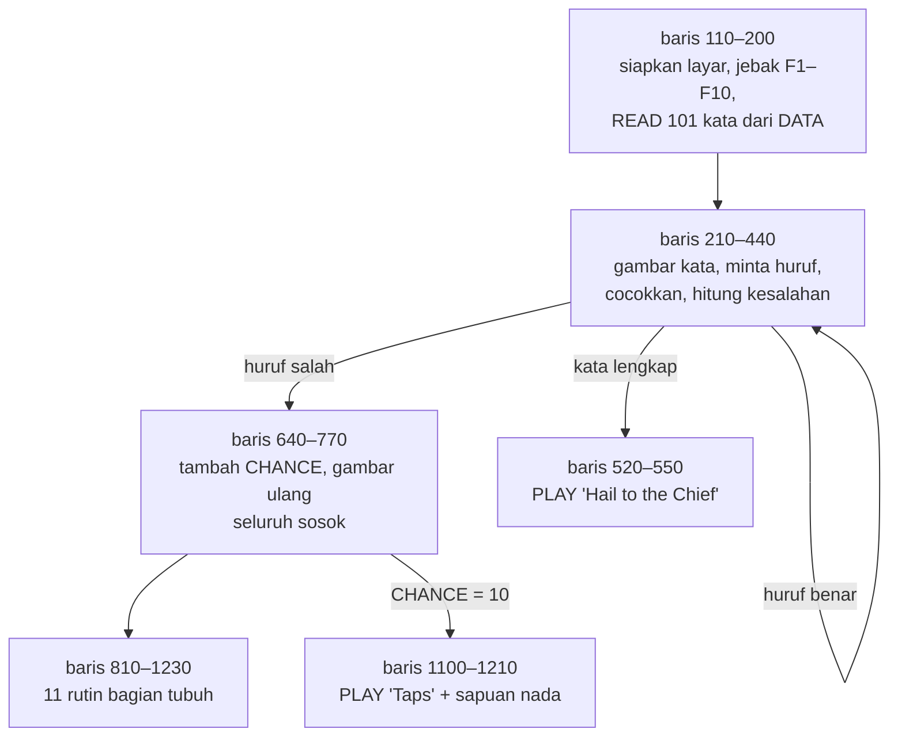

# HANGMAN — dari BASIC 1983 ke web

| | |
|---|---|
| Sumber | `run/HANGMAN.BAS` — Friendlyware PC Introductory Set |
| Tanggal di kode | `1 'update 2/1/83` |
| Ukuran asli | 217 baris, 21 subrutin, 7 `GOTO`, 3% komentar |
| Hasil port | [`../games/hangman/`](../games/hangman/index.html) — 3 berkas, ~20 KB |
| Analisis BASIC lengkap | [`../../reviews/HANGMAN.md`](../../reviews/HANGMAN.md) |

Program pertama yang diport, dan dipilih pertama karena satu alasan: ia
memperlihatkan **tabel dispatch** dalam bentuk yang paling murni di seluruh
koleksi, sekaligus punya gambar progresif yang cocok untuk SVG.

---

## 1 · Arsitektur asli

Ini salah satu program paling rapi di rombongan Friendlyware: **7 `GOTO` untuk
217 baris**, dengan 39 `GOSUB`. Rasionya kebalikan dari tetangganya seperti
`DOMINOES.BAS` (77 `GOTO`) atau `BATSHIP.BAS` (95).

Struktur intinya tiga bagian:



### Kejutan di baris 650

Ini bagian yang membuat program ini layak jadi porting pertama.

```basic
650 ON CHANCE GOTO 760,750,740,730,720,710,700,690,680
660 GOSUB 1230   ' tiang gantungan
670 GOSUB  980   ' telapak kaki kiri
680 GOSUB  970   ' telapak kaki kanan
690 GOSUB 1090   ' tangan kanan
700 GOSUB 1080   ' tangan kiri
710 GOSUB 1040   ' lengan kanan
720 GOSUB 1000   ' lengan kiri
730 GOSUB  960   ' paha kanan
740 GOSUB  950   ' paha kiri
750 GOSUB  880   ' badan
760 GOSUB  810   ' kepala
770 IF CHANCE=10 THEN GOSUB 1100   ' tali
```

Perhatikan dua hal yang mudah terlewat:

**Pertama, targetnya menurun.** `CHANCE=1` melompat ke 760 — baris terakhir —
dan hanya menggambar kepala. `CHANCE=2` melompat ke 750, menggambar badan,
lalu **jatuh** ke 760 dan menggambar kepala juga. Jadi satu lompatan
menghasilkan gambar **kumulatif**, tanpa satu pun loop.

Kenapa harus begitu? Karena `GOSUB` di BASIC tidak menerima nomor baris dari
variabel. Anda tidak bisa menulis `FOR i=1 TO CHANCE: GOSUB PART(i): NEXT`.
Rantai fall-through adalah satu-satunya cara menyatakan "gambar bagian 1 sampai
N" dengan sarana yang ada.

**Kedua, ada sepuluh kesempatan tapi hanya sembilan target.** Ketika
`CHANCE=10`, indeksnya di luar jangkauan — dan `ON x GOTO` di GW-BASIC
**diam saja** kalau indeksnya di luar daftar. Eksekusi lanjut ke baris
berikutnya, yaitu 660 dan 670, yang menggambar tiang gantungan dan telapak
kaki kiri.

Jadi keluar-jangkauan itu **disengaja**: ia dipakai sebagai "kasus ke-10".
Penulisnya butuh 11 bagian di kesalahan terakhir, sementara `ON` hanya bisa
menyebut sembilan, jadi dua sisanya diletakkan di atas rantai.

Efek sampingnya dramatis: **tiang gantungan baru muncul di kesalahan ke-10**,
bersamaan dengan tali dan lagu Taps. Selama sembilan kesalahan pertama, sosok
itu melayang tanpa tiang.

> Di bagian 3.3 di bawah, perilaku ini dipertahankan — dengan sakelar untuk
> mematikannya, karena pemain yang tidak tahu aslinya akan mengira itu rusak.

`ON x GOTO` yang diam saat indeksnya meleset adalah jebakan yang saya catat di
[dasar-dasar BASIC](../../reviews/00-DASAR-BASIC.md) sebagai "gampang bikin bug
diam-diam". Di sini ia justru dipakai dengan sengaja — contoh nyata bahwa
perilaku yang berbahaya bisa jadi alat kalau penulisnya benar-benar paham.

---

## 2 · Dari retro ke modern

Tabel wajib sesuai [aturan dokumentasi](_fondasi.md#1--cara-membaca-dokumen-ini).

| Aspek | Bentuk asli | Kendala yang melahirkannya | Bentuk sekarang & alasannya |
|---|---|---|---|
| Urutan bagian tubuh | `ON CHANCE GOTO` + rantai fall-through menurun (baris 650–760) | `GOSUB` tidak menerima nomor baris dari variabel, jadi tidak bisa dipanggil dalam loop | `PARTS.slice(0, chances)` — array biasa. Yang di BASIC butuh 11 baris kode, di sini jadi satu ekspresi. **Bentuk tabelnya dipertahankan**, hanya mekanismenya yang berubah |
| Gambar sosok | 11 rutin `PRINT` karakter CP437 di posisi `LOCATE` tetap | Mode grafis CGA lambat & boros; karakter hampir gratis | SVG dengan `stroke` — bebas resolusi, bisa dianimasikan, dan tiap bagian punya `id` sendiri untuk dinyalakan |
| Warna bagian tubuh | `COLOR 15` kepala, `2` badan, `5` paha, `4` telapak, `14` lengan, `7` tangan | Palet CGA 16 warna, dipilih per perintah `PRINT` | **Dipertahankan persis** sebagai variabel CSS (`--cga-green` dst). Tabel pemetaannya ada di `hangman.css` |
| Menunggu huruf | `1550 W=INKEY$:IF W<>"" THEN 1550` lalu `1560 IF W="" THEN 1560` | Tidak ada asinkron; menunggu = memutar CPU | Event listener papan ketik + tombol di layar. Menunggu tidak lagi membakar prosesor |
| Membuang tombol menumpuk | `120 DEF SEG:POKE 106,0` | Menulis langsung ke ruang kerja interpreter; tak terdokumentasi | Tidak diperlukan — model kejadian peramban tidak menumpuk tombol saat idle |
| Daftar kata | `1290–1310 DATA …` dibaca `FOR B=0 TO 100` | Satu-satunya cara menaruh tabel di dalam program | `words.js` — array. Disalin persis 101 kata, tanpa perubahan ejaan |
| Memilih kata | `260 B=RND(1)*100` lalu `270` mengulang kalau sudah pernah keluar | Tidak ada struktur himpunan | Saring dulu yang belum terpakai, baru pilih — lihat 3.2, ini memperbaiki bug nyata |
| Jeda antar layar | `780 FOR C=1 TO 3500:NEXT` | Tidak ada jam; waktu diukur dengan menghitung | Transisi CSS `--t-slow`. Kecepatannya sama di mesin mana pun |
| Musik menang/kalah | `PLAY "T140 MN MB…"` (Hail to the Chief) dan `"T120…"` (Taps) | Speaker PC: satu suara, gelombang kotak | **String makro `PLAY` disalin apa adanya** dan ditafsirkan oleh `_shared/audio.js`. Bunyi notnya sama |
| Papan skor | tidak ada | — | `localStorage` lewat `RETRO.store` — tambahan, bukan penerjemahan |

---

## 3 · Keputusan porting

### 3.1 Yang dipertahankan persis

- **Sepuluh kesempatan, bukan enam.** Hampir semua hangman modern memakai enam.
  Yang ini sepuluh (`440 IF CHANCE=10`), dan itu tidak diubah.
- **Tawaran menebak kata utuh setiap kali satu huruf tertebak benar.** Baris
  440 hanya memanggil rutin gambar kalau `FLAG=0`; kalau huruf ketemu, eksekusi
  jatuh ke baris 450 yang bertanya *"What Do You Think The Word Is?"*. Menebak
  salah di situ **tidak mengurangi kesempatan** (baris 490 langsung kembali ke
  290). Aturan yang tidak biasa, dan dipertahankan.
- **101 kata, ejaan apa adanya** — termasuk `QUE`, yang hampir pasti salah ketik
  dari `CUE`. Memperbaikinya berarti mengubah isi permainan.
- **Warna CGA tiap bagian tubuh.**
- **Teks Inggris asli**: `"You Guessed It !!!!  In n Tries"`,
  `"Nice Try. But No Cigar !!"`.

Kata terpanjang dalam daftar itu `FRIENDLYWARE` — nama penerbitnya sendiri,
diselipkan ke dalam daftar kata.

### 3.2 Bug yang diperbaiki

**Pemilihan kata bisa menggantung selamanya.**

```basic
260 B=RND(1)*100:A(A)=B
270 FOR C=0 TO A-1:IF A(C)=B THEN 260 ELSE NEXT
```

Polanya "ambil acak; kalau sudah pernah keluar, ambil lagi". Makin banyak kata
terpakai, makin sering gagal — dan **kalau semua 101 kata sudah keluar, baris
260 tidak pernah berhenti**. Program membeku tanpa pesan apa pun.

Di sini: saring dulu yang belum terpakai, baru pilih dari sisanya. Waktunya
pasti, dan kalau habis, daftarnya dimulai lagi dengan pemberitahuan.

Ini pelajaran umum: **"coba lagi sampai berhasil" tidak punya batas waktu.**
Kalau ruang pilihannya menyusut, ia berubah dari cepat jadi tidak berhenti.

### 3.3 Yang sengaja menyimpang

**Tiang gantungan digambar sejak awal.** Aslinya baru muncul di kesalahan ke-10
(lihat bagian 1), sehingga selama sembilan kesalahan pertama sosok itu melayang
tanpa tiang.

Ini penyimpangan yang **disengaja**, dan alasannya perlu dinyatakan jujur: bagi
pemain yang tidak membaca kode aslinya, sosok melayang terbaca sebagai
**gambar yang rusak**, bukan sebagai keputusan rancangan. Yang hilang bukan
aturan main — tiang gantungan tidak memengaruhi apa pun — melainkan hanya urutan
munculnya sebuah gambar.

Sempat saya sediakan sebagai sakelar agar kedua perilaku bisa dibandingkan, tapi
itu keliru: sakelar hanya berguna kalau kedua pilihan sama-sama masuk akal
dimainkan. Di sini yang satu jelas lebih baik, jadi menyodorkan pilihan hanya
memindahkan beban keputusan ke pemain tanpa memberi manfaat.

Perilaku aslinya tetap terekam di dua tempat: `'gallows'` sengaja dibiarkan di
dalam `PARTS[9]` supaya tabel itu tetap cerminan jujur dari rantai 650–760, dan
penjelasannya ada di komentar `activeParts()` serta di bagian 1 dokumen ini.

> Bandingkan dengan pendarat bulan di [demo SVG](../svg-demo.html), yang **tetap**
> memakai sakelar untuk "kembali tegak sendiri". Di sana kedua perilaku memang
> sama-sama sah — yang satu enak dimainkan, yang satu benar secara fisika — jadi
> pilihan itu punya isi. Aturannya: sediakan sakelar kalau kedua sisi punya
> pembelaan; ambil keputusan kalau tidak.

### 3.4 Yang ditambahkan

Semuanya di luar aturan main, dan dinyatakan sebagai tambahan:

- Sosok berubah **merah** saat 10/10, dengan mata silang dan mulut menghadap
  bawah. Aslinya warna tiap bagian tetap seperti semula.
- Kata dibuka saat kalah. Aslinya tidak — pemain tidak pernah tahu jawabannya.
- Bunyi klik pendek untuk huruf benar/salah.
- Papan skor menang–kalah yang bertahan antar sesi, **dengan tombol reset**.
- Tombol menyerah.
- Bisa dimainkan lewat sentuhan, dan seluruhnya bisa dioperasikan papan ketik.

Soal papan skor: aslinya tidak punya sama sekali — program berhenti, angka
hilang. Begitu sesuatu disimpan permanen, pengguna harus punya cara
menghapusnya; menyimpan data tanpa menyediakan jalan keluar adalah kelalaian,
bukan fitur. Tombol **Reset skor** meminta konfirmasi lebih dulu, dan hanya
menghapus angka menang–kalah — permainan yang sedang berjalan dan daftar kata
yang sudah keluar tidak ikut disentuh.

Daftar kata terpakai memang **tidak** disimpan permanen, mengikuti aslinya:
array `A()` di baris 260–270 hidup di memori dan hilang saat program dijalankan
ulang, jadi tiap sesi mulai lagi dari 101 kata penuh.

---

## 4 · Arsitektur baru

```mermaid
flowchart TD
    subgraph data["data — tidak berubah selama main"]
        W["words.js<br/>101 kata dari DATA 1290–1310"]
        P["PARTS[]<br/>10 langkah, dari rantai 650–760"]
        T["TUNE_WIN / TUNE_LOSE<br/>string PLAY dari 520–540, 1130–1170"]
    end

    subgraph state["keadaan — satu objek, satu sumber kebenaran"]
        S["word · guessed:Set · chances<br/>phase · tries · seen"]
    end

    subgraph act["aksi — hanya ini yang mengubah keadaan"]
        GL["guessLetter(ch)"]
        GW["guessWord(text)"]
        NW["newWord()"]
    end

    R["render()<br/>fungsi murni dari keadaan"]

    W --> NW
    P --> R
    T --> GL
    GL --> S
    GW --> S
    NW --> S
    S --> R
    R --> DOM["SVG + papan huruf + teks"]

    style S fill:#1e3f2c,stroke:#4ef08a
    style R fill:#3d3117,stroke:#f0b429
```



Aturan yang dipegang: **hanya tiga fungsi yang boleh mengubah `state`, dan
`render()` tidak pernah membaca apa pun dari DOM.** Ini persis pelajaran yang
gagal dipegang `BOWLING.BAS` di koleksi yang sama, yang memakai `SCREEN(r,c)`
untuk membaca posisi pin dari layar — menjadikan tampilan sebagai sumber
kebenaran.

---

## 5 · Sebelum & sesudah

### Tabel bagian tubuh

```basic
650 ON CHANCE GOTO 760,750,740,730,720,710,700,690,680
660 GOSUB 1230
670 GOSUB 980
680 GOSUB 970
690 GOSUB 1090
700 GOSUB 1080
710 GOSUB 1040
720 GOSUB 1000
730 GOSUB 960
740 GOSUB 950
750 GOSUB 880
760 GOSUB 810
```

```js
const PARTS = [
  ['head'], ['torso'], ['legL'], ['legR'], ['armL'],
  ['armR'], ['handL'], ['handR'], ['footR'],
  ['footL', 'gallows', 'face']      // kesalahan ke-10: tiga sekaligus
];

const on = new Set(PARTS.slice(0, state.chances).flat());
```

Sebelas baris jadi satu ekspresi — **dan tabelnya tetap terlihat sebagai
tabel**. Itu yang penting: bukan menghapus polanya, melainkan menuliskannya
dengan sarana yang lebih baik.

### Menunggu huruf

```basic
1550 W=INKEY$:IF W<>"" THEN 1550    ' buang sisa tombol
1560 W=INKEY$:IF W="" THEN 1560     ' tunggu tombol baru
1570 IF W<"a" OR W>"z" THEN 1590
```

```js
kb.on('*', e => {
  const ch = e.key.toUpperCase();
  if (ch.length === 1 && ch >= 'A' && ch <= 'Z') guessLetter(ch);
});
```

Baris 1550 itu penting untuk dipahami: ia **membuang** tombol yang sudah ada
sebelum menunggu yang baru. Tanpa itu, pemain yang menekan-nekan tombol akan
melewati beberapa layar sekaligus. Di web, penyangga seperti itu tidak ada —
kejadian datang saat terjadi, bukan menumpuk.

### Menghitung kesalahan

```basic
440 USED(X)=W:X=X+1:IF FLAG=0 THEN GOSUB 640:IF CHANCE=10 THEN 560 ELSE 290
```

Satu baris yang mengerjakan empat hal: catat huruf, majukan penunjuk, gambar
bagian tubuh kalau salah, dan periksa kekalahan.

```js
state.guessed.add(ch);
state.tries++;
if (state.word.includes(ch)) { ... } else {
  state.chances++;
  if (state.chances >= MAX_CHANCES) return lose();
}
```

`USED(27)` dan penunjuk `X` diganti satu `Set`. Array 27 elemen itu memakai
indeks 1–26 untuk A–Z dan menyia-nyiakan indeks 0 — trik yang benar di BASIC
(menghindari kurang-satu di setiap perhitungan), tapi tidak perlu di sini.

---

## 6 · Latihan

1. **Kembalikan rantai fall-through.** Tulis ulang `activeParts()` memakai
   `switch` tanpa `break` di JavaScript, sehingga strukturnya sama persis
   dengan baris 650–760. Bandingkan keterbacaannya. Mana yang lebih Anda
   percayai kalau harus menambah bagian tubuh ke-12?

2. **Buktikan bug pemilihan kata.** Ubah `words.js` jadi hanya 3 kata, lalu
   terapkan algoritma asli (`ambil acak; kalau sudah keluar, ambil lagi`).
   Mainkan empat kali. Apa yang terjadi pada kali keempat, dan kenapa tidak ada
   pesan galat?

3. **Tabel gambar dari data.** Tiap bagian tubuh sekarang adalah elemen SVG
   dengan `id`. Ubah agar bentuknya juga datang dari data — misalnya
   `{ id:'head', d:'M…', color:'--cga-white' }` — lalu bangkitkan SVG-nya dari
   array itu. Bandingkan dengan `DIM FIG$(5,5)` di `CRAZY8.BAS`, yang melakukan
   hal yang sama untuk kartu remi.

4. **Sepuluh atau enam?** Hitung peluang menang untuk kedua batas kesalahan
   dengan daftar 101 kata ini. Apakah sepuluh membuatnya terlalu mudah?

---

Berkas terkait: [mainkan](../games/hangman/index.html) ·
[analisis BASIC asli](../../reviews/HANGMAN.md) ·
[kode 1983](../../run/HANGMAN.BAS) ·
[keputusan fondasi](_fondasi.md) · [teknik SVG](_teknik-svg.md)
