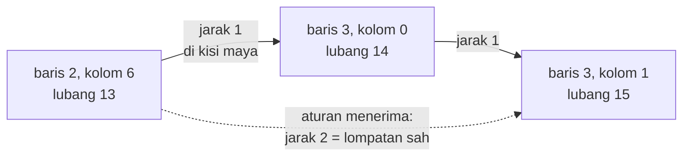

# HIQUE2 — dari BASIC 1983 ke web

| | |
|---|---|
| Sumber | `run/HIQUE2.BAS` — public domain, oleh **Wes Meier** (CompuServe 70215,1017) |
| Tahun | 1983 |
| Ukuran asli | 142 baris, **mendukung light pen** |
| Hasil port | [`../games/hique2/`](../games/hique2/index.html) |
| Analisis BASIC | [`../../reviews/HIQUE2.md`](../../reviews/HIQUE2.md) |

Peg solitaire Inggris: papan salib 33 lubang, semuanya berisi pasak kecuali
yang di tengah. Lompati satu pasak ke lubang kosong di seberangnya; yang
dilompati diangkat.

Yang membuatnya layak dibaca: cara program ini memeriksa apakah sebuah lompatan
sah — dan **delapan lompatan yang lolos padahal mustahil**.

---

## 1 · Papan salib di dalam larik lurus

```basic
9 DEFINT B-Z:DEFSTR A:DIM P(33),L(33),T(33),L2T(33)
```

Papan disimpan sebagai `P(33)` — satu larik lurus, dengan penomoran yang
mengikuti bentuk salibnya:

```
        1  2  3
        4  5  6
  7  8  9 10 11 12 13
 14 15 16 17 18 19 20
 21 22 23 24 25 26 27
       28 29 30
       31 32 33
```

Penomoran itu enak untuk manusia dan **tidak berguna untuk aritmetika**: 9 dan
10 bertetangga, tapi 13 dan 14 tidak — yang satu di ujung kanan barisnya, yang
satu di ujung kiri baris berikutnya.

Jadi sebelum memeriksa lompatan, nomor lubang diterjemahkan ke **kisi maya
tujuh kolom**:

```basic
109 IF MOVE.FROM<4  THEN MF=MOVE.FROM-6
110 IF MOVE.FROM<7  THEN MF=MOVE.FROM-2
111 IF MOVE.FROM>30 THEN MF=MOVE.FROM+6
112 IF MOVE.FROM>27 THEN MF=MOVE.FROM+2
113 MF=MOVE.FROM
```

Empat `IF`, satu pemetaan sepotong-sepotong. Setelah diterjemahkan, dua baris
berurutan berjarak tepat tujuh, sehingga aturan lompatnya jadi satu baris:

```basic
119 IF ABS(MT-MF)<>2 AND ABS(MT-MF)<>14 THEN <tolak>
```

Selisih **2** = lompatan mendatar. Selisih **14** = lompatan menegak
(dua baris × tujuh kolom). Lubang yang dilompati diperoleh dari titik
tengahnya, `(MF+MT)/2`, lalu diterjemahkan balik dengan empat `IF` lagi.

Pemetaannya **benar** — diperiksa untuk ketiga puluh tiga lubang, dan
selisihnya terhadap kisi sungguhan tetap −7 di semuanya.

> Ini gagasan yang bagus, dan bentuknya masih dipakai: menyimpan struktur dua
> dimensi di dalam larik satu dimensi, dengan indeks yang dihitung. Bedanya,
> hari ini kita menuliskan `r * lebar + c` sekali di satu tempat — bukan empat
> `IF` yang harus diulang di tiga tempat berbeda.

---

## 2 · Delapan lompatan yang mustahil

Aturan `|MT−MF| ∈ {2, 14}` menerima **84** lompatan. Papan sungguhan hanya
punya **76**.

| | |
|---|--:|
| Diterima aturan 1982 | 84 |
| Mungkin secara geometris | 76 |
| **Lompatan liar** | **8** |

Kedelapannya berpola sama:

| dari | lompati | ke | koordinat |
|--:|--:|--:|---|
| 12 | 13 | 14 | (2,5) → (2,6) → (3,0) |
| 13 | 14 | 15 | (2,6) → (3,0) → (3,1) |
| 19 | 20 | 21 | (3,5) → (3,6) → (4,0) |
| 20 | 21 | 22 | (3,6) → (4,0) → (4,1) |

…dan keempat kebalikannya.

Semuanya **membungkus tepi**: dari kolom paling kanan sebuah baris ke kolom
paling kiri baris berikutnya. Di kisi maya tujuh kolom, jaraknya memang tepat
2 — dan tidak ada apa pun yang menghentikannya, karena kisi itu **tidak punya
pagar**.



Di papan sungguhan, lubang 13 dan 15 tidak berhadapan sama sekali — yang satu
di baris atas, yang satu di baris bawah, terpisah seluruh lebar papan.

### Bandingkan dengan TICTAC, di disket yang sama

[TICTAC.BAS](tictac.md) menghadapi masalah yang **persis sama**: papan 3×3
disimpan di larik lurus, dan arah gerak jadi penambahan indeks. Kalau tidak
dijaga, `+1` dari ujung kanan sebuah baris akan menyeberang ke baris berikutnya.

Penyelesaiannya: **pagar**. Papan 3×3 ditaruh di dalam larik 5×5, dan enam
belas sel pinggirnya diisi angka 3 yang tidak pernah cocok dengan apa pun.

Dua program, satu koleksi, satu masalah. Satu menyelesaikannya dengan pagar;
satu tidak menyelesaikannya sama sekali.

> **Pelajaran.** Menyimpan kisi di larik lurus selalu memunculkan pertanyaan
> yang sama: *apa yang terjadi di tepi?* Ada tiga jawaban yang sah — pagar
> (TICTAC), pemeriksaan kolom secara eksplisit, atau memakai koordinat
> `(baris, kolom)` sejak awal. Yang tidak sah cuma satu: **berharap tepinya
> tidak akan pernah tersentuh.**

Di port ini lompatan diturunkan dari **geometri papan**, bukan dari aritmetika
indeks — tetangga dicari lewat koordinat, dan koordinat di luar salib memang
tidak ada. Aturan 1982 tetap bisa dinyalakan lewat tombol, dan lompatan
liarnya ditandai kuning, supaya bugnya bisa **dilihat**.

Daftar delapan itu pun **dihitung ulang** oleh halamannya dari aturan aslinya,
bukan disalin sebagai daftar tetap. Kalau suatu saat pemetaannya salah dibaca,
jumlahnya akan langsung berbeda dari delapan.

---

## 3 · Di mana pasak terakhir bisa berhenti

Tidak di sembarang lubang, dan alasannya bisa dihitung tanpa mencoba satu pun
permainan.

Warnai lubang *(baris, kolom)* dengan `(baris + kolom) mod 3`. Setiap lompatan
menyentuh **tiga sel berurutan**, jadi ketiga warnanya pasti berbeda: satu
pasak hilang dari dua kelas warna, satu muncul di kelas ketiga.

Artinya paritas ketiga cacahnya selalu berbalik **bersamaan** — sehingga
selisih paritasnya kekal sepanjang permainan.

Dijalankan untuk dua pewarnaan sekaligus (`(r+c) mod 3` dan `(r−c) mod 3`),
33 kemungkinan menyusut jadi **lima**:

| Lubang | Koordinat | |
|--:|---|---|
| 2 | (0,3) | ujung atas |
| 14 | (3,0) | ujung kiri |
| **17** | (3,3) | **pusat** |
| 20 | (3,6) | ujung kanan |
| 32 | (6,3) | ujung bawah |

Pusat salib dan keempat ujung lengannya. Tidak ada yang lain.

Ini syarat **perlu**, bukan cukup — ia hanya membuang yang mustahil, tidak
menjamin yang tersisa bisa dicapai. Tapi penelusur di halaman portnya memang
menemukan penyelesaian 31 lompatan yang berakhir di lubang **32**, dan itu ada
di dalam daftar.

> **Pelajaran.** Sebelum mencari dengan mesin, cari dulu **invarian**. Di sini
> satu sifat sederhana — jumlah pasak per kelas warna selalu berubah paritas
> bersamaan — memangkas ruang jawaban dari 33 jadi 5, tanpa memainkan satu pun
> permainan. Penelusuran habis-habisan atas 2³³ keadaan tidak akan pernah
> memberi tahu Anda *kenapa*.

Jumlah lompatannya selalu **31**, dan itu tidak perlu dicari sama sekali: tiap
lompatan membuang tepat satu pasak, jadi 32 → 1 menuntut 31 lompatan. Tidak
ada penyelesaian yang lebih pendek atau lebih panjang.

---

## 4 · Dari retro ke modern

| Aspek | Bentuk asli | Kendala yang melahirkannya | Bentuk sekarang & alasannya |
|---|---|---|---|
| Papan | `P(33)` + kisi maya lewat empat `IF` | Larik satu dimensi; tidak ada tipe rekaman | Koordinat `(baris, kolom)`; lompatan diturunkan dari geometri (§2) |
| Aturan lompat | `ABS(MT-MF)` = 2 atau 14 | Aritmetika indeks paling murah di 4,77 MHz | Diperbaiki, **dan** versi 1982 tetap bisa dinyalakan untuk dibandingkan |
| Masukan | `INPUT` nomor lubang, **atau light pen** (`PEN ON`) | Tetikus belum umum; light pen ada di beberapa monitor | Klik langsung. Light pen adalah tetikus dari era yang salah — ia menghilang, sentuhan menggantikannya |
| Pasak | `STRING$(4,219)` = balok penuh; lubang kosong = kotak bergaris | Layar teks 80×25 | Lingkaran di dalam lubang, sehingga "pasak" dan "lubang" tetap dua benda berbeda |
| Bunyi salah | `SOUND 37,5` (baris 94) | — | Dipertahankan |
| Mundur | tidak ada | Tidak ada memori untuk riwayat | Ditambahkan — peg solitaire tanpa "mundur" menghukum kesalahan sepele dengan mengulang dari nol |
| Penyelesaian | tidak ada; program hanya wasit | — | Ditambahkan (penelusuran mendalam + tabel keadaan) |
| Rekor | tidak ada | Tidak ada penyimpanan | `localStorage`, **hanya** dari permainan beraturan benar |
| Panel "Cara bermain" | layar aturan sebelum mulai (baris 38–49) | — | **Dikembalikan.** Port pertama menghapusnya; itu regresi, bukan penyederhanaan — lihat di bawah |

### Aturan yang sempat hilang

Port pertama halaman ini tidak menjelaskan aturannya sama sekali. Itu bukan
keputusan yang diambil, melainkan yang terlewat — dan aslinya justru
**menjelaskannya dengan sangat baik**:

```basic
42 PRINT"     - Pegs are removed ONLY when they are JUMPED by another peg."
43 PRINT"     - You may jump ONLY One peg at a time."
44 PRINT"     - You may jump ONLY vertically or horizontally...NOT diagonally."
45 PRINT"     - You may jump ONLY into an EMPTY space."
```

Empat baris, empat aturan, satu kata kunci dikapitalkan di tiap baris. Panel
sekarang membawa keempatnya.

Yang juga dikembalikan adalah **dua tingkat kemenangan** yang dibedakan
aslinya (baris 38–39): sisa satu pasak itu *"fantastic"*, tapi sisa satu pasak
**tepat di lubang tengah** adalah permainan yang *"PERFECT"*.
[PEGLEAP](pegleap.md) membuat pembedaan yang sama dengan kata berbeda —
*"A Perfect Score!"* lalu *"In The Center! You're A Genius!"* (baris 1360–1370).
Dua program, dua penulis, satu gagasan yang sama tentang apa yang pantas
dirayakan.

Satu kalimat aslinya yang **tidak** dibawa: *"Don't worry about making a
mistake, HIQUE won't let you!"* (baris 47). Itu janji tentang wasitnya, dan di
port ini janji itu lebih kuat daripada aslinya — aturan 1982 menerima delapan
lompatan mustahil (§1), jadi HIQUE justru **membiarkan** Anda melakukan
kesalahan yang tidak Anda sadari.

### Light pen

Baris 32–34 dan 63–74 seluruhnya untuk light pen — pena yang ditempelkan ke
layar CRT dan membaca posisinya dari waktu sapuan berkas elektron. `PEN(8)` dan
`PEN(9)` mengembalikan baris dan kolom karakter.

Itu **sepertiga kode program ini**, untuk perangkat yang hari ini tidak ada
lagi. Tidak diport, dan itu keputusan yang mudah: perangkatnya sudah tidak ada.

Tapi ia layak dicatat sebagai pengingat bahwa "cara menunjuk ke layar" bukan
masalah yang selesai sekali. Light pen kalah dari tetikus; tetikus kini berbagi
tempat dengan sentuhan.

---

## 5 · Latihan

1. **Temukan sendiri kedelapannya.** Tulis kode yang membangkitkan semua
   lompatan menurut aturan `|MT−MF| ∈ {2,14}`, lalu semua lompatan menurut
   geometri, dan kurangkan. Apakah Anda mendapat delapan? Sekarang ubah papan
   jadi 9 kolom — berapa lompatan liar yang muncul?

2. **Tambal aturan aslinya.** Perbaiki bug pembungkusan tepi **tanpa** membuang
   pendekatan kisi maya — misalnya dengan menambahkan satu pemeriksaan kolom.
   Berapa baris yang perlu? Bandingkan dengan pendekatan pagar di TICTAC.

3. **Buktikan kelima lubangnya.** Terapkan invarian di §3 sendiri. Lalu coba
   dengan lubang awal yang **bukan** pusat — misalnya lubang 1. Berapa lubang
   akhir yang mungkin sekarang?

4. **Cari yang tersulit.** Ubah penelusur supaya mencari penyelesaian yang
   berakhir di lubang tertentu. Apakah kelima lubang di §3 semuanya benar-benar
   bisa dicapai, atau ada yang lolos invarian tapi tetap mustahil?

5. **Hitung tanpa mencari.** Kenapa setiap penyelesaian pasti 31 lompatan?
   Sekarang jawab yang lebih sulit: berapa banyak penyelesaian berbeda yang
   ada? (Petunjuk: jawabannya diketahui, dan besar sekali — cari "English peg
   solitaire solution count".)

---

Berkas terkait: [mainkan](../games/hique2/index.html) ·
[TICTAC — masalah yang sama, diselesaikan dengan pagar](tictac.md) ·
[fondasi](_fondasi.md) · [LIFE2 — pagar nol juga](life2.md)
