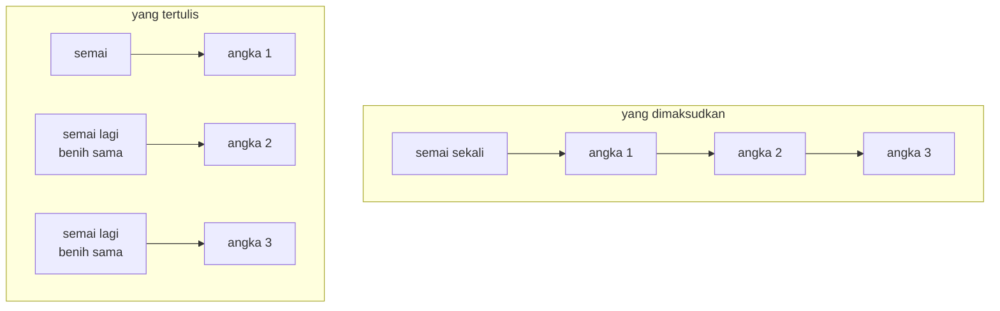

# MASTER — dari BASIC 1982 ke web

| | |
|---|---|
| Sumber | `run/MASTER.BAS` — Friendlyware PC Introductory Set, menu #1 pilihan E |
| Tahun | 1982 |
| Ukuran asli | 137 baris (nomor 100–1460) |
| Hasil port | [`../games/master/`](../games/master/index.html) |
| Analisis BASIC | [`../../reviews/MASTER.md`](../../reviews/MASTER.md) |

Mastermind. Aslinya memakai angka 0–9, bukan warna: tebak deret 3–6 angka,
boleh berulang. Dua hal di dalamnya layak dibaca — sebuah baris yang merusak
seluruh inti permainannya, dan dua subrutin yang terkirim dalam keadaan kosong.

Port ini juga menyediakan **mode warna dengan pasak hitam-putih** seperti papan
yang dijual toko. Penambahannya tidak menyentuh satu baris pun kode penilaian,
dan alasannya dibahas di §3b.

---

## 1 · Satu kata di tempat yang salah

```basic
710 FOR SUB=1 TO DIGITS
720   RANDOMIZE(VAL(RIGHT$(TIME$,2))):ANSWER(SUB)=FIX(RND(SUB)*10)
730 NEXT SUB
```

`RANDOMIZE` ada **di dalam** perulangan.

Sebuah pengacak bilangan semu bekerja dengan menyimpan keadaan dan
memajukannya tiap kali diminta angka. `RANDOMIZE` membuang keadaan itu dan
menggantinya dengan benih baru. Memanggilnya sekali di awal program adalah
benar; memanggilnya **sebelum setiap angka** membuang persis mekanisme yang
membuat deretnya acak.

Dan benihnya `VAL(RIGHT$(TIME$,2))` — dua digit terakhir jam, yaitu **detik**.
Angka itu tidak berubah selama perulangan tiga sampai enam putaran berjalan;
prosesor 4,77 MHz pun menyelesaikannya dalam hitungan milidetik.

Jadi setiap angka rahasia diambil dari pengacak yang baru saja dikembalikan ke
keadaan yang sama.



Akibatnya berlapis dua, dan keduanya buruk:

| | |
|---|---|
| **Di dalam satu permainan** | Semua angka berasal dari benih yang sama, jadi rahasianya cenderung seragam — `7 7 7 7` alih-alih `3 9 1 4` |
| **Antar permainan** | Benihnya cuma punya **60 nilai**. Dua permainan yang dimulai pada detik yang sama mendapat rahasia yang persis sama |

Yang bisa dinyatakan **dengan pasti dari kodenya**: penyemaian ulang di dalam
perulangan membuang keadaan pengacak setiap putaran, dan itu selalu salah.

Yang **tidak** saya pastikan: apakah GW-BASIC menimpa benihnya atau
mencampurnya dengan yang lama. Kalau menimpa, seluruh angka jadi identik;
kalau mencampur, ia tetap jauh lebih lemah dari yang dimaksudkan tapi tidak
seragam total. Memastikannya menuntut menjalankan GW-BASIC sungguhan, dan itu
tidak dilakukan.

Halaman portnya menyediakan dua tombol yang menyebar seribu rahasia — satu
dengan pengacak yang benar, satu dengan cacat 1982 ditiru — supaya sebarannya
bisa dilihat berdampingan, bukan diperdebatkan.

> **Pelajaran.** Letak sebuah pernyataan bisa merusaknya sepenuhnya tanpa
> mengubah satu huruf pun di dalamnya. `RANDOMIZE` di baris 700 benar;
> `RANDOMIZE` di baris 720 salah. Bug jenis ini tidak terlihat saat membaca
> baris itu sendiri — ia hanya terlihat saat memperhatikan **di mana** baris
> itu berada.
>
> Ini bukan kasus pertama di koleksi ini. Lihat
> [fondasi §2.6](_fondasi.md) untuk pola `RANDOMIZE` yang lain, termasuk
> `WILDCAT.BAS` yang menyemai dua kali dari keluarannya sendiri.

Port ini menyemai **sekali**, dari `crypto.getRandomValues`.

---

## 2 · Dua subrutin kosong yang ikut terkirim

```basic
1410 GOTO 1460
1420 REM LOSE SONG
1430 RETURN
1440 REM WIN SONG
1450 RETURN
1460 END
```

Keduanya **dipanggil sungguhan**:

```basic
1220 IF HITS=DIGITS THEN GOSUB 120:GOSUB 1440: … "C O N G R A T U L A T I O N S"
1250 GOSUB 1420: … "S O R R Y , Y O U   L O S T"
```

Lagu menang dan lagu kalah direncanakan, diberi nomor baris, diberi nama lewat
`REM`, dipanggil dari tempat yang benar — lalu tidak pernah ditulis. Dan tetap
ikut ke dalam produk yang dijual.

Ada yang menarik dari bentuk kelalaian ini: penulisnya **tidak lupa**. Ia tahu
persis di mana lagunya harus berbunyi, dan sudah memasang seluruh rangkanya.
Yang tidak terjadi cuma pengisian terakhirnya.

> Empat puluh tahun kemudian bentuknya belum berubah, cuma namanya:
> `// TODO: implement`. Yang berubah hanya bahwa sekarang ada alat yang bisa
> menemukannya sebelum dikirim.

Di port ini keduanya diisi — satu-satunya tambahan di seluruh proyek yang
terasa seperti **menyelesaikan** maksud penulisnya, bukan menyimpang darinya.

---

## 3 · Kondisi enam suku, dan apa yang sebenarnya dihitungnya

Baris 1160 adalah kondisi terpanjang di seluruh koleksi:

```basic
1160 IF GUESS(X)=ANSWER(Y) AND HITS$(GUESS(X),X)="" AND MISSES$(GUESS(X),X)=""
     AND X<>Y AND MISSES$(GUESS(X),Y)="" AND HITS$(GUESS(X),Y)="" THEN …
```

Masalah yang dipecahkannya nyata: kalau angka boleh berulang, satu angka tidak
boleh dihitung dua kali. Tebakan `3 3 9` terhadap rahasia `3 7 1` harus
menghasilkan **satu** angka benar, bukan dua.

Penyelesaiannya: dua larik teks `HITS$` dan `MISSES$` yang isinya hanya `""`
atau `"*"` — array teks dipakai sebagai array boolean, karena BASIC tidak punya
tipe boolean. Tiap posisi yang sudah terpakai ditandai, dan kondisi enam suku
itu memeriksa bahwa posisi tebakan **dan** posisi rahasia sama-sama masih bebas.

Setelah ditelusuri, yang dihitungnya ternyata rumus baku Mastermind:

```
tepat = berapa posisi yang angkanya sama
benar = Σ atas tiap angka d: min(muncul di tebakan, muncul di rahasia)
```

Dan itulah yang dipakai di port ini:

```js
function judge(guess, answer) {
  let exact = 0;
  const gc = new Array(MAXSYM).fill(0), ac = new Array(MAXSYM).fill(0);
  guess.forEach((d, i) => {
    if (d === answer[i]) exact++;
    gc[d]++; ac[answer[i]]++;
  });
  let total = 0;
  for (let d = 0; d < MAXSYM; d++) total += Math.min(gc[d], ac[d]);
  return { exact, total, near: total - exact };
}
```

Delapan baris menggantikan dua lintasan bersarang, dua larik penanda, `DIM` di
dalam perulangan, dan `ERASE` yang harus mengiringinya.

Yang lebih penting daripada pendeknya: **tidak ada penanda yang bisa tertinggal
dalam keadaan salah.** Versi 1982 harus mengosongkan `HITS$`/`MISSES$` tiap
baris tebakan — dan melakukannya dengan `DIM` di dalam perulangan lalu `ERASE`
di ujungnya (baris 1000 dan 1210). Kalau `ERASE` itu terlewat, GW-BASIC
melempar galat "Duplicate Definition"; kalau urutannya tertukar, penilaiannya
diam-diam salah.

> **Pelajaran.** Kalau sebuah algoritma butuh keadaan sementara yang harus
> dibersihkan, tanyakan apakah ia bisa ditulis ulang **tanpa keadaan itu**.
> Menghitung berapa kali tiap angka muncul tidak butuh dibersihkan — ia
> dihitung ulang dari nol tiap kali, dan tidak ada urutan yang bisa salah.

Kemiripan dengan kode asli memang hilang. Itu dibayar dengan bagian ini.

---

## 3b · Dua penyandian, satu permainan

Papan Mastermind yang dijual toko memakai **warna** dan pasak hitam-putih.
Yang 1982 memakai **angka** dan dua bilangan. Halaman portnya menyediakan
keduanya, dan penambahan mode warna **tidak menyentuh satu baris pun kode
penilaian**.

Itu bukan kebetulan — itu ujian atas rancangannya. `judge()` bekerja pada
larik bilangan bulat dan tidak tahu apakah bilangan itu berarti angka atau
warna. Yang berbeda hanya tiga hal, dan ketiganya di lapisan tampilan:

| | Mode angka | Mode warna |
|---|---|---|
| Jumlah lambang | 10 | 6 |
| Satu lambang digambar sebagai | angka | cakram berwarna + huruf |
| Petunjuk ditampilkan sebagai | dua bilangan | pasak hitam & putih |

> **Kalau `judge()` sampai perlu tahu modenya, rancangannya salah.** Itu ukuran
> yang bisa dipakai di mana saja: sebuah fitur tampilan yang menuntut
> perubahan di logika inti hampir selalu berarti keduanya sudah tercampur
> lebih dulu.

### Informasinya sama persis

Yang mungkin mengejutkan: kedua tampilan itu membawa **informasi yang identik**.

```
pasak hitam = tepat
pasak putih = benar − tepat
```

Salah satu selalu bisa dihitung dari yang lain. Jadi mengganti tampilan tidak
mempermudah maupun mempersulit permainannya — ia benar-benar cuma penyandian.

Ini layak diperhatikan karena naluri biasanya berkata sebaliknya. Papan klasik
*terasa* lebih informatif, padahal tidak; ia hanya menyajikan angka yang sama
dalam bentuk yang lebih mudah dihitung sekilas.

### Yang memang berubah: ruang pencariannya

| Posisi | 10 angka | 6 warna |
|--:|--:|--:|
| 3 | 1.000 | 216 |
| 4 | 10.000 | 1.296 |
| 5 | 100.000 | 7.776 |
| 6 | 1.000.000 | 46.656 |

Untuk empat posisi, mode warna hampir **delapan kali** lebih kecil. Dengan
sembilan tebakan, versi angka ketat sekali; versi warna longgar — Knuth
menunjukkan lima tebakan selalu cukup untuk 6 warna × 4 posisi.

Angka itu ditampilkan di bawah pemilih tingkat, supaya perbedaan kesulitannya
**terlihat**, bukan tersembunyi di balik pilihan yang tampak kosmetik.

### Warna saja tidak cukup

Tiap pasak warna diberi **huruf** (M, J, K, H, B, U).

Mastermind sungguhan mengandalkan warna semata. Itu menutup pintu bagi sekitar
8% laki-laki yang buta warna merah-hijau — dan merah/hijau justru pasangan yang
paling sering ada di papannya. Huruf di dalam pasak menghapus masalah itu tanpa
mengurangi apa pun bagi yang lain.

> **Pelajaran.** Warna adalah lapisan tambahan yang bagus dan saluran tunggal
> yang buruk. Aturannya sederhana: kalau sebuah informasi hanya bisa dibaca
> dari warnanya, informasi itu belum tersampaikan kepada semua orang.

---

## 4 · Dari retro ke modern

| Aspek | Bentuk asli | Kendala yang melahirkannya | Bentuk sekarang & alasannya |
|---|---|---|---|
| Rahasia | `RANDOMIZE` di dalam perulangan, benih = detik | Tidak ada sumber entropi selain jam | Disemai **sekali** dari `crypto.getRandomValues`. Bug-nya tetap bisa dilihat lewat tombol pembanding |
| Penilaian | Dua lintasan + dua larik penanda | Tidak ada tipe boolean, tidak ada struktur data selain larik | Hitung kemunculan tiap angka (§3) |
| Papan | `CHR$(220)` sebagai tempat kosong, ditimpa angka | Layar teks 80×25 | Kotak sungguhan, dengan penunjuk pada posisi yang sedang diisi |
| Lambang | Angka 0–9 | CGA teks: menggambar cakram berwarna mahal | **Dua mode**: angka (seperti 1982) dan warna + pasak hitam-putih (papan klasik). Lihat §3b |
| Masukan | `INKEY$` per angka, tanpa bisa dibatalkan | Tidak ada penyangga masukan | Angka bisa dihapus sebelum baris penuh (`Backspace` atau tombol) |
| Tingkat | A/B/C/D → 3/4/5/6 angka, 9–15 tebakan | — | Dipertahankan persis, termasuk jumlah tebakannya |
| Lagu menang/kalah | Subrutin kosong (§2) | — | Diisi |
| Rekor | tidak ada | Tidak ada penyimpanan | `localStorage`, terpisah per panjang deret |
| Keluar | `RUN "MENU"` | Tiap program berkas terpisah | Tautan kembali di bilah atas |
| Panel "Cara bermain" | *"Would You Like Instructions? <Y/N>"* (baris 230–350) | — | **Dikembalikan**, dan selalu terbuka — lihat di bawah |

### Petunjuk yang sempat hilang, dan satu kalimat yang menyelamatkannya

Aslinya menawarkan layar petunjuk sebelum bermain. Port pertama tidak
membawanya, dan akibatnya paling terasa di satu titik: **arti dua kolom
angkanya**.

```basic
310 PRINT"exists that you may have TWO of the same number in an"
320 PRINT"answer. An example of this would be `3 3 9' or `6 3 6'"
```

Kalimat itu menjawab pertanyaan yang selalu muncul di tebakan kedua: *boleh
tidak angkanya berulang?* Boleh — dan tanpa dinyatakan, pemain menghabiskan
beberapa tebakan dengan asumsi yang salah. Panel sekarang membawanya kembali.

Yang **ditambahkan** di luar aslinya cuma satu: penegasan bahwa kolom
*Correct* **sudah mencakup** kolom *In right position*. Aslinya menyebutkan
kedua bilangan itu, tapi dengan kata sambung yang justru menyesatkan
(baris 350–370):

```basic
350 PRINT"After each guess, you will be told the number of cor-"
360 PRINT"rect digits, along with how many are in the right po-
370 PRINT"sition. Use these  clues  to guess the correct series."
```

*"along with"* paling wajar dibaca sebagai **dan ditambah** — dua himpunan
yang terpisah. Yang benar adalah **yang di antaranya**: bilangan kedua adalah
bagian dari yang pertama. Salah baca di titik ini tidak memperlambat pemain,
ia merusak seluruh penalarannya, karena setiap kesimpulan sesudahnya dihitung
dari angka yang ditafsirkan salah. Panel ini menyertakan satu contoh yang
dihitung:

> rahasia `1 4 4 7`, tebakan `4 4 2 1` → **Correct 3**, **In right position 1**

Angka itu dihitung dari rumus yang sama dengan `judge()` (§3), bukan ditulis
dengan tangan.

Satu hal yang **tidak** diubah: jumlah tebakan. Sembilan tebakan untuk empat
angka dari sepuluh kemungkinan itu ketat — ruang pencariannya 10 000
kemungkinan. Itu terasa seperti seharusnya diperlonggar, dan justru karena
itulah dibiarkan: aturan permainan dipertahankan, hanya bug yang diperbaiki.

---

## 5 · Latihan

1. **Ukur cacatnya.** Tekan kedua tombol pembanding di halaman portnya. Berapa
   rahasia berbeda yang muncul dari seribu percobaan pada masing-masing?
   Sekarang perkirakan: dengan benih 60 nilai, berapa banyak rahasia berbeda
   yang **mungkin** ada?

2. **Pindahkan satu baris.** Di kode BASIC-nya, keluarkan `RANDOMIZE` dari
   perulangan — pindahkan ke baris 705. Apakah bug-nya hilang seluruhnya, atau
   tersisa separuh? (Petunjuk: ada dua akibat di §1, dan pemindahan ini hanya
   menyentuh satu.)

3. **Tebak optimal.** Tulis penyelesai yang memilih tebakan berikutnya dengan
   membuang semua kemungkinan yang tidak cocok dengan petunjuk sejauh ini.
   Berapa tebakan rata-rata yang dibutuhkannya untuk empat angka? Apakah
   sembilan cukup?

4. **Kembalikan penilaian aslinya.** Terapkan versi dua-lintasan dengan larik
   penanda, lalu bandingkan hasilnya dengan `judge()` untuk **semua** pasangan
   tebakan–rahasia sepanjang 3 (seribu × seribu). Apakah keduanya selalu sama?
   Kalau ada selisih, mana yang benar?

5. **Cari subrutin kosong yang lain.** Apakah ada program lain di koleksi ini
   yang mengirimkan `GOSUB` ke rutin yang isinya cuma `RETURN`? Mulai dari
   [daftar analisisnya](../../reviews/README.md).

---

Berkas terkait: [mainkan](../games/master/index.html) ·
[fondasi §2.6 — keacakan](_fondasi.md) · [TICTAC](tictac.md) ·
[TOWERS](towers.md)
