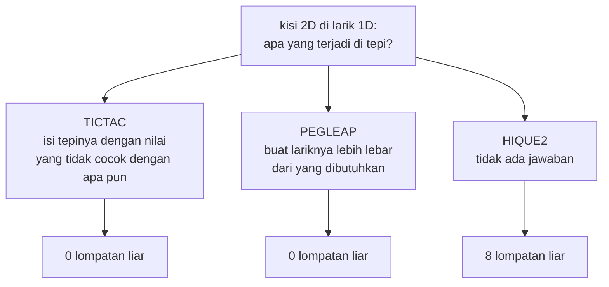

# PEGLEAP — dari BASIC 1982 ke web

| | |
|---|---|
| Sumber | `run/PEGLEAP.BAS` — Friendlyware PC Introductory Set |
| Tahun | 1982 |
| Ukuran asli | 202 baris |
| Hasil port | [`../games/pegleap/`](../games/pegleap/index.html) |
| Analisis BASIC | [`../../reviews/PEGLEAP.md`](../../reviews/PEGLEAP.md) |

Peg solitaire Inggris — teka-teki yang **persis sama** dengan
[HIQUE2](hique2.md) di koleksi ini. Papan salib 33 lubang, tengah kosong,
lompati satu pasak ke lubang di seberangnya.

Justru karena teka-tekinya sama, dua program ini jadi perbandingan yang
langka: **dua penyelesaian atas satu masalah yang sama, di satu koleksi**.
Yang satu benar, yang satu tidak — dan bedanya cuma dua kolom.

---

## 1 · Kisinya sembilan kolom, dan itu yang menyelamatkannya

Papan disimpan sebagai `DIM B(70)` — larik lurus selebar **sembilan**. Aturan
lompatnya aritmetika murni:

```basic
840 IF ((Z+P)/2)=INT((Z+P)/2) THEN 850 ELSE <tolak>   ' titik tengah harus bulat
850 IF (ABS(Z-P)-2)*(ABS(Z-P)-18)<>0 THEN <tolak>     ' 2 mendatar, 18 menegak
820 IF B(P)=0 OR B(P)=-7 THEN <tolak>                 ' 0 = bukan lubang
```

Selisih **2** = mendatar, **18** = menegak (dua baris × sembilan kolom).

Aritmetika indeks seperti ini biasanya membungkus tepi. Dari kolom 8, `+2`
mendarat di kolom **1 baris berikutnya** — bukan di luar larik, melainkan di
tempat yang sah tapi salah.

Tapi salibnya hanya memakai **kolom 2 sampai 8**. Kolom 0 dan 1 tidak pernah
jadi lubang, jadi `B()`-nya nol seumur hidup program, dan baris 820
menolaknya.

Diperiksa dengan membangkitkan seluruh lompatan menurut aturan itu lalu
membandingkannya dengan geometri papan:

| | |
|---|--:|
| Diterima aturan PEGLEAP | **76** |
| Mungkin secara geometris | **76** |
| Lompatan liar | **0** |

Pagarnya **ada** — hanya saja berupa "kolom yang kebetulan tidak dipakai",
bukan nilai penjaga yang sengaja ditulis.

---

## 2 · Tiga program, satu masalah, tiga jawaban

Menyimpan kisi dua dimensi di dalam larik satu dimensi selalu memunculkan
pertanyaan yang sama: **apa yang terjadi di tepi?** Koleksi ini menjawabnya
tiga kali, dan ketiganya berbeda.

| Program | Cara | Lompatan liar |
|---|---|--:|
| [TICTAC](tictac.md) | **pagar tersurat** — papan 3×3 di dalam larik 5×5, enam belas sel pinggir diisi nilai penjaga 3 | 0 |
| **PEGLEAP** | **pagar tersirat** — kisi sembilan kolom; sel yang bukan lubang bernilai 0 dan ditolak | 0 |
| [HIQUE2](hique2.md) | **tidak ada** — kisi maya tujuh kolom, mepet | **8** |



### Yang perlu dinyatakan jujur

Pagar PEGLEAP mungkin **tidak disengaja**.

Lebar sembilan bisa saja dipilih karena `B(70)` enak dihitung, atau karena
lariknya harus memuat 33 lubang dengan penomoran yang rapi — bukan karena
penulisnya memikirkan apa yang terjadi di kolom 8.

Kalau begitu, ia benar dengan cara yang **sama rapuhnya** dengan bug cakram di
[TOWERS](towers.md): aman karena kebetulan, bukan karena dijaga. Persempit
kisinya jadi tujuh kolom — hemat 14 sel — dan ia berubah jadi HIQUE2.

> **Pelajaran.** Antara TICTAC dan PEGLEAP ada perbedaan yang tidak terlihat
> dari hasilnya: keduanya menghasilkan nol bug, tapi hanya satu yang
> **menyatakan maksudnya**. Pagar TICTAC diisi nilai 3 di baris yang jelas
> tujuannya; pagar PEGLEAP adalah dua kolom kosong yang tidak disebut di mana
> pun.
>
> Kode yang benar tanpa menyatakan kenapa ia benar akan berhenti benar begitu
> seseorang mengoptimalkannya.

Halaman portnya menggambar larik `B()` apa adanya di sebelah papan — termasuk
kedua kolom yang jadi pagar itu — supaya "kenapa ia selamat" bisa dilihat,
bukan cuma dibaca.

---

## 3 · Kursor panah, dan tampilan sebagai sumber kebenaran

Ini bedanya yang kedua dengan HIQUE2. HIQUE2 meminta pemain mengetik nomor
lubang; PEGLEAP memakai kursor yang digerakkan tombol panah:

```basic
410 KEY(11) ON:KEY(12) ON:KEY(13) ON:KEY(14) ON
430 ON KEY(11) GOSUB 500     ' panah atas
470 MOVE$=INKEY$:IF MOVE$<>CHR$(13) THEN 410
```

Lebih enak dipakai. Tapi lihat bagaimana posisinya dibaca kembali:

```basic
480 XSAVE=POS(0):XCOORD=(POS(0)-10)/6
490 YSAVE=CSRLIN:YCOORD=(CSRLIN/3)+1
```

`POS(0)` dan `CSRLIN` adalah **posisi kursor di layar**. Program tidak
menyimpan "kursor sedang di lubang mana" di mana pun — ia menyimpannya di
layar, lalu menghitungnya balik dengan membagi enam dan membagi tiga.

Itu pola yang sudah dicatat di [fondasi](_fondasi.md) sebagai yang **tidak**
ditiru, dan contoh terkenalnya di koleksi ini adalah `BOWLING.BAS` yang
membaca `SCREEN(r,c)` untuk mengetahui posisi pin.

Kenapa orang menulis begini? Karena di BASIC 1982 layar **adalah** struktur
data yang paling mudah diakses: sudah ada, sudah dua dimensi, dan tidak
memakan memori tambahan. `DIM` sebuah larik koordinat justru terasa boros.

Harganya baru terasa saat sesuatu berubah. Geser papan tiga kolom ke kanan,
dan `(POS(0)-10)/6` salah — di tempat yang sama sekali tidak berhubungan
dengan tata letak.

Di port ini `cur` adalah data biasa, dan layar digambar darinya. Arahnya sama;
sumber kebenarannya terbalik.

---

## 4 · Dari retro ke modern

| Aspek | Bentuk asli | Kendala yang melahirkannya | Bentuk sekarang & alasannya |
|---|---|---|---|
| Papan | `B(70)`, kisi sembilan kolom | Larik satu dimensi paling murah | **Dipertahankan** sebagai struktur data. Papan mainnya menggambar kolom 2–8 saja; lariknya yang utuh sembilan kolom digambar terpisah di panel "Larik `B(70)`, apa adanya" — lihat catatan di bawah |
| Panel "Cara bermain" | tidak ada (aturannya diasumsikan sudah diketahui) | Program 1982 langsung masuk permainan | Ditambahkan, terbuka, tepat di bawah papan |
| Aturan lompat | `ABS(Z-P)` = 2 atau 18 | Aritmetika indeks | Dipertahankan persis; dibangkitkan ulang saat halaman dimuat, bukan disalin sebagai daftar |
| Kursor | `ON KEY(11..14)`, posisi dibaca dari `POS(0)`/`CSRLIN` | Layar sebagai struktur data | Panah dipertahankan; posisinya jadi data, bukan dibaca balik dari tampilan (§3) |
| Pasak / lubang | `PEG$="o"`, `HOLE$=" "` | Layar teks | Lingkaran di dalam lubang |
| Jeda | `FOR DD=1 TO 1000:NEXT` | Tidak ada pewaktu | Dibuang; tidak ada yang perlu ditunggu |
| Mundur | tidak ada | Tidak ada memori riwayat | Ditambahkan (`Z` atau tombol) |
| Rekor | tidak ada | Tidak ada penyimpanan | `localStorage` |

Satu hal yang **tidak** ditambahkan di sini, padahal ada di HIQUE2:
penyelesai otomatis. Alasannya sederhana — teka-tekinya sama persis, jadi
menaruh penyelesai kedua hanya menggandakan kode tanpa menambah apa pun.
Kalau Anda ingin melihat penyelesaiannya, [HIQUE2](hique2.md) punya.

### Kenapa papan mainnya berhenti menggambar sembilan kolom

Versi pertama halaman ini menggambar papan pada kesembilan kolom `B(70)`,
supaya dua kolom yang jadi pagar (§1) ikut terlihat. Niatnya benar; hasilnya
tidak.

Kolom 0 dan 1 tidak pernah berisi apa pun. Sel yang bukan lubang digambar
`background: none` — jadi yang muncul di sana bukan "dua kolom kosong yang
bicara", melainkan **ruang putih yang tidak bicara apa-apa**. Sementara itu
kisi sembilan kolomnya yang dipusatkan di panel, bukan salibnya, sehingga
salib duduk **46px di sebelah kanan** titik tengah. Papan terlihat miring,
dan pagarnya tetap tidak kelihatan. Biaya visual dibayar penuh, imbalan
pedagogisnya nol.

Sekarang pagar itu ditunjukkan di satu tempat saja: panel **"Larik `B(70)`,
apa adanya"**, yang memang menggambar kesembilan kolom lengkap dengan nilai
`0`-nya. Di sana kolom 0 dan 1 punya warna dan angka — argumennya benar-benar
terbaca. Papan mainnya kembali jadi papan main.

Jumlah kolom papan **dihitung dari `HOLES`**, bukan ditulis `7`:

```js
const C0 = Math.min(...HOLES.map(colOf));
const C1 = Math.max(...HOLES.map(colOf));
```

Alasannya sama dengan alasan `JUMPS` dibangkitkan ulang alih-alih disalin
(§1): kalau daftar lubangnya diubah, papannya ikut berubah, dan tidak ada
angka yang diam-diam jadi bohong. Latihan 1 di bawah — yang meminta Anda
mempersempit `W` jadi 7 — tetap berjalan seperti sebelumnya; yang berubah
cuma lebar gambarnya, bukan aritmetikanya.

Ini penyimpangan karena **selera visual**, dan dinyatakan begitu: tidak ada
kendala teknis yang memaksanya. Yang membuatnya bisa dipertanggungjawabkan
adalah bahwa pelajarannya tidak hilang, hanya pindah ke tempat yang benar.

---

## 5 · Latihan

1. **Persempit kisinya.** Ubah `W` di `pegleap.js` dari 9 jadi 7 dan
   sesuaikan indeks lubangnya. Berapa lompatan liar yang muncul? Bandingkan
   dengan delapan milik HIQUE2 — apakah persis sama?

2. **Nyatakan pagarnya.** Tambahkan sesuatu ke kode PEGLEAP yang membuat
   maksud kedua kolom kosong itu **tersurat** — komentar, konstanta bernama,
   atau pemeriksaan kolom. Mana yang paling kecil kemungkinannya dihapus orang
   berikutnya?

3. **Cari pola yang sama.** `POS(0)` dan `CSRLIN` dipakai sebagai penyimpan
   keadaan di beberapa program lain. Temukan satu, dan tuliskan apa yang akan
   rusak kalau tata letak layarnya digeser.

4. **Bandingkan dua penyandian.** PEGLEAP dan HIQUE2 memainkan teka-teki yang
   sama dengan penomoran yang berbeda. Tulis fungsi yang menerjemahkan nomor
   lubang PEGLEAP ke nomor lubang HIQUE2. Berapa baris? Apa yang membuat salah
   satunya lebih enak dipakai manusia, dan yang lain lebih enak dipakai
   aritmetika?

---

Berkas terkait: [mainkan](../games/pegleap/index.html) ·
[HIQUE2 — teka-teki sama, kisi mepet](hique2.md) ·
[TICTAC — pagar tersurat](tictac.md) ·
[TOWERS — aman karena kebetulan juga](towers.md) · [fondasi](_fondasi.md)
