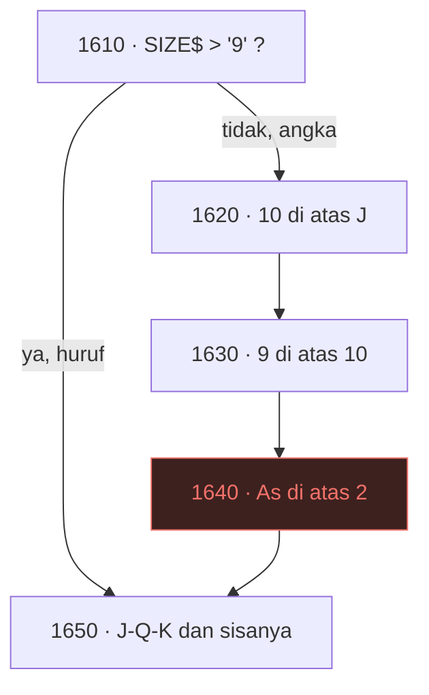

# SOLITAIR — dari BASIC 1982 ke web

| | |
|---|---|
| Sumber | `run/SOLITAIR.BAS` — "The Game of Klondyke Solitar" |
| Penulis | Jeff Littlefield, 1982; diubah Ken Handzik 27/11/1983; direvisi Littlefield 2/2/1984 |
| Ukuran asli | 313 baris |
| Hasil port | [`../games/solitair/`](../games/solitair/index.html) |
| Analisis BASIC | [`../../reviews/SOLITAIR.md`](../../reviews/SOLITAIR.md) |
| Peran | **pilot komponen kartu** — 11 program kartu berikutnya memakai `_shared/cards.js` |

Klondike buang-tiga, lengkap: tujuh tumpukan, empat fondasi, kartu tertutup
yang terbuka sendiri, klaim kemenangan, dan spanduk bintang di akhir.

Program ini istimewa di koleksi karena dua alasan yang berlawanan. Ia
mengandung **satu baris yang tidak pernah dijalankan sejak 1982**, dan
sekaligus satu-satunya program yang **menyemai pengacaknya dengan benar**
setelah lima program sebelumnya gagal.

---

## 1 · Baris yang tidak pernah dijalankan

```basic
1610 IF SIZE$>"9" THEN 1650
1620 IF SIZE$="0" AND SIZEST$="J" THEN 1700
1630 IF SIZE$="9" AND SIZEST$="0" THEN 1700
1640 IF SIZE$="A" AND SIZEST$="2" THEN 1700
1650 IF SIZE$="J" AND SIZEST$="Q" THEN 1700
```

Untuk melihat masalahnya, kita harus tahu dulu bagaimana pangkat disimpan.

### Satu huruf per pangkat

```basic
560 DATA" A"," 2"," 3"," 4"," 5"," 6"," 7"," 8"," 9","10"," J"," Q"," K"
    SIZE$ = MID$(W$,2,1)          ' huruf KEDUA
```

Tiap pangkat ditulis dua karakter dan yang dibaca hanya karakter kedua. Jadi:

| Pangkat | Disimpan | `SIZE$` | ASCII |
|---|---|---|--:|
| As | `" A"` | `A` | 65 |
| 2–9 | `" 2"`…`" 9"` | `2`…`9` | 50–57 |
| **10** | `"10"` | **`0`** | 48 |
| J Q K | `" J"` … | `J` `Q` `K` | 74 81 75 |

Sepuluh menjadi `"0"` — trik yang manis, karena `"0"` lebih kecil daripada
`"9"` persis seperti sepuluh harus dianggap "di atas" sembilan dalam
perbandingan yang lain. Baris 1630 memanfaatkannya langsung.

### Lalu satu baris tersandung

Baris 1610 berkata: **kalau pangkatnya berupa huruf, lompat ke 1650.**

Dan `"A"` adalah huruf. ASCII 65 > 57.



Baris 1640 hanya bisa dicapai lewat jalur angka, tapi satu-satunya pangkat
yang diurusnya adalah `"A"` — yang selalu lewat jalur huruf. **Kode mati,
sejak hari pertama.**

### Bukti, bukan dugaan

Menelusuri seluruh 13 × 14 pasangan pangkat (13 kartu × 13 kartu + tempat
kosong) lewat baris 1610–1690 apa adanya:

| Baris | Berapa kali menerima langkah |
|---|--:|
| 1620 (10 di atas J) | 1 |
| 1630 (9 di atas 10) | 1 |
| **1640 (As di atas 2)** | **0** |
| 1650 (J di atas Q) | 1 |
| 1660 (Q di atas K) | 1 |
| 1670 (K ke tempat kosong) | 1 |
| 1680 (angka turun satu) | 7 |

Dan dibandingkan dengan aturan Klondike sesungguhnya, **tepat satu**
ketidakcocokan: `('A', '2')` — sah menurut aturan, tertolak oleh program.

> **Pelajaran.** Kode mati jarang terlihat seperti kode mati. Baris 1640 ada
> di tempat yang benar, berisi aturan yang benar, ditulis dengan gaya yang
> sama persis dengan tetangganya. Yang membunuhnya adalah baris **tiga puluh
> karakter di atasnya**, yang dirancang untuk kepentingan lain.
>
> Penulisnya menguji "apakah ini huruf?" untuk memisahkan J/Q/K dari angka,
> dan lupa bahwa As juga huruf. Perbandingan ASCII terhadap tipe data yang
> dipalsukan sebagai teks memang begitu: ia bekerja sampai satu anggota
> keluar dari kelompok yang Anda bayangkan.

Di port ini baris itu hidup:

```js
function bolehTumpuk(c, target) {
  if (!target) return c.v === 13;               // 1670: hanya Raja
  if (c.color === target.color) return false;   // 1590-1600
  return target.v - c.v === 1;                  // termasuk As di atas 2
}
```

Perhatikan bahwa versi ini **tidak punya tempat untuk bug yang sama**, karena
pangkat disimpan sebagai angka 1–13, bukan sebagai huruf yang kebetulan bisa
dibandingkan. Bugnya bukan hilang karena diperbaiki; ia hilang karena
representasinya diganti.

### Dan seberapa besar pengaruhnya? Nol.

Pertanyaan yang jujur: apakah bug ini pernah merugikan pemain?

Diukur dengan penyelesai serakah atas 400 papan, sekali dengan baris 1640
mati dan sekali dengan baris itu hidup:

| | Menang | Rata-rata kartu ke fondasi |
|---|--:|--:|
| baris 1640 mati (asli) | 4 / 400 | 6,5 |
| baris 1640 hidup (port) | 4 / 400 | 6,5 |

**Sama persis.** Alasannya begitu dilihat jadi jelas: kalau sebuah As
terbuka, mengirimnya ke fondasi selalu lebih baik daripada menumpuknya di
atas 2. Langkah yang diblokir baris 1610 adalah langkah yang hampir tidak
pernah ingin dilakukan siapa pun.

> Jadi perbaikan ini dilakukan **karena kodenya sendiri menyatakan maksud
> sebaliknya**, bukan karena berdampak. Dua alasan itu berbeda, dan
> membedakannya penting: kalau saya menuliskan "diperbaiki" tanpa mengukur,
> pembaca akan menyimpulkan dampaknya besar. Ternyata nol.

Angka yang sama juga menjelaskan kenapa bugnya bertahan sejak 1982 sampai
sekarang tanpa ada yang melaporkannya.

---

## 2 · Kenapa penunjuknya mulai di 31

```basic
550 DECKPTR=31 : ENDDECK=52 : DECK$(28)="   " : NC=24
```

Empat angka, dan tiga di antaranya menjelaskan seluruh aturan buangan.

- Tumpukan mengambil kartu 1–28 (1+2+…+7).
- Sisanya, **29–52**, adalah buangan: 24 kartu, cocok dengan `NC=24`.
- Jadi penunjuk seharusnya mulai di 29. Ia mulai di **31**.

Selisih dua itu bukan kekeliruan. `DECKPTR-28` ditampilkan sebagai
`Card #`, dan di awal permainan ia menunjukkan **3**. Ini Klondike
**buang-tiga**, dan keadaan awalnya sengaja dibuat seolah pemain sudah
sekali menekan `N`.

```basic
1220 IF DECKPTR+3>ENDDECK THEN DECKPTR=28
1230 X=ENDDECK-28
1240 IF X<=3 THEN DECKPTR=ENDDECK ELSE DECKPTR=DECKPTR+3
```

Dan `DECK$(28)="   "` adalah **penjaga**: sebuah "kartu kosong" tepat sebelum
kartu pertama. Saat penunjuk memutar kembali ke pangkal, ia mendarat di
sana — bukan di luar larik, dan bukan di sebuah nilai yang perlu diperiksa
khusus. Semua kode yang menggambar tinggal menulis `DECK$(DECKPTR)`.

Ini pola penjaga yang sama dengan [OTHELLO](othello.md) (bingkai 10×10),
[TICTAC](tictac.md) (5×5), dan [PEGLEAP](pegleap.md) (kisi selebar 9) —
kemunculan kelimanya di koleksi ini, dan yang paling ringkas: **satu elemen**.

### Yang berubah di port

```js
at = 0; ambil();          // bukan: at = 3
```

Angka 3 tidak ditulis di mana pun. Keadaan awal dibuat dengan **menjalankan
aturannya sekali**. Kalau suatu hari aturannya jadi buang-satu, yang berubah
hanya satu tempat, dan keadaan awalnya ikut benar dengan sendirinya.

> **Pelajaran.** Kalau sebuah nilai awal adalah *hasil* dari sebuah aturan,
> jalankan aturannya — jangan menyalin hasilnya. Angka 31 benar, tapi ia
> tidak memberi tahu siapa pun **kenapa** 31.

---

## 3 · Penyemaian keenam, dan yang pertama benar

```basic
220 RANDOMIZE(VAL(MID$(TIME$,7,2)) + (VAL(MID$(TIME$,4,2))*60))
```

`RANDOMIZE` dari jam sudah muncul lima kali di koleksi ini dan **kelimanya
salah**, masing-masing dengan cara berbeda:

| Program | Bentuk salahnya |
|---|---|
| [MASTER](master.md) | di dalam perulangan angka rahasia |
| [MAZE](maze.md) | dua kali, dari keluarannya sendiri |
| [MAXIT1](maxit1.md) | dua kali dari sumber yang sama |
| `WILDCAT.BAS` | dari keluarannya sendiri |
| [BOGGY](boggy.md) | di dalam gelung penolakan |
| **SOLITAIR** | **benar** |

Dan ia benar di tiga hal sekaligus, yang layak dipisah karena masing-masing
adalah kesalahan tersendiri kalau dilanggar:

**Jangkauan.** `RIGHT$(TIME$,2)` hanya memberi detik: 60 kemungkinan benih,
jadi 60 permainan yang mungkin. Menambahkan menit × 60 membuatnya
0–3599. Masih tidak besar, tapi enam puluh kali lebih baik, dan gratis.

**Tempat.** Sekali, di baris 220, di luar segalanya. Bukan di dalam
pengocokan, bukan di dalam gelung.

**Main ulang.** Ini yang paling halus:

```basic
340 IF FLAG=1 AND WON THEN 230 ELSE IF FLAG=1 THEN CLS:...:GOTO 250
```

Main lagi melompat ke **230** atau **250** — keduanya **melewati** baris 220.
Penulisnya tidak menyemai ulang. Deret acaknya berjalan terus, jadi papan
kedua benar-benar berbeda dari papan pertama.

> **Pelajaran.** Lima program gagal pada perkakas yang sama, satu berhasil.
> Bedanya bukan kepandaian — bedanya adalah **memahami bahwa `RANDOMIZE`
> menyetel titik awal, bukan mengaduk**. Sekali paham, ketiga keputusan di
> atas jadi jelas dengan sendirinya.

---

## 4 · Pengocokan, diuji bersama pembandingnya

```basic
410 FOR I=52 TO 1 STEP -1
420   X=INT(RND(1)*I)+1      ' undi dari sisa yang belum terpakai
430   DECK$(I)=CARD$(X)      ' pindahkan yang terundi ke hasil
440   CARD$(X)=CARD$(I)      ' tutup lubangnya dengan yang terakhir
450 NEXT I
```

Ini Fisher–Yates yang benar, dan kuncinya baris 440. [MAXIT1](maxit1.md)
mengocok dengan **menggeser** seluruh sisa larik untuk menutup lubang; ini
**menukar**.

Pertanyaannya: apakah keduanya sama-sama seragam, atau salah satu bias?
Diuji dengan khi-kuadrat atas 200.000 kocokan, tabel 52 posisi × 52 kartu:

| Cara | χ² | Kesimpulan |
|---|--:|---|
| SOLITAIR (tukar) | 2777 | seragam, **O(n)** |
| MAXIT1 (geser) | 2687 | seragam, O(n²) |
| kontrol: undi dari seluruh 52 | 137 362 | **bias** |

Derajat bebas 2601, ambang 99,9% = 2830.

Baris ketiga itu penting: tanpa pembanding yang **memang salah**, "lulus uji"
tidak membuktikan apa-apa — bisa saja ujinya yang tidak bisa gagal. Kontrol
itu adalah kesalahan pengocokan paling terkenal (`for i: swap a[i], a[acak
0..51]`), dan ujinya menolaknya dengan telak.

> **Catatan menyusul.** Kontrol itu ternyata bukan karangan. Empat sesi
> kemudian ia ditemukan hidup di koleksi ini, di `BJ.BAS` baris 260 —
> program blackjack empat dek yang justru punya penanganan sepatu paling
> canggih di seluruh koleksi. Lihat [blackjack §4](blackjack.md).

Jadi perbedaan SOLITAIR dan MAXIT1 adalah **biaya, bukan kebenaran** — dan
itu kesimpulan yang berbeda dari yang saya duga sebelum mengukur.

---

## 5 · Komponen kartu: apa yang ditetapkan sesi ini

Program ini pilot. Sebelas program kartu berikutnya (`21`, `BJ`, `BLACK`,
`BLACKJCK`, `CRAZY8`, `KENO`, `YAHTZEE`, `CRAPS`, `DOMINOES`, `MATCH`,
`BACKGAM`) akan memakai apa yang diputuskan di sini, jadi keputusannya
ditulis di sini juga.

### Yang masuk ke `_shared/cards.js`

Hanya yang tidak tahu apa-apa soal solitaire: bentuk kartu, setumpuk 52,
nama untuk pembaca layar, dan penggambaran (muka, punggung, tempat kosong).
Aturan permainan tinggal di berkas permainannya.

Urutan lambangnya bukan dikarang: ia mengikuti `CHR$(3)`–`CHR$(6)` dari baris
390, yang di halaman kode 437 IBM PC persis hati, wajik, keriting, sekop.

### Yang sengaja TIDAK masuk

**Pengocokan.** `rng.js` sudah punya Fisher–Yates. Menaruh salinan kedua di
`cards.js` berarti dua algoritma identik di satu proyek, yang lambat laun
akan berbeda tanpa ada yang memutuskannya. Ini persis kesalahan yang baru
saja diperbaiki pada panel *Cara Bermain* MAXIT/BOGGY — jadi tidak diulang.

**Dadu, domino, dan papan backgammon.** Tiga dari sebelas program itu bukan
permainan kartu. Memaksanya masuk ke modul kartu akan membuat modulnya kabur
sejak awal. Masing-masing akan dapat modulnya sendiri — kalau memang terbukti
dipakai lebih dari sekali.

### Kartu tidak ikut berganti tema

Satu keputusan yang perlu dinyatakan terang-terangan: muka kartu tetap
terang, merah tetap merah, hitam tetap hitam — di tema gelap maupun terang.

Alasannya, seluruh aturan solitaire bertumpu pada perbedaan merah/hitam.
Kalau muka kartu ikut menggelap, dua warna itu berhenti berarti apa-apa. Yang
berganti tema adalah **mejanya**, dan itu memang sesuai: meja adalah perabot,
kartu adalah benda yang diletakkan di atasnya.

Ini satu-satunya tempat di seluruh proyek yang punya paletnya sendiri di luar
token tema, dan alasannya ditulis di `cards.css` supaya tidak ada yang
"merapikannya" nanti.

---

## 6 · Dari retro ke modern

| Aspek | Bentuk asli | Kendala | Bentuk sekarang & alasannya |
|---|---|---|---|
| Kartu | Dua karakter + `CHR$(3..6)`, warna dari `COLOR 12/0` | Layar teks 80×25, 16 warna | Elemen HTML dengan sudut indeks; pangkat jadi **angka 1–13**, bukan huruf — inilah yang membuat bug §1 tidak punya tempat |
| Pangkat 10 | Disimpan `"10"`, dibaca `"0"` | Satu karakter per pangkat | `v = 10`; tipuan `"0"` tidak diperlukan lagi |
| Langkah | Perintah dua huruf lewat `INKEY$` | Tidak ada tetikus | Klik-lalu-klik, **seret**, klik ganda ke fondasi — **dan** perintah aslinya tetap hidup di kotak *Perintah 1984* |
| Deret antar tumpukan | Selalu seluruh deret terbuka (baris 1920/2030) | Perintah dua huruf tak bisa menyatakan "mulai dari kartu mana" | **Diubah** ke aturan Klondike: yang terangkat adalah kartu yang dipegang ke bawah (§7). Jalur perintah `##` tetap memindahkan seluruh deret |
| As di atas 2 | Baris 1640 tidak pernah jalan | — | **Diperbaiki** (§1), satu-satunya aturan yang diubah |
| Penunjuk buangan | `DECKPTR=31` ditulis langsung | — | Dibuat dengan menjalankan aturannya sekali (§2) |
| Tertutup vs buangan | Satu kartu saja yang digambar | Layar teks 80×25 | Tumpukan tertutup dan buangan **digambar terpisah**, tiga kartu buangan terlihat. `at` memang selalu memisahkan keduanya; aslinya hanya tak punya tempat menggambarnya |
| Turun dari fondasi | Tidak ada perintahnya sama sekali | — | **Diizinkan** — aturan Klondike, dan kadang satu-satunya jalan keluar (§7) |
| Penjaga | `DECK$(28)="   "` | Tidak ada nilai kosong | Indeks `at = 0` berarti "tidak ada kartu"; penjaganya jadi angka, bukan spasi |
| Waktu | `TIME$` dicetak ulang tiap putaran `INKEY$` | Tidak ada pewaktu | `RETRO.clock()` — berhenti saat menang, bukan saat halaman tak aktif |
| Menyerah | Tawaran melihat kartu + `"Cheater... Shame Shame!"` | — | **Dipertahankan utuh**, termasuk konsekuensinya: papan yang sudah diintip tidak masuk rekor |
| Spanduk menang | 82 bintang digambar acak di `SCREEN 1` | Grafik 320×200 | Ditampilkan utuh; **82 titiknya tidak diubah satu pun** |
| Rekor | tidak ada | Tidak ada penyimpanan | `localStorage`, diukur dengan **waktu**, bukan skor |

### Tentang "Cheater"

```basic
2540 SOUND 50,5:LOCATE 24,17:PRINT"Cheater... Shame Shame!  You've already seen the cards!"
```

Program ini mengingat apakah Anda pernah mengintip, dan menegur Anda nanti.
Itu tiga baris kode untuk sesuatu yang tidak memengaruhi permainan sama
sekali — murni watak. Bagian seperti ini yang paling gampang hilang dalam
sebuah port, karena tidak ada di daftar fitur mana pun.

Yang ditambahkan port ini hanyalah **konsekuensi**: papan yang sudah diintip
tidak berhak masuk rekor. Aslinya tidak punya rekor untuk dilindungi.

### Tentang spanduk bintangnya

```basic
3040 DATA "002","006","009","010","011","014","018","023","027","030"
```

82 angka tiga digit. Digit pertama baris, dua digit terakhir kolom:

```
*   *  ***  *   *    *   *  ***  *   *
 * *  *   * *   *    *   * *   * **  *
  *   *   * *   *    * * * *   * *** *
  *   *   * *   *    * * * *   * * ***
  *   *   * *   *    * * * *   * *  **
  *    ***   ***      * *   ***  *   *
```

Dan urutan munculnya diacak dengan **pengocokan yang sama persis** seperti
kartunya (baris 2950–2970: undi, pakai, tutup lubang dengan yang terakhir).
Penulisnya memakai algoritma yang sama dua kali untuk dua keperluan yang
sama sekali berbeda — dan yang kedua bahkan bukan pengocokan, melainkan
*urutan animasi*.

---

## 7 · Di mana aturan Klondike menang atas aturan program

Tiga aturan di port ini berbeda dari aslinya, dan ketiganya perlu dibela satu
per satu. Batas yang saya pakai: **aturan yang membuat permainan ini permainan
ini dipertahankan; batasan yang hanya lahir dari antarmukanya tidak.**

| Perubahan | Kenapa |
|---|---|
| As di atas 2 | Kodenya sendiri menuliskan aturannya (baris 1640) lalu membuatnya tak terjangkau (§1) |
| Deret boleh sebagian | Baris 1920/2030 selalu memindah seluruh deret. Itu aturan **program ini**, bukan aturan Klondike |
| Turun dari fondasi | Tidak ada perintahnya. Klondike mengizinkannya |

Yang menentukan untuk dua terakhir: keduanya adalah hal yang **tidak bisa
dinyatakan oleh perintah dua huruf**. `25` tidak punya tempat untuk berkata
"mulai dari kartu keempat"; tidak ada huruf tersisa untuk "turunkan dari
fondasi". Batasannya lahir dari kolom perintah selebar dua karakter, bukan
dari pandangan penulisnya tentang solitaire.

Buktinya masih bisa dilihat: **perintah `##` di port ini tetap memindahkan
seluruh deret.** Jalur 1984 berperilaku seperti 1984; tetikuslah yang
mendapat aturan Klondike, karena tetikus memang bisa menunjuk kartu yang mana.

### Sebuah angka yang hampir saya laporkan salah

Saya ukur pengaruh dua aturan itu dengan penyelesai serakah, 2000 papan:

| Aturan | Menang |
|---|--:|
| aturan program 1984 | 31 / 2000 (1,6%) |
| + deret boleh sebagian | 13 / 2000 (0,7%) |
| + boleh turun dari fondasi | 0 / 2000 (0,0%) |

Dibaca apa adanya, tabel ini berkata **memulihkan aturan Klondike membuat
permainannya lebih sulit**. Itu tidak mungkin benar.

Alasannya bisa dibuktikan tanpa mengukur apa pun: langkah yang sah di aturan
1984 **seluruhnya masih sah** di aturan Klondike. Jadi tiap papan yang bisa
dimenangkan dulu pasti masih bisa dimenangkan sekarang — himpunan papan yang
menang hanya bisa membesar, tidak pernah mengecil.

Pemeriksaannya: dari 31 papan yang menang di baris pertama, **31 hilang dan
0 bertambah** di baris ketiga. Bukan sebagian — semuanya. Itu bukan pola
"lebih sulit", itu pola penyelesai yang **teralihkan**: langkah sebagian yang
baru tersedia menyerobot giliran lebih dulu dan membawanya ke jalan buntu
yang lain.

> **Pelajaran.** Angkanya benar; yang salah adalah apa yang saya kira
> diukurnya. Tabel itu mengukur **penyelesainya**, bukan aturannya. Sebuah
> tolok ukur hanya bisa menjawab pertanyaan kalau kebijakan di dalamnya
> dijaga tetap — dan menambah pilihan mengubah kebijakan serakah secara
> diam-diam, karena "ambil yang pertama sah" jadi menunjuk langkah yang
> berbeda.
>
> Yang menyelamatkan di sini bukan pengukuran yang lebih teliti, melainkan
> **argumen himpunan bagian** — sebuah alasan yang sudah tahu jawabannya
> sebelum angka pertama keluar.

---

## 8 · Latihan

1. **Temukan kode matinya sendiri.** Tulis ulang baris 1610–1690 di bahasa
   apa pun, lalu telusuri seluruh 13 × 14 pasangan pangkat dan catat baris
   mana yang pernah menerima langkah. Berapa lama sampai Anda melihat 1640
   tidak pernah muncul? Sekarang coba temukan dengan **membaca saja**.

2. **Ubah representasinya.** Ganti `SIZE$` satu huruf menjadi angka 1–13 di
   versi BASIC-nya. Berapa baris dari 1590–1790 yang bisa dihapus? (Jawaban
   port ini: tujuh baris jadi satu perbandingan.)

3. **Buang-satu.** Ubah aturan buangan dari tiga menjadi satu. Di aslinya,
   berapa tempat yang harus diubah? Di port ini? Selisihnya adalah harga dari
   menulis `31` alih-alih menjalankan aturannya.

4. **Deret sebagian.** Izinkan memindahkan sebagian deret terbuka, seperti
   Klondike modern. Berapa persen papan yang tadinya buntu jadi bisa
   diselesaikan? Tulis penyelesai untuk mengukurnya.

5. **Bangun penyelesai yang lebih baik.** Tabel di §7 gagal karena
   kebijakannya serakah. Tulis penyelesai yang menoleh satu langkah ke depan,
   lalu ulangi ketiga baris tabel itu. Apakah urutannya sekarang naik?

6. **Uji pengocokan Anda.** Ambil tiga cara mengocok — yang benar, yang
   O(n²), dan yang bias — lalu jalankan khi-kuadrat. Kalau ujinya tidak
   menolak yang bias, ujinya yang salah, bukan pengocokannya.

---

Berkas terkait: [mainkan](../games/solitair/index.html) ·
[fondasi §2.6 — keacakan](_fondasi.md) · [MAXIT1](maxit1.md) ·
[BOGGY](boggy.md) · [OTHELLO](othello.md) · [PEGLEAP](pegleap.md)
