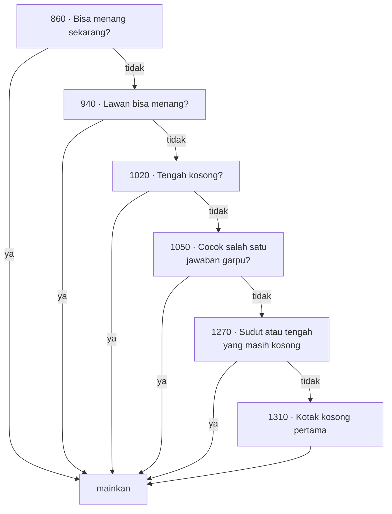

# TICTAC — dari BASIC 1982 ke web

| | |
|---|---|
| Sumber | `run/TICTAC.BAS` — Friendlyware PC Introductory Set, menu #1 pilihan N |
| Tahun | 1982 |
| Ukuran asli | 141 baris (nomor 10–1490) |
| Hasil port | [`../games/tictac/`](../games/tictac/index.html) |
| Analisis BASIC | [`../../reviews/TICTAC.md`](../../reviews/TICTAC.md) |

Tic-tac-toe adalah permainan yang sudah selesai secara matematis, jadi sebuah
port darinya seharusnya membosankan. Program ini tidak, karena dua alasan: cara
ia menyimpan papan, dan sebuah klaim di layar petunjuknya yang ternyata bisa
diuji.

---

## 1 · Papannya 5×5, bukan 3×3

```basic
120 DEFSTR Z:DIM A(9),B(9),C(24),D(7),E(18)
740 FOR A=1 TO 4
750    C(A-1)=3:C(A*5)=3:C(A*5-1)=3:C(A+20)=3
760 NEXT
```

`C(24)` adalah 25 sel. Disusun lima kolom, hasilnya:

```
   0   1   2   3   4          ·  ·  ·  ·  ·
   5   6   7   8   9          ·  1  2  3  ·
  10  11  12  13  14    -->   ·  4  5  6  ·
  15  16  17  18  19          ·  7  8  9  ·
  20  21  22  23  24          ·  ·  ·  ·  ·
```

Enam belas sel di pinggir diisi angka **3** dan tidak pernah dimainkan.
Sembilan di tengah — indeks 6, 7, 8, 11, 12, 13, 16, 17, 18 — adalah papan
sesungguhnya.

Kenapa membuang 64% larik? Karena dengan begitu **pengecekan tepi hilang sama
sekali**. Arah gerak jadi sekadar penambahan indeks:

```basic
810 DATA 1,6,5,4,-1,-6,-5,-4
```

`+1` kanan, `+5` bawah, `+6` bawah-kanan, `+4` bawah-kiri, dan negatifnya.

Sekarang bandingkan dua cara menulis "apakah ada dua berderet ke arah ini":

```basic
' tanpa pagar — harus memeriksa tepi lebih dulu
IF col < 2 AND row < 2 THEN IF B(row,col)=B(row+1,col+1) AND ...

' dengan pagar — tidak ada yang perlu diperiksa
IF C(A+D(B))=2 AND C(A+D(B)*2)=0 THEN ...
```

Baris kedua itulah yang ada di program aslinya. Sel di luar papan berisi 3, dan
3 tidak pernah sama dengan 0, 1, atau 2 — jadi perbandingannya gagal dengan
sendirinya, tanpa satu pun `IF` tambahan.

> **Namanya sentinel**, dan ia masih dipakai persis seperti ini. Mesin catur
> menyimpan papan 8×8 di dalam larik 12×12 karena kuda bisa melompat dua
> petak keluar. `strlen()` di C berhenti pada sentinel `\0`. Batas larik
> penjaga di algoritma pengurutan. Gagasannya sama: **daripada menanyakan
> "apakah saya sudah di tepi?" berkali-kali, buat tepinya menjawab sendiri.**

Halaman portnya menggambar larik 5×5 itu di sebelah papan, dibaca dari keadaan
yang sama — jadi pagarnya bisa dilihat, bukan cuma dibaca.

### Dua tabel penerjemah

```basic
820 DATA 1,2,3,0,0,4,5,6,0,0,7,8,9      ' E(): indeks berpagar -> kotak 1-9
830 DATA 6,7,8,11,12,13,16,17,18        ' A(): kotak 1-9 -> indeks berpagar
```

Pemain memikirkan kotak 1–9; algoritmanya memikirkan indeks 6–18. Dua tabel
kecil menerjemahkan bolak-balik, dan tidak ada satu pun perhitungan di antara
keduanya. Itu pola yang layak ditiru: **kalau dua bagian program butuh
penomoran yang berbeda, terjemahkan di perbatasan** — jangan paksa salah satu
memakai penomoran yang tidak cocok untuknya.

---

## 2 · "I can not be defeated !!!"

Begitu bunyi layar petunjuknya, di baris 680. Klaim seperti itu bisa diuji, dan
tidak mahal: papannya cuma sembilan kotak.

AI-nya diport ke Python apa adanya, lalu seluruh pohon permainan ditelusuri —
manusia mencoba **setiap** langkah yang mungkin di **setiap** giliran, dari
kedua kemungkinan siapa yang jalan duluan.

| | |
|---|---|
| Permainan diperiksa | **549** |
| Komputer menang | 412 |
| Seri | 137 |
| **Komputer kalah** | **0** |
| Jatuh ke jalur darurat `RUN` (baris 1340) | 0 |

Klaimnya benar.

Dan itu tidak sepele, karena **AI-nya bukan minimax**. Tidak ada penelusuran ke
depan sama sekali, tidak ada penilaian posisi. Hanya enam aturan yang diperiksa
berurutan:



Aturan keempat itulah yang menarik. Ia bukan aturan, melainkan **daftar**:

```basic
1050 IF C(6)<>1 THEN 1100
1060 IF C(13)<>1 THEN 1080
1070 IF C(8)=0 THEN N=8:GOTO 1040
1080 IF C(17)<>1 THEN 1100
1090 IF C(16)=0 THEN N=16:GOTO 1040
…
```

Sebelas baris seperti itu, masing-masing menangani satu bentuk jebakan garpu.
Tidak ada polanya. Ini hasil seseorang duduk, memainkan semua kemungkinan
dengan tangan, dan menuliskan jawabannya satu per satu.

> **Yang bisa dipelajari.** Untuk ruang masalah yang cukup kecil, tabel
> jawaban yang ditulis tangan bisa mengalahkan algoritma umum — lebih cepat,
> lebih hemat memori, dan bisa diverifikasi habis-habisan. Batasnya jelas:
> begitu papannya jadi 4×4, pendekatan ini runtuh dan minimax menang telak.
>
> Pertanyaan yang tepat bukan "mana yang lebih canggih", melainkan **"seberapa
> besar ruang masalahnya, dan apakah ia akan tumbuh"**.

Di mesin 4,77 MHz dengan 64 KB, pilihan ini bukan kemalasan — ia satu-satunya
yang muat.

Halaman portnya menyorot aturan mana yang menyala pada tiap langkah komputer.
Aslinya tidak punya cara memperlihatkan penalarannya sendiri; ini tambahan
murni, dan alasannya pedagogis.

---

## 3 · Yang tidak bisa dilakukan program aslinya

**Ia tidak bisa mendeteksi manusia menang.**

```basic
160 FOR A=6 TO 18:IF C(A)<>0 THEN NEXT:GOSUB 1350:GOTO 140
170 IF W<>1 THEN 150 ELSE GOSUB 1350:GOTO 140
```

Baris 160 memeriksa papan penuh (seri). Baris 170 memeriksa `W=1` — bendera
yang hanya dipasang oleh rutin kemenangan **komputer**. Tidak ada satu pun
tempat yang menanyakan apakah manusia sudah punya tiga berderet.

Itu bukan kelalaian sembarangan; ia konsekuensi wajar dari yakin bahwa AI-nya
tidak bisa kalah. Dan kita sudah tahu keyakinan itu benar.

Tapi ia mengubah "tidak pernah kalah" dari **sifat yang diperiksa** menjadi
**asumsi yang dipegang** — dan program yang memegang asumsi tanpa memeriksanya
akan berperilaku aneh, bukan gagal dengan jelas, kalau asumsinya suatu saat
tidak berlaku.

Di port ini kemenangan manusia **diperiksa**, dan kalau terjadi, halaman
mengatakan terus terang bahwa ada yang salah pada portingnya. Itu bukan
menambah fitur; itu memasang alarm di tempat yang dulu kosong.

> **Pelajaran.** Kalau sebuah program bergantung pada suatu hal yang mustahil,
> tetap periksa hal mustahil itu — bukan karena Anda ragu, tapi karena
> pemeriksaan itulah yang akan memberi tahu Anda ketika asumsinya patah.

---

## 4 · Dari retro ke modern

| Aspek | Bentuk asli | Kendala yang melahirkannya | Bentuk sekarang & alasannya |
|---|---|---|---|
| Papan | 5×5 berpagar di `C(24)` | Menghemat perbandingan tepi di CPU 4,77 MHz | **Dipertahankan persis.** Justru inilah pelajarannya, jadi ia ditampilkan, bukan disembunyikan |
| AI | Enam aturan berurutan, 1050–1240 ditulis tangan | Tidak ada memori untuk penelusuran | **Dipertahankan persis**, termasuk `ELSE` berlapis di baris 1210–1230 |
| Gambar X/O | Karakter blok `▓` tiga baris (baris 490–560) | Mode teks 80×25 | SVG: dua garis untuk X, satu lingkaran untuk O. Warnanya tetap merah/hijau, mengikuti `COLOR 12`/`COLOR 10` |
| Masukan | `ON KEY(1..9) GOSUB` + `INKEY$` | Tidak ada tetikus | Klik kotak **atau** tekan angka 1–9. Keduanya, karena keduanya wajar sekarang |
| Kalah/seri | Hanya seri dan kalah komputer yang dideteksi | Percaya pada AI-nya | Kemenangan manusia ikut diperiksa (lihat §3) |
| Ulang main | `RUN` — memuat ulang seluruh program | Cara termurah membersihkan keadaan | Keadaan disetel ulang di tempat; skor bertahan |
| Keluar | `RUN "menu"` | Tiap program adalah berkas terpisah | Tautan kembali di bilah atas |
| Skor | tidak ada | Tidak ada penyimpanan | `localStorage`, dengan tombol reset |

### Jeda 420 ms sebelum komputer melangkah

Aslinya seketika — AI-nya cuma beberapa perbandingan. Di port ini ada jeda
420 ms sebelum jawabannya muncul, dan itu **penyimpangan yang murni rasa**:
lawan yang menjawab dalam nol detik terasa seperti kesalahan tampilan, bukan
seperti sedang berpikir.

Itu dinyatakan sebagai selera, bukan keharusan.

---

## 5 · Sebelum & sesudah

```basic
860 FOR A=6 TO 18
870   IF C(A)<>2 THEN 930
880   FOR B=0 TO 7
890    IF A+2*D(B)<6 OR A+2*D(B)>18 THEN 920
900     IF C(A+D(B))=2 AND C(A+D(B)*2)=0 THEN N=A+D(B)*2:W=1:GOTO 1040
910     IF C(A+D(B))=0 AND C(A+D(B)*2)=2 THEN N=A+D(B):W=1:GOTO 1040
920   NEXT
930 NEXT
```

```js
for (let a = 6; a <= 18; a++) {
  if (c[a] !== ROBOT) continue;
  for (const d of DIRS) {
    const far = a + 2 * d;
    if (far < 6 || far > 18) continue;      // baris 890
    if (c[a + d] === ROBOT && c[far] === EMPTY) return { at: far, rule: 'win' };
    if (c[a + d] === EMPTY && c[far] === ROBOT) return { at: a + d, rule: 'win' };
  }
}
```

Nyaris satu lawan satu. Yang hilang cuma nomor barisnya.

Perhatikan baris 890 yang saya salin apa adanya. Ia terlihat seperti
pengecekan tepi — padahal bukan. Sel 9, 10, 14, dan 15 ada di dalam jangkauan
6–18 tapi berisi pagar, jadi yang benar-benar menyaringnya tetap angka 3.
Yang dikerjakan baris 890 adalah **menjaga indeks larik tetap sah** (`A+2*D`
bisa jadi −6 atau 30), bukan menjaga papan.

Dua tugas yang kelihatan sama, dikerjakan oleh dua mekanisme berbeda, di baris
yang sama. Itu jenis kerumitan yang hanya terlihat kalau kodenya dibaca pelan.

---

## 6 · Latihan

1. **Lepas pagarnya.** Tulis ulang pengecekan tiga-berderet memakai papan 3×3
   biasa dan indeks `(baris, kolom)`. Berapa banyak `IF` tambahan yang muncul?
   Sekarang bayangkan menuliskannya untuk papan catur 8×8 dengan langkah kuda.

2. **Cari batas AI-nya.** Ubah `DIRS` supaya hanya berisi empat arah
   (`+1, +5, +6, +4`) alih-alih delapan. Apakah AI-nya masih tak terkalahkan?
   Kenapa delapan arah dibutuhkan padahal tiap garis diperiksa dua kali?

3. **Buktikan sendiri.** Tulis penelusur pohon permainan seperti yang dipakai
   di §2 — sekitar empat puluh baris. Lalu rusak satu aturan dengan sengaja
   (misalnya hapus baris `if (c[12] === EMPTY)`) dan lihat berapa banyak
   kekalahan yang muncul.

4. **Bandingkan dengan minimax.** Tulis AI minimax untuk papan yang sama, lalu
   bandingkan: berapa posisi yang dievaluasi tiap langkah, dan berapa baris
   kodenya? Mana yang lebih pendek — dan apakah yang lebih pendek itu yang
   lebih mudah dipercaya?

5. **Kotak yang tidak pernah dipilih.** Baris 1270 memindai indeks genap
   6, 8, 10, 12, 14, 16, 18. Dua di antaranya adalah pagar. Apakah itu
   disengaja, atau kebetulan yang menguntungkan? Petunjuk: apa jadinya kalau
   papannya 4×4 di larik 6×6?

---

Berkas terkait: [mainkan](../games/tictac/index.html) ·
[fondasi](_fondasi.md) · [teknik SVG](_teknik-svg.md) ·
[15PUZZLE — papan sebagai larik lurus juga](15puzzle.md)
