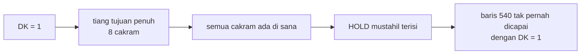

# TOWERS — dari BASIC 1982 ke web

| | |
|---|---|
| Sumber | `run/TOWERS.BAS` — Friendlyware PC Introductory Set, menu #1 pilihan P |
| Tahun | 1982 (pembaruan terakhir 1 Sep 1982, 10:00 pagi — tertulis di baris 1) |
| Ukuran asli | 131 baris (nomor 1–1500), **nol komentar** |
| Hasil port | [`../games/towers/`](../games/towers/index.html) |
| Analisis BASIC | [`../../reviews/TOWERS.md`](../../reviews/TOWERS.md) |

Menara Hanoi delapan cakram. Teka-teki yang sudah dipecahkan sejak 1883, jadi
yang menarik di sini bukan permainannya — melainkan sebuah angka di layar
petunjuknya yang ternyata salah, dan sebuah bug yang tidak pernah meledak.

---

## 1 · Angka yang salah

Baris 1150–1200 menulis:

> *"This may take all of two hundred fifty-three moves."*

Angka sebenarnya **255**.

Ini bukan soal tafsir. Jumlah langkah terpendek untuk memindahkan *n* cakram
antar dua tiang adalah `2ⁿ − 1`, dan untuk delapan cakram itu 255. Tapi program
ini punya dua kekhasan yang membuat rumus bakunya patut diperiksa ulang, bukan
diasumsikan:

1. Cakram dimulai di tiang **tengah**, bukan paling kiri (baris 890).
2. Tujuannya boleh tiang luar **mana saja** (baris 1380–1430 menghitung tiang 1
   *dan* tiang 3).

Kebebasan memilih tujuan terlihat seperti kelonggaran yang menghemat langkah.
Jadi angkanya dihitung ulang dengan penelusuran melebar (BFS) atas seluruh
ruang keadaan — bukan dengan rumus:

| Cakram | BFS (mulai dari tengah, tujuan bebas) | 2ⁿ − 1 |
|--:|--:|--:|
| 6 | 63 | 63 |
| 7 | 127 | 127 |
| **8** | **255** | **255** |
| 9 | 511 | 511 |
| 10 | 1023 | 1023 |

Cocok di semua *n*. Kelonggarannya tidak menghemat apa pun, dan alasannya
sederhana: **begitu cakram terbesar bergerak, tujuannya sudah terkunci.** Tujuh
cakram di atasnya harus lebih dulu bertumpuk di satu-satunya tiang yang
tersisa. Pilihan itu ada di langkah pertama, dan hilang di langkah ke-128.

Jadi 253 memang meleset dua. Kemungkinan besar salah ketik, atau seseorang
mengurangi dua tanpa alasan yang tercatat.

> **Yang bisa dipelajari** bukan "hati-hati salah ketik", melainkan cara
> memeriksanya. Rumus `2ⁿ − 1` adalah pengetahuan; BFS adalah **pengukuran**.
> Ketika sebuah program mengubah aturan permainan — di sini: dua tujuan yang
> sah, bukan satu — pengetahuan lama belum tentu masih berlaku, dan mengukur
> jauh lebih murah daripada berdebat.

---

## 2 · Bug yang aman karena aritmetika, bukan karena diperiksa

```basic
500 FOR DK=1 TO 8
510  IF TW(PL,DK) THEN 540
520 NEXT DK
530 GOTO 560
540 IF TW(PL,DK)>HOLD THEN TW(PL,DK-1)=HOLD:GOTO 570
```

Baris 540 menaruh cakram yang dipegang **satu baris di atas** cakram teratas di
tiang tujuan. Kalau `DK` bernilai 1, ia menulis ke `TW(PL,0)` — baris nol, yang
tidak pernah digambar oleh rutin tampilan (baris 660: `FOR B=1 TO 8`).

Cakramnya akan lenyap dari layar sambil tetap ada di larik.

Itu tidak pernah terjadi. Tapi bukan karena dijaga — tidak ada satu pun `IF`
yang memeriksa `DK>1`. Ia aman karena hitungan: `DK=1` berarti tiang tujuan
sudah terisi penuh dari baris 1 sampai 8, yaitu delapan cakram. Dan kalau
delapan cakram ada di sana, tidak ada cakram tersisa untuk dipegang.



Kesimpulannya benar. Yang rapuh adalah **cara ia benar**: rantai penalaran itu
bergantung pada delapan cakram dan delapan baris. Ubah jumlah cakram jadi
sembilan tanpa mengubah `FOR DK=1 TO 8`, dan rantainya putus — diam-diam, tanpa
galat, dengan cakram yang menghilang.

> **Pelajaran.** Ada dua cara sebuah program tidak crash: karena keadaan
> berbahayanya dicegah, atau karena keadaan itu kebetulan tidak bisa terjadi.
> Keduanya "bekerja". Hanya yang pertama yang tetap bekerja setelah kodenya
> disentuh orang lain.
>
> Kalau Anda menemukan yang kedua, penambalannya bukan menambah `IF` —
> melainkan **menuliskan alasannya**, supaya orang berikutnya tahu apa yang
> akan ia patahkan.

Di port ini keadaannya disimpan sebagai larik bertumpuk (`pegs[p]` dari bawah
ke atas), sehingga baris nol tidak ada sama sekali. Bugnya hilang bukan karena
ditambal, melainkan karena bentuk datanya tidak lagi memungkinkannya.

---

## 3 · Struktur data: baris tetap vs tumpukan

```basic
890 FOR A=0 TO 8:TW(2,A)=A:READ RDK$(A),LDK$(A):NEXT
```

`TW(tiang, baris)` — tiga tiang, sembilan baris, nol berarti kosong. Untuk
menemukan cakram teratas, program harus **memindai**:

```basic
420 FOR DK=1 TO 8
430   IF TW(PL,DK) THEN HOLD=TW(PL,DK):HOLD1=PL:HOLD2=DK:GOTO 460
440 NEXT DK
```

Pemindaian itu muncul dua kali (baris 420 dan 500), dan keduanya nyaris sama —
tanda bahwa bentuk datanya tidak cocok dengan pertanyaan yang paling sering
ditanyakan.

Di port ini tiap tiang adalah larik dari bawah ke atas:

```js
const canDrop = (peg, size) =>
  pegs[peg].length === 0 || pegs[peg][pegs[peg].length - 1] > size;
```

Puncak selalu elemen terakhir. Seluruh aturan permainan jadi satu baris, dan
kedua pemindaian hilang.

Kenapa aslinya tidak begitu? Karena BASIC tidak punya larik yang bisa tumbuh.
`DIM` menetapkan ukuran sekali, dan tidak ada `push`/`pop`. Baris tetap adalah
satu-satunya bentuk yang tersedia — bukan pilihan yang buruk, melainkan
**satu-satunya pilihan**.

> Ini pola yang berulang di seluruh koleksi: banyak kode 1982 yang terlihat
> berbelit sebenarnya adalah struktur data modern yang ditiru dengan bahan
> seadanya. Mengenalinya membuat kode lama jauh lebih mudah dibaca.

---

## 4 · Yang tidak dimiliki program aslinya: penyelesaiannya

Program 1982 ini hanya **wasit**. Ia memeriksa langkah, menghitung, dan
mengumumkan kemenangan. Yang memecahkan teka-tekinya adalah pemain.

Padahal Menara Hanoi adalah contoh baku rekursi, dan penyelesaiannya muat dalam
empat baris:

```js
function solveMoves(n, from, to, via, depth, out) {
  if (n === 0) return out;
  solveMoves(n - 1, from, via, to, depth + 1, out);
  out.push({ size: n, from, to, depth });
  solveMoves(n - 1, via, to, from, depth + 1, out);
  return out;
}
```

Tombol **"Selesaikan sendiri"** menjalankannya, dan menggambar kedalaman
rekursinya sambil berjalan. Kedalaman maksimumnya persis **delapan** — sedalam
jumlah cakram, tidak pernah lebih. Itu terlihat langsung di layar, dan jauh
lebih meyakinkan daripada dibaca.

Dari sinilah 255 berasal, dan bisa dibaca dari kodenya sendiri:

```
T(n) = 2·T(n−1) + 1,   T(0) = 0
     = 2ⁿ − 1
```

Dua panggilan rekursif, satu geseran. Itu saja.

Satu keputusan yang saya ambil sendiri: **penyelesaian otomatis tidak pernah
mencatat rekor.** Rekor adalah catatan permainan Anda, bukan catatan komputer
menjalankan rumus.

---

## 4b · Tiga cara memindahkan cakram, satu jalur kode

Seret-dan-lepas mustahil di aslinya: IBM PC 1982 tidak punya tetikus, dan
seluruh masukannya lewat `INKEY$`. Jadi ini tambahan penuh — tapi tambahan yang
**tidak menggantikan** cara lama.

Ketiganya hidup berdampingan: seret, klik-dua-kali (seperti 1982), dan panah
kiri/kanan + Enter (persis baris 290–310).

Yang membuat ketiganya muat dalam satu jalur kode adalah satu keputusan kecil:

> Tekanan yang dilepas **tanpa digeser** diperlakukan sebagai *"ambil"*, bukan
> sebagai *"ambil lalu kembalikan"*.

Dengan begitu mode klik dua tahap **muncul sendiri** dari mesin seret yang
sama — bukan dari cabang terpisah yang harus dijaga tetap sejalan dengan yang
lain. Dan hanya ada satu fungsi yang menambah penghitung langkah, jadi tidak
mungkin ada jalur masukan yang lupa menghitung.

Dua rincian yang menentukan rasanya:

- **Tiang tujuan dicari dari jarak mendatar terdekat**, bukan dari elemen apa
  yang kebetulan ada di bawah penunjuk. Melepas cakram sedikit di atas atau di
  bawah papan tetap masuk ke tiang yang benar, dan tidak ada "zona mati" di
  antara tiang.
- **Ambang enam satuan** sebelum tekanan dianggap seretan. Tanpa itu, getaran
  jari saat mengetuk layar sentuh langsung dibaca sebagai seret, dan mode klik
  dua tahap praktis tidak bisa dipakai.

### Bug yang ditemukan sambil mengerjakannya

Cakram digambar **setelah** daerah kliknya, jadi cakram berada di atasnya.
Karena daerah klik itu elemen bersebelahan (bukan induk), penunjuk yang mengenai
cakram tidak pernah sampai ke sana.

Akibatnya: **menekan tepat di atas sebuah cakram tidak melakukan apa-apa.**
Satu-satunya tempat yang paling wajar ditekan justru jadi titik mati, dan itu
lolos karena saya menguji dengan mengklik ruang kosong di sekitar tiang.

Perbaikannya satu baris — `pointer-events: none` pada cakram, sehingga seluruh
tiang selalu jadi sasarannya.

> **Pelajaran.** Di SVG tidak ada `z-index`: urutan dokumen adalah urutan
> lapisan. Elemen yang digambar belakangan menutupi yang di depannya —
> **termasuk menutupi kemampuannya menerima sentuhan.** Kalau sebuah lapisan
> hanya untuk dilihat, nyatakan itu dengan `pointer-events: none`, jangan
> berharap ia kebetulan tidak menghalangi.

---

## 5 · Dari retro ke modern

| Aspek | Bentuk asli | Kendala yang melahirkannya | Bentuk sekarang & alasannya |
|---|---|---|---|
| Cakram | Dua potong teks per cakram (`RDK$`/`LDK$`), disambung jadi bentuk simetris | Layar teks 80×25; satu `PRINT` per setengah cakram | SVG: satu persegi bulat per cakram, lebar sebanding ukuran |
| Warna cakram | **Semua** merah muda (`COLOR 12`) | CGA teks: warna per karakter, dan mengganti warna berarti `PRINT` ulang | Warna bergerak menurut ukuran. Di layar besar, "mana yang lebih besar" jadi terbaca tanpa mengukur |
| Penunjuk | `**` berkedip, digeser panah kiri/kanan (baris 290–300) | Tidak ada tetikus | Dipertahankan — **dan** ditambah klik serta seret |
| Memilih cakram | Dua tahap: pilih asal, lalu tujuan | Konsekuensi masukan papan ketik | Dipertahankan, **dan** seret-dan-lepas ditambahkan. Lihat §4b |
| Keadaan | `TW(tiang, baris)` dengan baris tetap | `DIM` tidak bisa tumbuh | Larik bertumpuk; pemindaian puncak hilang (lihat §3) |
| Pesan salah | `"Invalid Move. Please Try Again."` lalu `FOR A=1 TO 2000:NEXT` | Tidak ada pewaktu | Teks aslinya **dipertahankan apa adanya**; jedanya jadi `setTimeout` 1,4 detik |
| Penyelesaian | tidak ada | — | Ditambahkan, beserta gambar kedalaman rekursinya (§4) |
| Rekor | tidak ada | Tidak ada penyimpanan | `localStorage`, hanya dari permainan manusia |
| Ulang main | `RUN` | Cara termurah membersihkan keadaan | Keadaan disetel ulang di tempat |

---

## 6 · Latihan

1. **Ubah jumlah cakramnya.** Di `towers.js`, ganti `const N = 8` jadi `10`.
   Berapa langkah minimumnya sekarang, dan berapa lama penyelesaian otomatis
   berjalan? Sekarang lakukan hal yang sama pada kode BASIC aslinya —
   berapa tempat yang harus diubah, dan apa yang terjadi pada baris 540?

2. **Buktikan `2ⁿ − 1`.** Tulis BFS seperti di §1 untuk *n* = 1..12 dan
   bandingkan dengan rumusnya. Lalu ubah aturannya: bagaimana kalau ada
   **empat** tiang? (Petunjuk: jawabannya tidak sesederhana yang Anda kira —
   cari "Frame–Stewart".)

3. **Hitung tanpa rekursi.** Ada penyelesaian iteratif Menara Hanoi yang hanya
   melihat paritas nomor langkah. Tulis, lalu bandingkan keterbacaannya dengan
   versi rekursif empat baris di §4. Mana yang lebih mudah dipercaya benar?

4. **Cari bug yang sejenis.** Bug di §2 adalah "aman karena kebetulan". Cari
   satu lagi di koleksi ini — mulai dari
   [`CRAZY8.BAS`](../../reviews/CRAZY8.md) dan
   [`YAHTZEE.BAS`](../../reviews/YAHTZEE.md), lalu tuliskan rantai penalaran
   yang membuatnya aman, dan apa yang akan memutusnya.

5. **Kembalikan 253.** Cari tahu langkah apa yang bisa membuat seseorang
   menulis 253. Petunjuk yang mungkin membantu: apa jadinya kalau cakram
   terkecil dan terbesar dianggap "tidak perlu dihitung"?

---

Berkas terkait: [mainkan](../games/towers/index.html) ·
[TICTAC — larik lurus juga](tictac.md) · [fondasi](_fondasi.md) ·
[teknik SVG](_teknik-svg.md)
