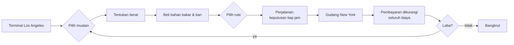
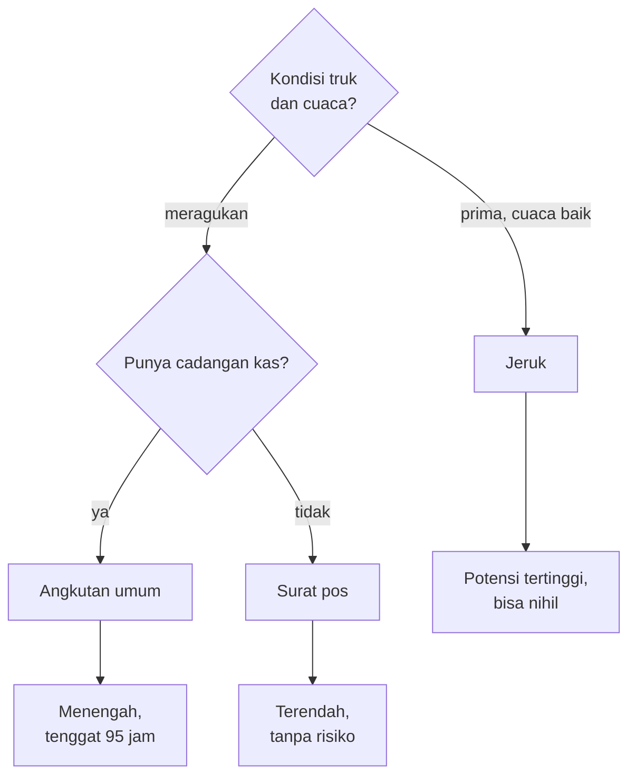
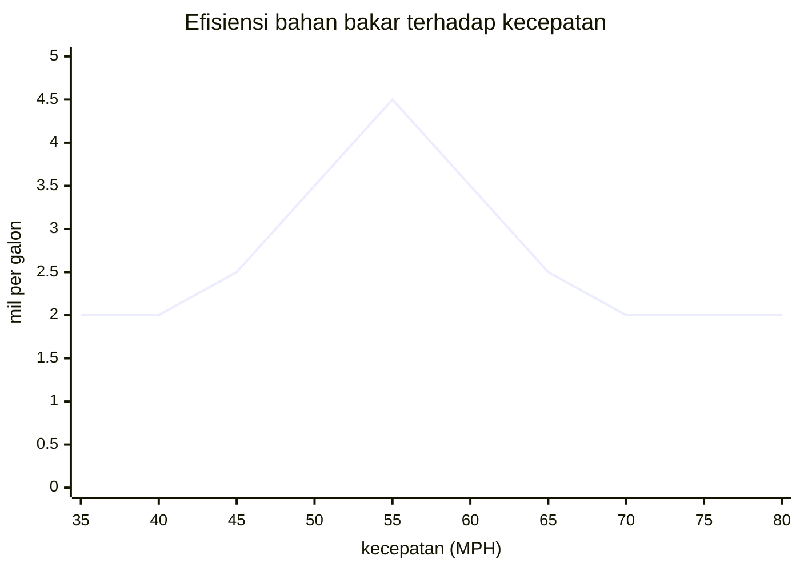
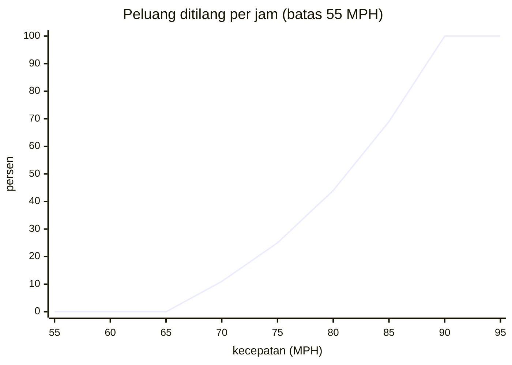
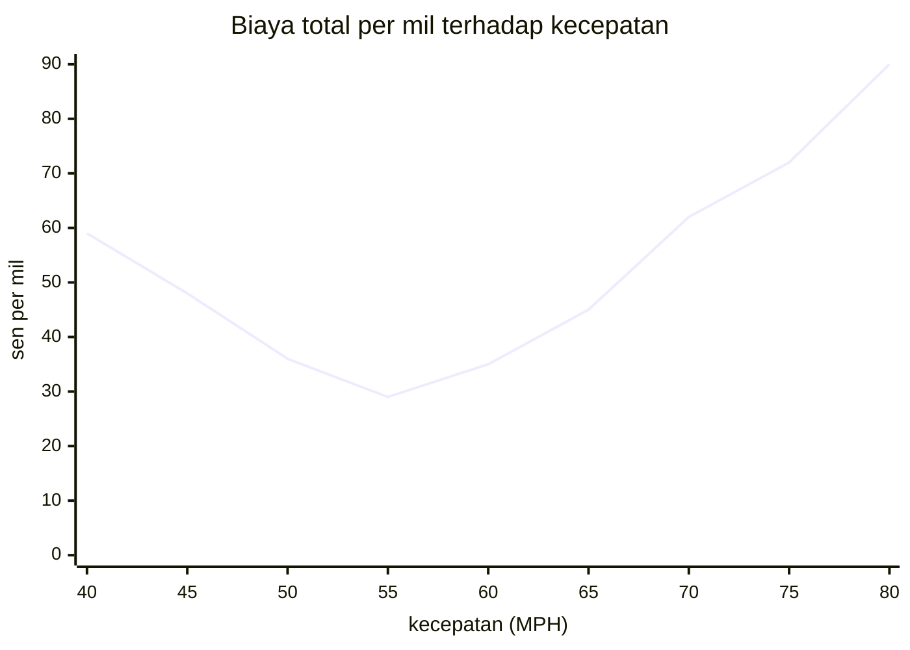
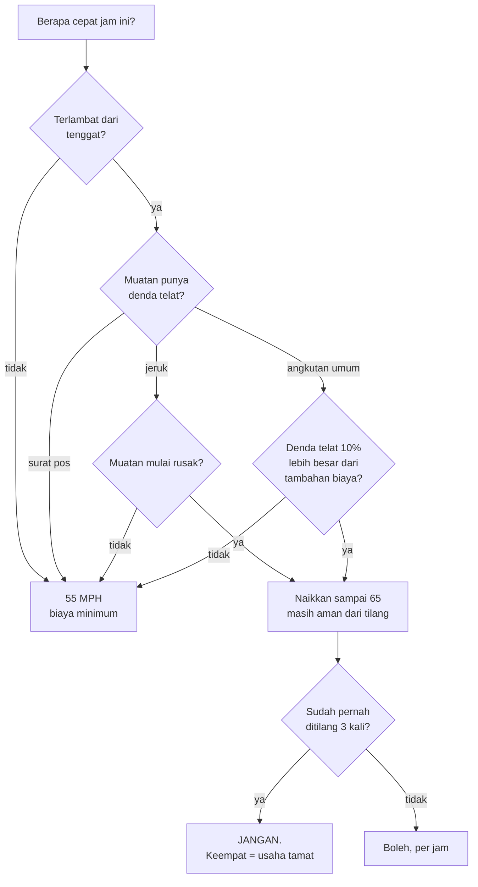
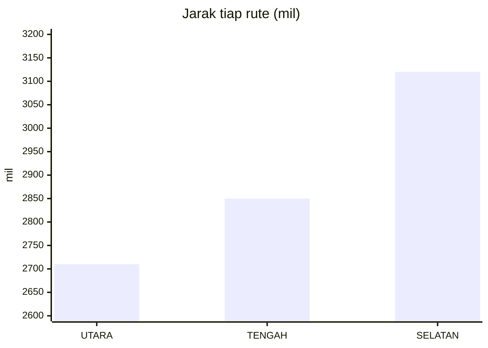
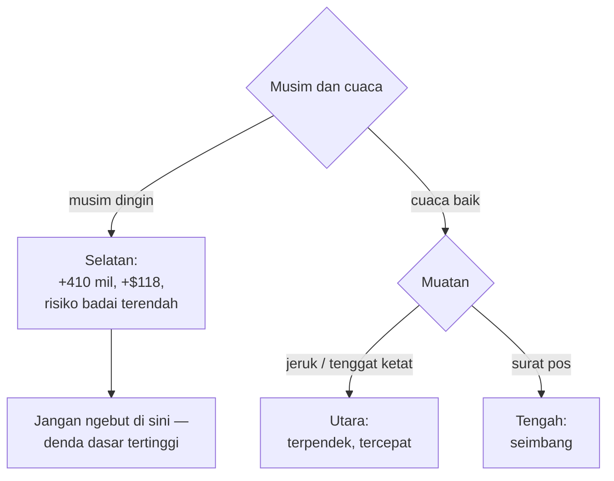

# Delgado Freight Lines — dokumen analisis bisnis

> **Wawancara lapangan** · Los Angeles, Maret 1982
> Narasumber: **Ray Delgado**, pemilik-pengemudi, armada satu unit
> Penyusun: analis bisnis, atas permintaan calon pemberi pinjaman
>
> Dokumen ini bukan dokumen teknis. Tidak ada kode, tidak ada nama variabel,
> tidak ada nomor baris. Isinya bagaimana usaha angkutan jarak jauh ini
> sebenarnya berjalan — dan setiap angka di dalamnya berasal dari operasi yang
> nyata, bukan dari perkiraan.
>
> **Untuk pembaca yang sedang belajar:** di akhir tiap bagian ada kotak
> *Dari bisnis ke mekanik*. Di situ ditunjukkan bagaimana aturan bisnisnya
> berubah menjadi mekanik permainan — dan, yang lebih penting, **apa yang
> hilang** dalam penerjemahan itu. Bagian terakhir itu yang paling mahal
> nilainya bagi perancang game.

---

## 1 · Usaha ini dalam satu paragraf

Ray memiliki satu unit tractor-trailer. Ia mengambil muatan di terminal Los
Angeles dan mengantarkannya ke New York — sekitar 2.700 sampai 3.100 mil,
tergantung rute. Pendapatannya dihitung **per pon muatan**, dan seluruh biaya
perjalanan ditanggungnya sendiri. Selisihnya laba. Satu perjalanan memakan tiga
sampai lima hari.

Ia bukan sopir gajian. Setiap keputusan di jalan — kecepatan, rute, kapan
mengisi bahan bakar, kapan tidur — adalah keputusan **keuangan**, dan
akibatnya langsung masuk ke kantongnya sendiri.



---

## 2 · Pendapatan: tiga jenis muatan, tiga watak risiko

Ray bisa memilih satu dari tiga muatan. Tarifnya berbeda, tapi **yang
sebenarnya membedakan bukan tarifnya melainkan risikonya.**

| muatan | tarif | tenggat | risiko khas |
|---|--:|---|---|
| **Jeruk segar** | 6,50 ¢/pon | tidak ada denda telat | **membusuk.** Unit pendingin bisa rusak; berhenti terlalu lama merusak muatan |
| **Angkutan umum** | 5,00 ¢/pon | **95 jam** | denda **10 %** kalau terlambat |
| **Surat pos** | 4,75 ¢/pon | tidak ada | **tidak ada.** Bayar apa adanya |

Pada muatan 40.000 pon:

| muatan | pendapatan kotor |
|---|--:|
| Jeruk (utuh) | $2.600 |
| Angkutan umum | $2.000 |
| Angkutan umum (telat) | $1.800 |
| Surat pos | $1.900 |

Jeruk membayar **30 % lebih tinggi** daripada angkutan umum. Tapi jeruk yang
busuk tidak dibayar sama sekali — ia dibuang, dan Ray justru **membayar $50**
untuk membuangnya. Kerusakan sebagian dipotong **5 % per tingkat kerusakan**.

> **Ray:** *"Jeruk itu taruhan. Kalau lancar, itu perjalanan terbaik dalam
> sebulan. Kalau kena satu masalah saja di gurun dengan pendingin mati, saya
> pulang membawa utang. Surat pos tidak pernah membuat saya kaya, tapi surat
> pos tidak pernah membuat saya bangkrut."*

**Aturan keputusannya**, sebagaimana Ray sendiri merumuskannya:



> **Dari bisnis ke mekanik.** Tiga muatan itu menjadi **tiga profil risiko**
> yang bisa dipilih pemain di awal — cara paling murah memberi permainan
> tingkat kesulitan tanpa mengubah satu pun aturan lainnya. Yang **hilang**:
> di dunia nyata harga jeruk berfluktuasi, dan ada kontrak, langganan, serta
> reputasi. Di sini tarifnya tetap selamanya, dan tidak ada pelanggan yang
> mengingat Anda. Perancang yang ingin usaha ini terasa hidup harus menambahkan
> ingatan itu sendiri.

---

## 3 · Muatan: satu-satunya tuas yang menaikkan pendapatan

Pendapatan = tarif × berat. Tarifnya tidak bisa ditawar. Jadi satu-satunya cara
menaikkan pendapatan adalah **membawa lebih berat** — dan di situlah letak
jebakannya.

- Di bawah **25.000 pon**, usaha ini tidak layak jalan. *"Tidak ada nafkah dari
  setengah muatan."*
- Batas hukumnya **40.000 pon**.
- Trailer secara fisik masih muat sampai **50.000 pon**.

Antara 40.000 dan 50.000 itulah godaannya: tambahan 10.000 pon berarti tambahan
**$650** pada muatan jeruk. Tapi jembatan timbang di jalan menimbang truk
**beserta muatan, bahan bakar, dan pengemudi** — dan batasnya **60.000 pon**.

```
berat tertimbang = 19.000 (truk kosong)
                 + muatan
                 + 7 × sisa galon bahan bakar
                 + pengemudi & barang bawaan
```

Dendanya **$200 ditambah 2–5 sen per pon kelebihan**. Pada 50.000 pon dengan
tangki penuh, timbangan membaca sekitar 70.000 pon — kelebihan 10.000 pon,
denda antara **$400 dan $700**. Tambahan pendapatan $650 lenyap dalam satu kali
penimbangan.

> **Perhatikan yang halus:** bahan bakar ikut ditimbang, **7 pon per galon**.
> Artinya truk yang baru mengisi penuh lebih berat 1.300 pon daripada truk yang
> hampir kering. Waktu mengisi bahan bakar ikut menentukan apakah Anda lolos
> timbangan.

> **Dari bisnis ke mekanik.** Ini contoh **batas lunak** yang bagus: aturannya
> memberi tahu Anda batasnya 40.000, tapi tidak mencegah Anda melewatinya —
> hanya menghukum kalau tertangkap. Perancang yang menutup pilihan itu sama
> sekali akan menghapus keputusan paling menarik di seluruh permainan. Yang
> **hilang**: di dunia nyata kelebihan muatan merusak ban, rem, dan poros
> secara kumulatif. Di sini ia hanya berbahaya di jembatan timbang.

---

## 4 · Struktur biaya

| pos | besaran | sifat |
|---|--:|---|
| Bahan bakar awal (tangki ~190 galon) | $190 | tetap, di muka |
| Ban baru | $200 / buah | pilihan |
| Ban vulkanisir | $100 / buah | pilihan, lebih cepat aus |
| Angsuran truk, asuransi, pajak | **$85 × hari + $85** | **tetap per hari** |
| Bahan bakar di jalan | harga pompa × galon | berubah |
| Tol | $0 – $7,90 per titik | tetap per rute |
| Denda ngebut | naik tiap pelanggaran | risiko |
| Denda kelebihan muatan | $200 + 2–5 ¢/pon | risiko |
| Ban pecah (ada cadangan) | 1–2 jam | risiko |
| Ban pecah (tanpa cadangan) | **$400 + 4 jam** | risiko |
| Kehabisan bahan bakar | **$200 + 0–4 jam** | kelalaian |
| Pendingin rusak (jeruk) | $100 + 2 jam | risiko |

**Pos yang paling sering diremehkan adalah `$85 per hari`.** Ia berjalan
terus, apakah truk bergerak atau tidak. Tidur delapan jam di rest area
berbiaya **$28** meskipun Ray tidak mengeluarkan sesen pun. Menunggu enam jam
di terowongan yang tertimbun longsor berbiaya **$21** sebelum menghitung
apa pun yang lain.

> **Ray:** *"Orang mengira musuh saya adalah harga solar. Bukan. Musuh saya
> adalah kalender. Truk yang parkir itu truk yang tetap menagih."*

> **Dari bisnis ke mekanik.** Biaya tetap per hari adalah **jam pasir yang
> tidak terlihat**. Ia menciptakan tekanan waktu tanpa perlu ada tenggat, dan
> itu sebabnya bahkan muatan surat pos — yang tidak punya tenggat sama sekali —
> tetap terasa mendesak. Perancang yang ingin ketegangan tanpa penghitung waktu
> di layar bisa meniru ini.

---

## 5 · Logika kecepatan optimal — dan hasilnya mengejutkan

Ini keputusan yang diambil Ray paling sering: **setiap jam, berapa cepat.**

### 5.1 Kurva efisiensi bahan bakar

Konsumsi truknya mengikuti pola yang sangat tegas:

```
mil per galon = 4,5 − 0,2 × |55 − kecepatan|      (dasar 2,0)
```

Artinya efisiensi memuncak **tepat di 55 MPH** pada **4,5 mpg**, dan turun
**0,2 mpg untuk setiap MPH menjauh dari 55 — ke arah mana pun.** Terlalu pelan
sama borosnya dengan terlalu cepat.

| kecepatan | mpg | galon/jam | biaya bahan bakar per mil* |
|--:|--:|--:|--:|
| 35 | 2,00 | 17,5 | $0,500 |
| 45 | 2,50 | 18,0 | $0,400 |
| 50 | 3,50 | 14,3 | $0,286 |
| **55** | **4,50** | **12,2** | **$0,222** |
| 60 | 3,50 | 17,1 | $0,286 |
| 65 | 2,50 | 26,0 | $0,400 |
| 70 | 2,00 | 35,0 | $0,500 |
| 75 | 2,00 | 37,5 | $0,500 |

\* pada $1,00 per galon



Kurvanya berbentuk **tenda simetris** — bukan kurva menurun seperti yang
biasanya diduga orang. Berjalan 45 MPH sama mahalnya dengan berjalan 65 MPH.

### 5.2 Risiko ditilang

Polisi baru menaruh perhatian kalau Ray lebih dari **10 MPH di atas batas**.
Di atas itu, peluang dihentikan **per jam** naik secara kuadratik:

```
peluang per jam = (kelebihan − 5)² ÷ 900      (maksimum 100 %)
```

| kecepatan (batas 55) | kelebihan | peluang ditilang / jam |
|--:|--:|--:|
| 65 | 10 | 0 % |
| 70 | 15 | 11 % |
| 75 | 20 | 25 % |
| 80 | 25 | 44 % |
| 85 | 30 | 69 % |
| 90 | 35 | **100 %** |



Dan dendanya **naik tiap pelanggaran**: pelanggaran pertama sekitar $40 dan
satu jam menunggu; kedua sekitar $87 dan dua jam; ketiga lebih besar lagi.
**Pelanggaran keempat berarti tiga puluh hari penjara dan pencabutan izin —
usahanya tamat.**

### 5.3 Biaya total per mil

Menggabungkan bahan bakar, biaya waktu ($85/hari = $3,54/jam), dan denda
harapan:

| kecepatan | bahan bakar | waktu | denda harapan | **total/mil** |
|--:|--:|--:|--:|--:|
| 45 | $0,400 | $0,079 | — | **$0,479** |
| 50 | $0,286 | $0,071 | — | **$0,357** |
| **55** | **$0,222** | **$0,064** | — | **$0,286** |
| 60 | $0,286 | $0,059 | — | **$0,345** |
| 65 | $0,400 | $0,054 | — | **$0,454** |
| 70 | $0,500 | $0,051 | $0,069 | **$0,620** |
| 75 | $0,500 | $0,047 | $0,190 | **$0,737** |



**Kecepatan optimalnya 55 MPH, dan ia menang telak.** Berjalan 70 MPH
berbiaya **dua kali lipat** per mil — dan hanya menghemat waktu 21 %.

Yang membuat ini menarik secara bisnis: **55 MPH adalah batas kecepatan
nasional Amerika pada 1982**, diberlakukan sejak krisis minyak 1974 justru
dengan alasan efisiensi bahan bakar. Jadi struktur biaya usaha ini
**menjadikan mematuhi hukum sebagai strategi paling menguntungkan** — bukan
karena dendanya, tapi karena solarnya.



> **Dari bisnis ke mekanik.** Inilah cara membuat keputusan yang **tampak**
> sederhana ("seberapa cepat?") menjadi kaya: tiga tekanan yang saling melawan,
> masing-masing dengan bentuk matematis berbeda — tenda simetris untuk bahan
> bakar, kuadratik untuk risiko, linier untuk waktu. Pemain tidak perlu tahu
> rumusnya; ia cukup merasakan bahwa 55 terasa benar dan 75 terasa gegabah.
>
> Yang **hilang**: di dunia nyata, angin, tanjakan, dan muatan mengubah kurva
> itu terus-menerus. Di sini kurvanya tetap. Perancang yang ingin kedalaman
> tambahan bisa menggeser puncak tendanya menurut medan — dan itu perubahan
> kecil dengan akibat besar.

---

## 6 · Logika pemilihan rute

Tiga rute dari Los Angeles ke New York:

| rute | jarak | titik | watak |
|---|--:|--:|---|
| **Utara** — I-15 / I-80 lewat Denver dan Omaha | **2.710 mil** | 18 | terpendek |
| **Tengah** — I-40 lewat Albuquerque dan Oklahoma City | **2.850 mil** | 21 | menengah |
| **Selatan** — I-10 / I-20 lewat El Paso, Dallas, Atlanta | **3.120 mil** | 25 | terpanjang |



Selisih terpanjang ke terpendek **410 mil** — pada 4,5 mpg dan $1/galon,
sekitar **$91** bahan bakar, ditambah 7,5 jam berkendara (**$27** biaya
tetap). Jadi rute selatan berbiaya sekitar **$118 lebih mahal** sebelum
menghitung apa pun yang lain.

**Tapi cuacanya tidak sama.** Peluang badai salju berbeda tajam per rute, dan
risikonya naik seiring jarak yang sudah ditempuh:

| rute | ambang badai salju |
|---|---|
| Utara | **paling rendah — paling sering kena** |
| Tengah | menengah |
| Selatan | **paling tinggi — paling jarang kena** |

Badai salju bukan gangguan kecil: dalam kondisi itu truk bisa keluar jalur ke
parit — dan **kecelakaan berarti kehilangan truk dan seluruh laba.**

> **Ray:** *"Rute utara paling pendek di atas peta. Di bulan Januari, peta itu
> bohong."*

Ada satu lagi yang tidak terlihat di peta: **besaran denda ngebut berbeda per
rute.** Rute selatan mengenakan denda dasar lebih tinggi daripada rute utara.
Jadi rute yang paling aman dari cuaca justru paling mahal kalau Anda ngebut di
sana.



> **Dari bisnis ke mekanik.** Tiga rute yang hanya berbeda **jarak** akan jadi
> pilihan hampa — selalu ambil yang terpendek. Yang membuatnya jadi keputusan
> nyata adalah **sumbu kedua yang berlawanan arah**: yang terpendek paling
> berbahaya. Ini pola perancangan yang bisa dipakai di mana saja — kalau sebuah
> pilihan terasa hampa, tambahkan sumbu yang melawan, jangan tambahkan pilihan
> keempat.
>
> Yang **hilang**: rute nyata punya perbedaan tol, kepadatan, jam sibuk kota,
> dan ketersediaan rest area. Di sini tol memang berbeda per titik, tapi
> selebihnya sama.

---

## 7 · Logika bahan bakar

Tangki penuh **190 galon**. Pada 4,5 mpg, itu **855 mil** — jadi perjalanan
2.710 mil menuntut **sekurang-kurangnya tiga kali pengisian**. Pada 2,0 mpg
(kalau Ray ngebut), jangkauannya jatuh ke **380 mil**, dan ia perlu **tujuh
kali** berhenti.

**Kecepatan tidak hanya membakar uang — ia juga membakar waktu berhenti.**

Kehabisan bahan bakar di jalan berbiaya **$200 untuk satu barel yang
diantar**, ditambah **0–4 jam** hilang, ditambah kerusakan muatan jeruk karena
pendingin ikut mati. Itu tiga hukuman sekaligus untuk satu kelalaian.

> **Dan inilah yang paling menyusahkan menurut Ray:** pengukur bahan bakarnya
> tidak akurat. Ia hanya memberi **perkiraan yang meleset sampai lima galon ke
> atas atau ke bawah**. Ray tidak pernah tahu persis isi tangkinya.
>
> *"Saya tidak pernah mengisi karena sudah waktunya. Saya mengisi karena
> jarumnya sudah cukup rendah untuk membuat saya tidak bisa tidur."*

Aturan praktis yang ia pakai: **isi setiap kali di bawah 50 galon**, tidak
pernah menunggu di bawah 20 — karena kesalahan pengukur 5 galon pada sisa 20
galon adalah selisih antara sampai dan tidak sampai.

> **Dari bisnis ke mekanik.** Pengukur yang tidak akurat adalah **cara termurah
> membuat sumber daya terasa menegangkan**. Angka yang tepat menghasilkan
> perhitungan; angka yang berdesir menghasilkan kecemasan. Perancang yang ingin
> pemain merasakan ketidakpastian tidak perlu mengubah aturannya sama sekali —
> cukup mengaburkan informasinya.

---

## 8 · Logika istirahat dan kelelahan

Ray melacak dua hal berbeda: **berapa lama sejak tidur terakhir**, dan
**berapa panjang perjalanan ini secara keseluruhan**.

| jam sejak istirahat | kondisi |
|---|---|
| < 4 | segar |
| < 8 | baik |
| < 12 | bosan |
| < 16 | lelah |
| < 20 | mengantuk |
| ≥ 20 | **kelelahan berat** |

Kelelahan berat bukan penalti kecil — ia **penyebab kecelakaan langsung**, dan
kecelakaan berarti kehilangan truk beserta seluruh laba. Tertidur di belakang
kemudi adalah salah satu dari enam sebab kecelakaan yang tercatat, bersama
mengebut di atas 65, jalan licin, kabut, badai salju, dan pengemudi mabuk yang
menabrak dari arah lain.

Perhitungan istirahatnya murni ekonomi: delapan jam tidur berbiaya **$28**
biaya tetap. Satu kecelakaan berbiaya **seluruhnya**.

> **Dari bisnis ke mekanik.** Kelelahan adalah **sumber daya kelima** setelah
> uang, bahan bakar, waktu, dan ban — dan satu-satunya yang dipulihkan dengan
> membelanjakan sumber daya lain (waktu). Struktur semacam ini, di mana satu
> sumber daya hanya bisa ditukar dengan sumber daya lain, adalah cara paling
> ringkas menciptakan dilema tanpa menambah aturan.

---

## 9 · Daftar risiko

| risiko | pemicu | dampak | bisa dikurangi? |
|---|---|---|---|
| Ban pecah | naik seiring jarak tempuh | 1–2 jam, atau **$400 + 4 jam** tanpa cadangan | ya — beli **tiga** ban baru, yang ketiga jadi cadangan |
| Ditilang | kecepatan > batas + 10 | denda naik tiap kali; **keempat = tamat** | ya — jangan lebih 10 di atas batas |
| Kelebihan muatan | > 60.000 pon tertimbang | $200 + 2–5 ¢/pon | ya — muat ≤ 40.000, isi bahan bakar sesudah timbangan |
| Kehabisan bahan bakar | kelalaian | $200 + 0–4 jam + muatan jeruk rusak | ya — isi di bawah 50 galon |
| Muatan jeruk busuk | waktu + pendingin rusak | **pendapatan nol, bayar $50 buang** | sebagian |
| Terlambat (angkutan umum) | > 95 jam | denda 10 % | ya |
| Badai salju | rute + jarak tempuh | kecelakaan → **kehilangan segalanya** | ya — pilih rute selatan |
| Kelelahan | > 20 jam tanpa istirahat | kecelakaan → **kehilangan segalanya** | ya — tidur |
| Longsor terowongan | acak, satu titik | 0–5 jam | tidak |
| Pengemudi mabuk | acak | kecelakaan | **tidak** |

**Empat risiko terakhir tidak bisa dihindari sepenuhnya.** Itu disengaja: usaha
ini tidak bisa dijalankan tanpa risiko sisa, dan bagian dari keahlian Ray
adalah menerima itu alih-alih melawannya.

Perhatikan pola pada kolom terakhir: **hampir semua yang bisa dikurangi
dikurangi dengan mengeluarkan uang atau waktu di muka.** Ban ketiga $200
mencegah kerugian $400. Tidur delapan jam $28 mencegah kehilangan truk. Itu
seluruh filosofi usaha ini dalam satu kolom.

---

## 10 · Ukuran keberhasilan

Ray menilai dirinya dengan **laba bersih per perjalanan** dan **rata-rata
berjalan** dari seluruh perjalanan.

| capaian | penilaian |
|---|---|
| Laba > $100 | *"Kerja bagus"* |
| Laba < $200 **atau** rata-rata < $250 | *"Anda lebih untung mencuci piring"* |
| Laba negatif | perjalanan buruk |
| Rata-rata negatif | **bangkrut** |

Ambang **$250 rata-rata** itu patut direnungkan. Pada muatan jeruk 40.000 pon
yang sempurna — pendapatan $2.600 — laba $250 berarti biayanya $2.350. Dengan
kata lain, **usaha ini beroperasi pada margin sekitar 10 %**, dan satu denda
ngebut kedua ($87) menghapus sepertiga dari margin satu perjalanan.

> **Ray:** *"Selisih antara tahun yang baik dan tahun yang buruk itu bukan
> keberuntungan besar. Itu belasan keputusan kecil yang benar, diulang terus."*

---

## 10b · Tips lapangan — untuk yang belum pernah menempuh ketiga rute

Bagian ini bukan analisis. Ini yang akan dikatakan Ray kepada sopir baru pada
malam sebelum perjalanan pertamanya.

### Sebelum berangkat

- **Beli tiga ban baru, bukan dua.** Yang ketiga jadi cadangan. Selisihnya $200
  di muka; tanpa cadangan, satu ban pecah berbiaya $400 ditambah empat jam
  menunggu derek. Ban pecah **pasti** terjadi kalau perjalanannya cukup panjang
  — peluangnya naik seiring mil yang sudah ditempuh.
- **Muat 40.000 pon, jangan lebih.** Godaan 10.000 pon tambahan bernilai $650,
  tapi satu jembatan timbang menghapusnya. Trailer memang muat 50.000, tapi
  hukum tidak.
- **Perjalanan pertama: ambil surat pos.** Tarifnya terendah, tapi tidak ada
  tenggat dan tidak ada yang bisa busuk. Pelajari dulu medannya, baru bertaruh
  dengan jeruk.

### Ketiga rute, dari kursi pengemudi

**Utara** (2.710 mil, I-15 lalu I-80) — Las Vegas, gurun Utah, lalu naik ke
Denver dan turun ke dataran Nebraska. Terpendek, jalannya paling lengang, dan
paling cepat kalau lancar. **Tapi ia melintasi Rocky Mountains dan dataran
tengah**, dan itu rute yang paling sering kena badai salju. Ambil ini kalau
cuacanya baik dan tenggatnya ketat.

**Tengah** (2.850 mil, I-40) — Barstow, Flagstaff, Albuquerque, Amarillo,
Oklahoma City, lalu St. Louis dan Pennsylvania Turnpike. Rute klasik. Tolnya
banyak di paruh timur — Oklahoma Turnpike dan Pennsylvania Turnpike keduanya
menagih. Risikonya menengah di segala hal. Kalau ragu, ambil ini.

**Selatan** (3.120 mil, I-10 lalu I-20) — Phoenix, Tucson, El Paso, Dallas,
lalu Atlanta dan naik ke pantai timur. Terpanjang, sekitar $118 lebih mahal.
Tapi **paling jarang kena badai salju** — perbedaannya besar, bukan tipis. Di
musim dingin, ini rute yang benar meskipun petanya bilang sebaliknya.
Perhatikan: di sini denda ngebut paling mahal, jadi jangan tergoda mengejar
selisih jaraknya dengan pedal gas.

> Satu jebakan di rute selatan: ada titik di perbatasan Louisiana yang
> **menolak muatan berat**, dan Anda dipaksa memutar 200 mil lewat jalan-jalan
> kabupaten Arkansas dengan batas 45 MPH. Itu menambah jarak *dan* memaksa Anda
> keluar dari kecepatan optimal.

### Di jalan

- **Pegang 55 MPH.** Ini bukan nasihat moral, ini nasihat keuangan. Setiap MPH
  menjauh dari 55 — ke atas **atau ke bawah** — memakan 0,2 mil per galon.
- **Isi bahan bakar setiap kali di bawah 50 galon.** Jangan pernah menunggu di
  bawah 20. Pengukurnya meleset sampai lima galon, dan pada sisa 20 galon
  kesalahan lima galon adalah selisih antara sampai dan tidak.
- **Isi bahan bakar *sesudah* jembatan timbang, bukan sebelum.** Bahan bakar
  ditimbang 7 pon per galon; tangki penuh menambah 1.300 pon di timbangan.
- **Tidur sebelum jam ke-16, bukan sesudah.** Setelah 20 jam tanpa istirahat
  Anda masuk kategori kelelahan berat, dan itu penyebab kecelakaan langsung.
  Delapan jam tidur berbiaya $28. Satu kecelakaan berbiaya seluruhnya.
- **Sesudah tilang kedua, berhenti mengebut sama sekali.** Yang ketiga mahal,
  yang keempat mencabut izin Anda dan mengakhiri usaha ini. Tidak ada muatan
  yang sepadan dengan itu.
- **Kalau membawa jeruk, jangan berhenti lama.** Setiap jam berdiri dengan
  pendingin mati merusak muatan, dan kerusakan tidak bisa dipulihkan.

### Membaca cuaca

Kondisi jalan berubah sepanjang perjalanan, dan risikonya **naik seiring jarak
yang sudah ditempuh** — paruh kedua perjalanan selalu lebih berbahaya daripada
paruh pertama, di rute mana pun. Kalau cuaca memburuk:

| kondisi | yang harus dilakukan |
|---|---|
| cerah & kering | 55 MPH, jalan terus |
| jalan basah / hujan | tetap 55, jangan lebih |
| salju ringan | turunkan sedikit, terima kerugian bahan bakarnya |
| kabut | turunkan; kecelakaan menabrak dari belakang terjadi di sini |
| **badai salju** | **berhenti.** Tidak ada muatan yang sepadan dengan truk |

---

## 11 · Ringkasan untuk perancang game

Apa yang membuat usaha ini bisa menjadi permainan yang baik, dan apa yang perlu
ditambahkan sendiri:

**Yang sudah kuat:**

1. **Satu keputusan berulang** (berapa cepat) yang menyatukan tiga tekanan
   berbentuk matematis berbeda.
2. **Sumbu yang berlawanan** pada pemilihan rute — terpendek = paling
   berbahaya.
3. **Biaya tetap per hari** sebagai jam pasir tak terlihat.
4. **Informasi yang sengaja dikaburkan** (pengukur bahan bakar) untuk mengubah
   perhitungan menjadi kecemasan.
5. **Hukuman bertingkat** (denda ke-1, ke-2, ke-3, lalu tamat) yang membuat
   risiko terasa makin berat tanpa perlu diberitahu.
6. **Pencegahan berbiaya di muka** — hampir semua risiko dikurangi dengan
   membayar lebih dulu.

**Yang hilang, dan layak ditambahkan:**

1. **Pelanggan tidak punya ingatan.** Tidak ada reputasi, tidak ada kontrak
   berulang, tidak ada langganan yang hilang karena sering terlambat.
2. **Harga tidak pernah berubah.** Tidak ada musim, tidak ada persaingan.
3. **Truknya tidak menua** kecuali bannya. Tidak ada perawatan tertunda yang
   menagih di kemudian hari.
4. **Tidak ada pertumbuhan.** Tidak bisa membeli unit kedua, tidak bisa
   mempekerjakan sopir. Ray akan selalu menjadi armada satu unit.

Ketiadaan nomor empat itu yang paling menentukan wataknya: ini bukan permainan
**membangun kerajaan**, melainkan permainan **bertahan hidup**. Setiap
perjalanan dimulai dari nol, dan satu-satunya yang menumpuk adalah rata-rata
laba dan catatan pelanggaran. Perancang yang menambahkan pertumbuhan akan
mengubahnya menjadi permainan yang sama sekali berbeda — dan itu pilihan yang
sah, asal disadari.

---

*Dokumen ini diturunkan dari operasi `TRUCKER` sebagaimana ia benar-benar
berjalan. Angka, ambang, dan konsekuensinya nyata; yang ditambahkan hanyalah
suaranya. Catatan teknis dan arsitekturnya ada di*
[`trucker.md`](trucker.md) — *dokumen yang sama sekali berbeda, untuk pembaca
yang berbeda.*
