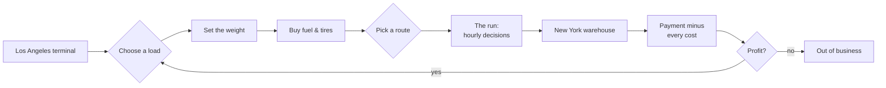
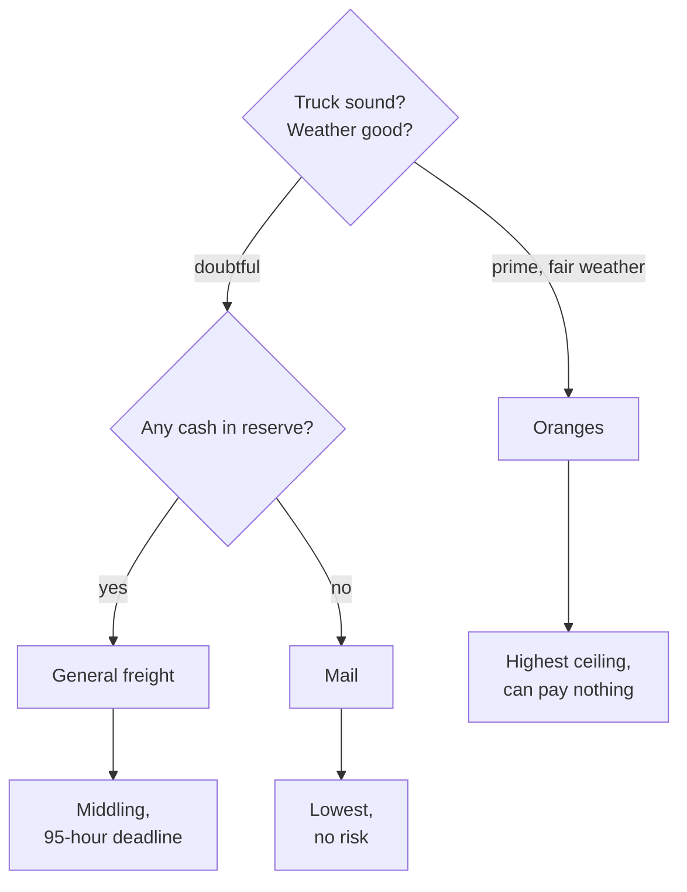
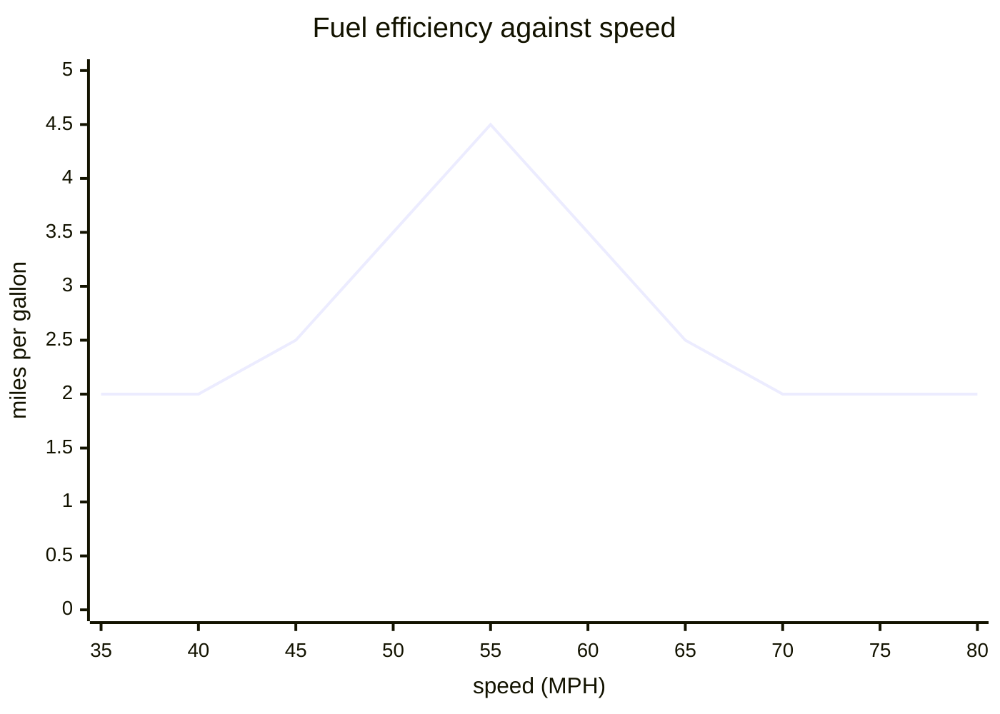
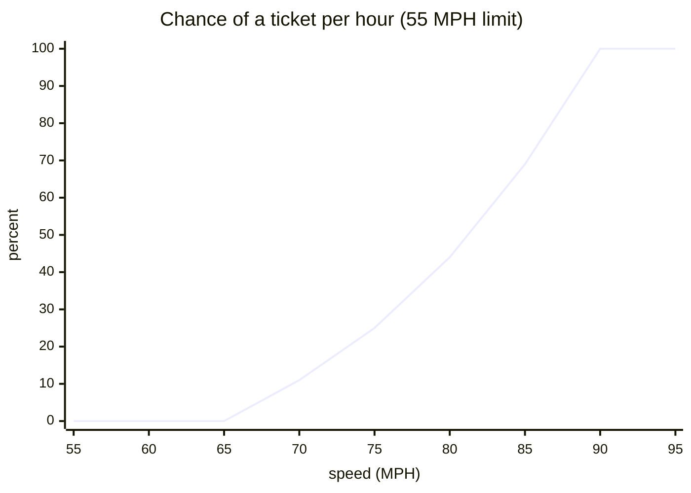
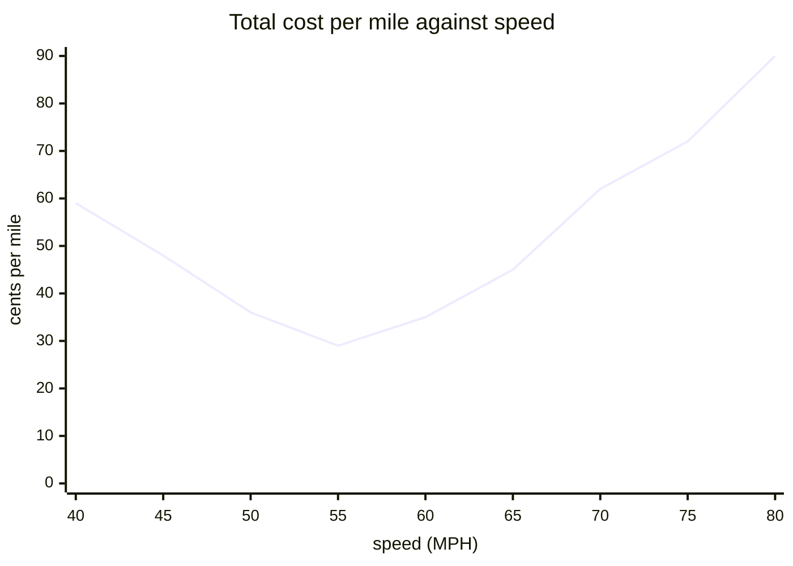
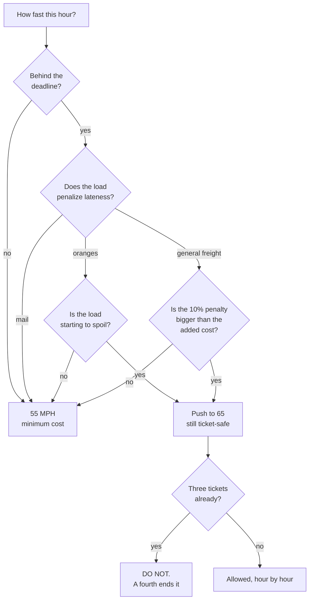
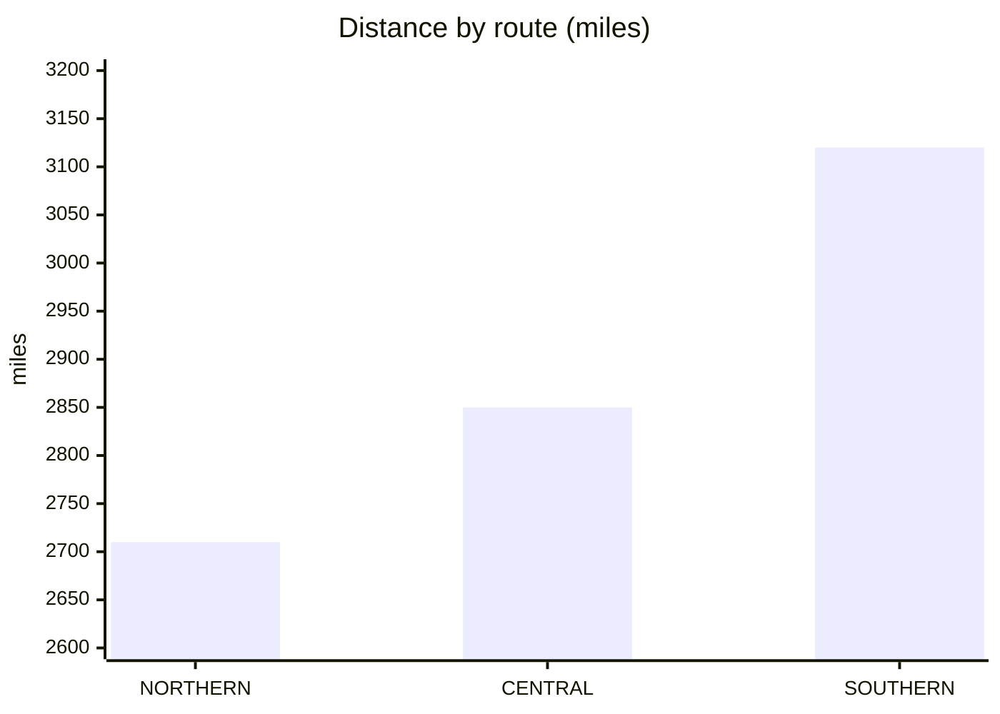
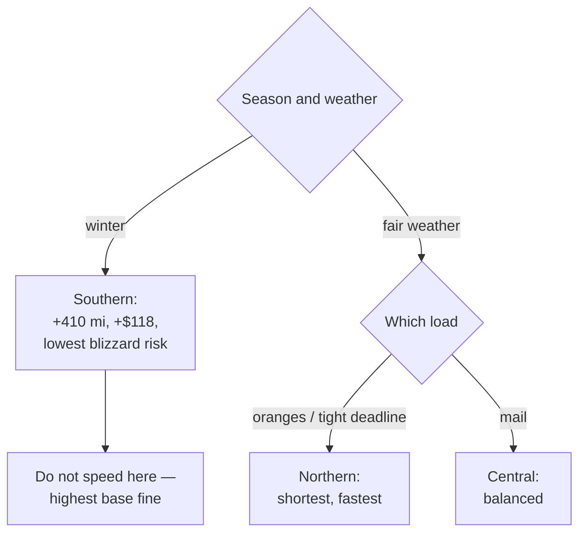

# Delgado Freight Lines — business analysis

> **Field interview** · Los Angeles, March 1982
> Subject: **Ray Delgado**, owner-operator, one-truck fleet
> Prepared by: a business analyst, at the request of a prospective lender
>
> This is not a technical document. No code, no variable names, no line
> numbers. It is about how this long-haul trucking business actually runs —
> and every number in it comes from a real operation, not from an estimate.
>
> **For readers who are here to learn:** each section ends with a box called
> *From business to mechanic*. It shows how the business rule turns into a
> game mechanic — and, more importantly, **what is lost** in that translation.
> That last part is the most valuable thing here for a game designer.

---

## 1 · The business in one paragraph

Ray owns one tractor-trailer. He picks up a load at the Los Angeles terminal
and delivers it to New York — roughly 2,700 to 3,100 miles, depending on the
route. He is paid **per pound of freight**, and he covers every cost of the
trip himself. The difference is his profit. One run takes three to five days.

He is not a salaried driver. Every decision on the road — speed, route, when
to fuel, when to sleep — is a **financial** decision, and the consequence
lands directly in his own pocket.



---

## 2 · Revenue: three loads, three risk temperaments

Ray can pick one of three loads. The rates differ, but **what really separates
them is not the rate — it is the risk.**

| load | rate | deadline | characteristic risk |
|---|--:|---|---|
| **Fresh oranges** | 6.50 ¢/lb | no late penalty | **spoilage.** The refrigeration unit can fail; standing still too long ruins the load |
| **General freight** | 5.00 ¢/lb | **95 hours** | **10 %** penalty if late |
| **Mail** | 4.75 ¢/lb | none | **none.** Pays exactly what it says |

On a 40,000-pound load:

| load | gross revenue |
|---|--:|
| Oranges (intact) | $2,600 |
| General freight | $2,000 |
| General freight (late) | $1,800 |
| Mail | $1,900 |

Oranges pay **30 % more** than general freight. But spoiled oranges pay
nothing at all — they are dumped, and Ray **pays $50** to dump them. Partial
spoilage is docked **5 % per level of damage**.

> **Ray:** *"Oranges are a bet. When it goes clean, it's the best run of the
> month. Hit one problem in the desert with the reefer dead and I drive home
> owing money. Mail never made me rich, but mail never broke me either."*

**The decision rule**, as Ray states it himself:



> **From business to mechanic.** The three loads become **three risk profiles**
> the player picks at the start — the cheapest way to give a game a difficulty
> setting without changing a single other rule. What is **lost**: in the real
> world the price of oranges fluctuates, and there are contracts, repeat
> customers, and reputation. Here the rate is fixed forever, and no customer
> remembers you. A designer who wants this business to feel alive has to add
> that memory himself.

---

## 3 · Weight: the only lever that raises revenue

Revenue = rate × weight. The rate is not negotiable. So the only way to raise
revenue is to **carry more weight** — and that is exactly where the trap is.

- Below **25,000 pounds** the business does not pay to run. *"You can't make a
  living on half a load."*
- The legal limit is **40,000 pounds**.
- The trailer physically holds up to **50,000 pounds**.

Between 40,000 and 50,000 lies the temptation: another 10,000 pounds is another
**$650** on an orange load. But the weigh stations on the road weigh the truck
**together with its cargo, its fuel, and its driver** — and that limit is
**60,000 pounds**.

```
scale weight = 19,000 (empty truck)
             + cargo
             + 7 × gallons of fuel remaining
             + driver & personal gear
```

The fine is **$200 plus 2–5 cents per pound over**. At 50,000 pounds with full
tanks the scale reads about 70,000 — 10,000 pounds over, a fine between **$400
and $700**. The extra $650 of revenue vanishes in a single weighing.

> **Note the subtle part:** fuel is weighed too, at **7 pounds per gallon**.
> That means a truck that has just filled up is 1,300 pounds heavier than one
> running near empty. *When* you fuel helps decide whether you clear the scale.

> **From business to mechanic.** This is a good **soft limit**: the rule tells
> you the limit is 40,000, but does not stop you from exceeding it — it only
> punishes you if you are caught. A designer who closes that option off
> entirely deletes the most interesting decision in the whole game. What is
> **lost**: in the real world overloading wears tires, brakes, and axles
> cumulatively. Here it is only dangerous at the scale.

---

## 4 · Cost structure

| item | amount | nature |
|---|--:|---|
| Starting fuel (tank ~190 gal) | $190 | fixed, up front |
| New tire | $200 each | optional |
| Retread tire | $100 each | optional, wears faster |
| Truck payment, insurance, taxes | **$85 × days + $85** | **fixed per day** |
| Fuel on the road | pump price × gallons | variable |
| Tolls | $0 – $7.90 per point | fixed per route |
| Speeding fines | rises with each offense | risk |
| Overweight fine | $200 + 2–5 ¢/lb | risk |
| Blowout (spare available) | 1–2 hours | risk |
| Blowout (no spare) | **$400 + 4 hours** | risk |
| Running out of fuel | **$200 + 0–4 hours** | negligence |
| Reefer failure (oranges) | $100 + 2 hours | risk |

**The most underestimated item is the `$85 per day`.** It runs whether the
truck moves or not. Eight hours of sleep at a rest area costs **$28** even
though Ray spends nothing. Six hours waiting at a tunnel closed by a rockslide
costs **$21** before anything else is counted.

> **Ray:** *"People think my enemy is the price of diesel. It isn't. My enemy
> is the calendar. A parked truck still sends a bill."*

> **From business to mechanic.** A fixed daily cost is an **invisible
> hourglass**. It creates time pressure without any deadline existing, and that
> is why even the mail load — which has no deadline at all — still feels
> urgent. A designer who wants tension without an on-screen timer can copy
> this.

---

## 5 · Optimal speed logic — and the answer is surprising

This is the decision Ray makes most often: **every hour, how fast.**

### 5.1 The fuel efficiency curve

His truck's consumption follows a very sharp pattern:

```
miles per gallon = 4.5 − 0.2 × |55 − speed|      (floor 2.0)
```

So efficiency peaks **exactly at 55 MPH** at **4.5 mpg**, and falls **0.2 mpg
for every MPH away from 55 — in either direction.** Too slow wastes just as
much as too fast.

| speed | mpg | gal/hour | fuel cost per mile* |
|--:|--:|--:|--:|
| 35 | 2.00 | 17.5 | $0.500 |
| 45 | 2.50 | 18.0 | $0.400 |
| 50 | 3.50 | 14.3 | $0.286 |
| **55** | **4.50** | **12.2** | **$0.222** |
| 60 | 3.50 | 17.1 | $0.286 |
| 65 | 2.50 | 26.0 | $0.400 |
| 70 | 2.00 | 35.0 | $0.500 |
| 75 | 2.00 | 37.5 | $0.500 |

\* at $1.00 per gallon



The curve is a **symmetric tent** — not the downward slope most people assume.
Running at 45 MPH costs exactly as much as running at 65.

### 5.2 Ticket risk

Police only take an interest above **10 MPH over the limit**. Above that, the
chance of being pulled over **per hour** rises quadratically:

```
chance per hour = (excess − 5)² ÷ 900      (capped at 100 %)
```

| speed (limit 55) | excess | ticket chance / hour |
|--:|--:|--:|
| 65 | 10 | 0 % |
| 70 | 15 | 11 % |
| 75 | 20 | 25 % |
| 80 | 25 | 44 % |
| 85 | 30 | 69 % |
| 90 | 35 | **100 %** |



And the fine **escalates with each offense**: the first is about $40 and an
hour's wait; the second about $87 and two hours; the third more again. **The
fourth offense means thirty days in jail and a revoked license — the business
is finished.**

### 5.3 Total cost per mile

Combining fuel, the cost of time ($85/day = $3.54/hour), and expected fines:

| speed | fuel | time | expected fine | **total/mile** |
|--:|--:|--:|--:|--:|
| 45 | $0.400 | $0.079 | — | **$0.479** |
| 50 | $0.286 | $0.071 | — | **$0.357** |
| **55** | **$0.222** | **$0.064** | — | **$0.286** |
| 60 | $0.286 | $0.059 | — | **$0.345** |
| 65 | $0.400 | $0.054 | — | **$0.454** |
| 70 | $0.500 | $0.051 | $0.069 | **$0.620** |
| 75 | $0.500 | $0.047 | $0.190 | **$0.737** |



**The optimal speed is 55 MPH, and it wins outright.** Running at 70 MPH costs
**twice as much** per mile — and saves only 21 % of the time.

What makes this interesting as business history: **55 MPH was the American
national speed limit in 1982**, imposed after the 1974 oil crisis for exactly
this reason — fuel efficiency. So this operation's cost structure **makes
obeying the law the most profitable strategy** — not because of the fines, but
because of the diesel.



> **From business to mechanic.** This is how you make a decision that **looks**
> simple ("how fast?") turn out rich: three opposing pressures, each with a
> different mathematical shape — a symmetric tent for fuel, a quadratic for
> risk, a linear term for time. The player never needs the formulas; he only
> needs to feel that 55 feels right and 75 feels reckless.
>
> What is **lost**: in the real world wind, grade, and load reshape that curve
> constantly. Here the curve is fixed. A designer wanting more depth can shift
> the peak of the tent with the terrain — a small change with a large
> consequence.

---

## 6 · Route selection logic

Three routes from Los Angeles to New York:

| route | distance | points | character |
|---|--:|--:|---|
| **Northern** — I-15 / I-80 via Denver and Omaha | **2,710 mi** | 18 | shortest |
| **Central** — I-40 via Albuquerque and Oklahoma City | **2,850 mi** | 21 | middling |
| **Southern** — I-10 / I-20 via El Paso, Dallas, Atlanta | **3,120 mi** | 25 | longest |



Longest to shortest is a difference of **410 miles** — at 4.5 mpg and $1 a
gallon, about **$91** of fuel, plus 7.5 hours of driving (**$27** of fixed
cost). So the southern route costs roughly **$118 more** before anything else
is counted.

**But the weather is not the same.** Blizzard probability differs sharply by
route, and the risk climbs with the distance already covered:

| route | blizzard threshold |
|---|---|
| Northern | **lowest — hit most often** |
| Central | middling |
| Southern | **highest — hit least often** |

A blizzard is not a minor inconvenience: in those conditions the truck can
slide off into a ditch — and **a crash means losing the truck and the entire
profit.**

> **Ray:** *"The northern route is shortest on the map. In January, the map
> lies."*

There is one more thing the map does not show: **the size of speeding fines
differs by route.** The southern route levies a higher base fine than the
northern one. So the route that is safest from the weather is the most
expensive one to speed on.



> **From business to mechanic.** Three routes differing only in **distance**
> would be an empty choice — always take the shortest. What makes it a real
> decision is **a second axis running the opposite way**: the shortest is the
> most dangerous. This design pattern travels anywhere — if a choice feels
> empty, add an opposing axis rather than a fourth option.
>
> What is **lost**: real routes differ in tolls, congestion, city rush hours,
> and rest-area availability. Here tolls do differ per point, but the rest is
> uniform.

---

## 7 · Fuel logic

A full tank is **190 gallons**. At 4.5 mpg that is **855 miles** — so a
2,710-mile run demands **at least three fuel stops**. At 2.0 mpg (if Ray runs
hard) the range collapses to **380 miles**, and he needs **seven** stops.

**Speed does not only burn money — it burns stopping time.**

Running dry on the road costs **$200 for a single delivered barrel**, plus
**0–4 hours** lost, plus spoilage on an orange load because the reefer dies
with the engine. That is three penalties at once for a single lapse.

> **And here is what Ray finds hardest:** his fuel gauge is not accurate. It
> gives only an **estimate, off by as much as five gallons either way**. Ray
> never knows exactly what is in the tank.
>
> *"I never fuel because it's time. I fuel because the needle got low enough
> to keep me awake."*

The rule of thumb he uses: **fill up any time it drops below 50 gallons**,
never wait below 20 — because a five-gallon gauge error on a 20-gallon
remainder is the difference between arriving and not.

> **From business to mechanic.** An inaccurate gauge is the **cheapest way to
> make a resource feel tense**. Exact numbers produce arithmetic; numbers that
> shimmer produce anxiety. A designer who wants the player to feel uncertainty
> need not change any rule at all — only blur the information.

---

## 8 · Rest and fatigue logic

Ray tracks two different things: **how long since he last slept**, and **how
long this run has been overall**.

| hours since rest | condition |
|---|---|
| < 4 | fresh |
| < 8 | fine |
| < 12 | bored |
| < 16 | tired |
| < 20 | drowsy |
| ≥ 20 | **severely fatigued** |

Severe fatigue is not a small penalty — it is a **direct cause of crashes**,
and a crash means losing the truck along with the entire profit. Falling asleep
at the wheel is one of six recorded causes of crashes, alongside speeding above
65, wet roads, fog, blizzards, and a drunk driver coming the other way.

The rest calculation is purely economic: eight hours of sleep costs **$28** in
fixed cost. One crash costs **everything**.

> **From business to mechanic.** Fatigue is the **fifth resource** after money,
> fuel, time, and tires — and the only one restored by spending another
> resource (time). A structure like this, where one resource can only be traded
> for another, is the most compact way to create a dilemma without adding a
> rule.

---

## 9 · Risk register

| risk | trigger | impact | reducible? |
|---|---|---|---|
| Blowout | rises with miles covered | 1–2 hours, or **$400 + 4 hours** without a spare | yes — buy **three** new tires, the third is the spare |
| Ticket | speed > limit + 10 | fine rises each time; **fourth = finished** | yes — never exceed limit + 10 |
| Overweight | > 60,000 lb on the scale | $200 + 2–5 ¢/lb | yes — load ≤ 40,000, fuel after the scale |
| Out of fuel | negligence | $200 + 0–4 hours + orange spoilage | yes — fill below 50 gallons |
| Oranges spoil | time + reefer failure | **zero revenue, pay $50 to dump** | partly |
| Late (general freight) | > 95 hours | 10 % penalty | yes |
| Blizzard | route + distance covered | crash → **lose everything** | yes — take the southern route |
| Fatigue | > 20 hours without rest | crash → **lose everything** | yes — sleep |
| Tunnel rockslide | random, one point | 0–5 hours | no |
| Drunk driver | random | crash | **no** |

**The last four risks cannot be avoided entirely.** That is deliberate: this
business cannot be run without residual risk, and part of Ray's skill is
accepting that instead of fighting it.

Notice the pattern in the last column: **almost everything reducible is reduced
by spending money or time up front.** A $200 third tire prevents a $400 loss.
Eight hours of sleep at $28 prevents losing the truck. That is the entire
philosophy of this business in one column.

---

## 10 · Measures of success

Ray judges himself by **net profit per run** and the **running average** across
all runs.

| result | verdict |
|---|---|
| Profit > $100 | *"Good work"* |
| Profit < $200 **or** average < $250 | *"You'd do better washing dishes"* |
| Negative profit | a bad run |
| Negative average | **out of business** |

That **$250 average** threshold is worth dwelling on. On a perfect 40,000-pound
orange load — $2,600 of revenue — a $250 profit means costs of $2,350. In other
words, **this business runs on roughly a 10 % margin**, and a single second
speeding ticket ($87) erases a third of one run's margin.

> **Ray:** *"The difference between a good year and a bad one isn't one big
> piece of luck. It's a dozen small decisions made right, over and over."*

---

## 10b · Field advice — for anyone who has never run all three routes

This section is not analysis. This is what Ray would tell a new driver the
night before his first run.

### Before you leave

- **Buy three new tires, not two.** The third is your spare. It costs $200 up
  front; without it, one blowout costs $400 plus four hours waiting for a tow.
  A blowout **will** happen if the run is long enough — the odds climb with
  every mile covered.
- **Load 40,000 pounds, no more.** The extra 10,000 is worth $650, but one
  weigh station erases it. The trailer holds 50,000; the law does not.
- **First run: take the mail.** Lowest rate, but no deadline and nothing that
  can rot. Learn the road first, then gamble on oranges.

### The three routes, from the driver's seat

**Northern** (2,710 mi, I-15 then I-80) — Las Vegas, the Utah desert, then up
to Denver and down onto the Nebraska plains. Shortest, emptiest road, and
fastest when it goes clean. **But it crosses the Rockies and the high plains**,
and it is the route blizzards hit most often. Take it when the weather is good
and the deadline is tight.

**Central** (2,850 mi, I-40) — Barstow, Flagstaff, Albuquerque, Amarillo,
Oklahoma City, then St. Louis and the Pennsylvania Turnpike. The classic route.
Tolls are heavy on the eastern half — the Oklahoma Turnpike and the
Pennsylvania Turnpike both collect. Middling risk in everything. When in doubt,
take this one.

**Southern** (3,120 mi, I-10 then I-20) — Phoenix, Tucson, El Paso, Dallas,
then Atlanta and up the east coast. Longest, about $118 dearer. But **blizzards
hit it least often** — and the gap is wide, not narrow. In winter this is the
right route even when the map says otherwise. Note: speeding fines are steepest
here, so do not try to win back the distance with the accelerator.

> One trap on the southern route: there is a point at the Louisiana line that
> **refuses heavy loads**, and you are forced onto a 200-mile detour along
> Arkansas county roads posted at 45 MPH. That adds distance *and* forces you
> off your optimal speed.

### On the road

- **Hold 55 MPH.** This is not moral advice, it is financial advice. Every MPH
  away from 55 — **above or below** — costs 0.2 miles per gallon.
- **Fuel any time you are below 50 gallons.** Never wait below 20. The gauge is
  off by as much as five gallons, and on a 20-gallon remainder a five-gallon
  error is the difference between arriving and not.
- **Fuel *after* the weigh station, not before.** Fuel weighs 7 pounds per
  gallon; a full tank adds 1,300 pounds on the scale.
- **Sleep before hour 16, not after.** Past 20 hours without rest you are
  severely fatigued, and that is a direct cause of crashes. Eight hours of sleep
  costs $28. One crash costs everything.
- **After the second ticket, stop speeding entirely.** The third is expensive;
  the fourth takes your license and ends the business. No load is worth that.
- **If you are carrying oranges, do not stop for long.** Every hour standing
  with the reefer dead damages the load, and damage cannot be undone.

### Reading the weather

Road conditions change over the course of the run, and the risk **climbs with
the distance already covered** — the second half of a run is always more
dangerous than the first, on any route. When the weather turns:

| condition | what to do |
|---|---|
| clear & dry | 55 MPH, keep rolling |
| wet road / rain | hold 55, no more |
| light snow | ease off, accept the fuel penalty |
| fog | slow down; this is where rear-end crashes happen |
| **blizzard** | **stop.** No load is worth the truck |

---

## 11 · Summary for game designers

What makes this business into a good game, and what you have to add yourself:

**Already strong:**

1. **One repeated decision** (how fast) that unites three pressures of
   different mathematical shape.
2. **An opposing axis** on route selection — shortest = most dangerous.
3. **A fixed daily cost** as an invisible hourglass.
4. **Deliberately blurred information** (the fuel gauge) to turn arithmetic
   into anxiety.
5. **Escalating punishment** (first, second, third ticket, then finished) that
   makes risk feel heavier without being told.
6. **Prevention paid up front** — nearly every risk is reduced by paying first.

**Missing, and worth adding:**

1. **Customers have no memory.** No reputation, no repeat contracts, no client
   lost to chronic lateness.
2. **Prices never move.** No seasons, no competitors.
3. **The truck does not age** except its tires. No deferred maintenance coming
   due later.
4. **There is no growth.** You cannot buy a second rig, cannot hire a driver.
   Ray will always be a one-truck fleet.

That fourth absence is what defines its character most: this is not a game
about **building an empire**, it is a game about **staying alive**. Every run
starts from zero, and the only things that accumulate are the profit average
and the violation record. A designer who adds growth turns it into an entirely
different game — and that is a legitimate choice, as long as it is made
knowingly.

---

*This document is derived from the `TRUCKER` operation as it actually runs. The
numbers, thresholds, and consequences are real; only the voice was added. The
technical and architectural notes are in* [`trucker.md`](trucker.md) — *a
completely different document, for a different reader.*
