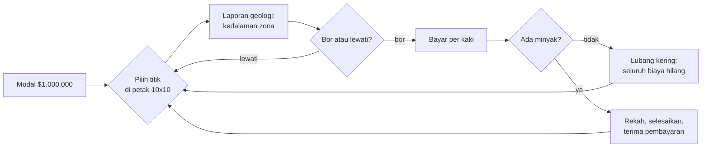
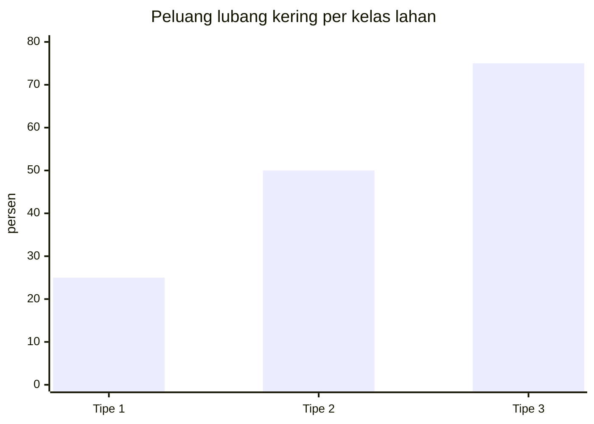
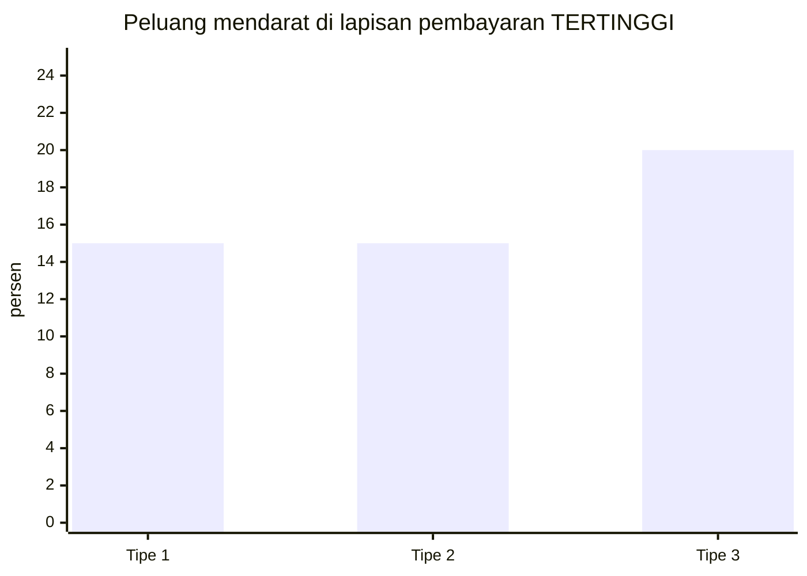
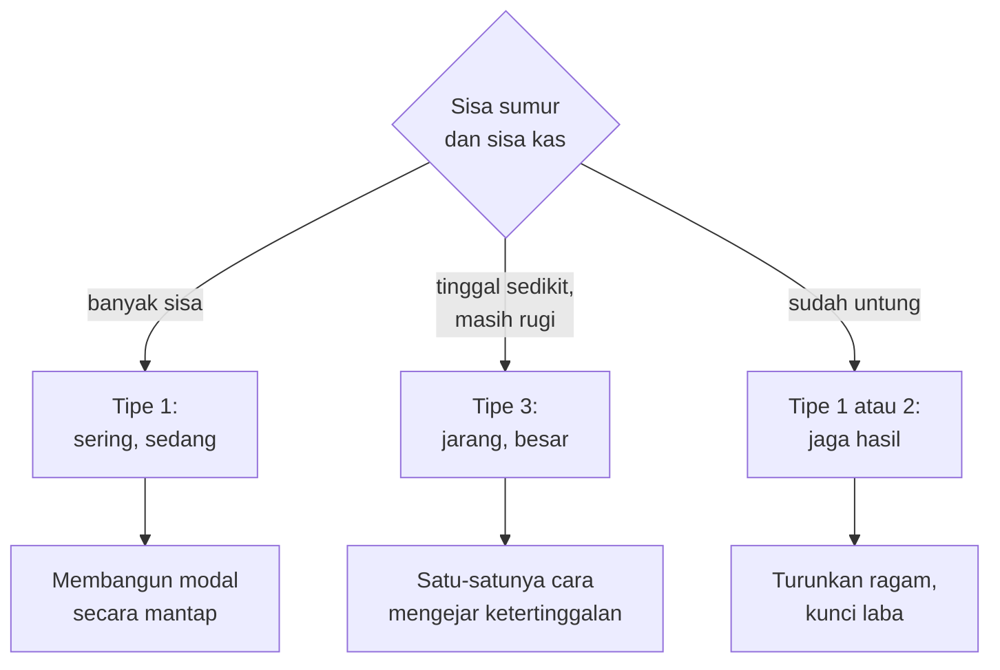
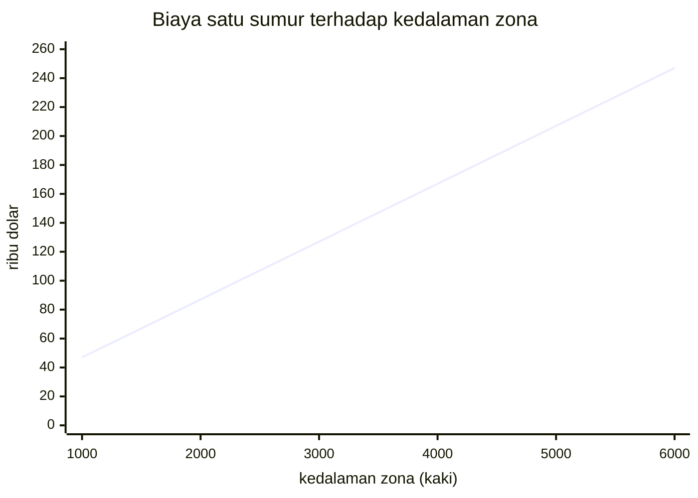
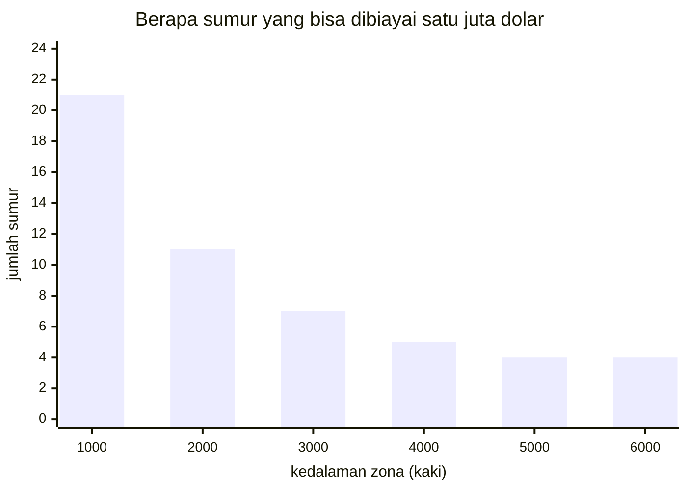
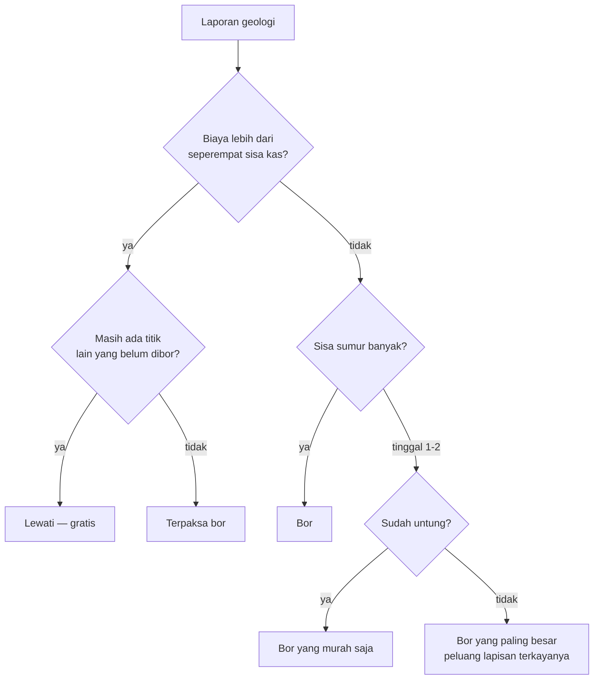

# Boom County Petroleum — dokumen analisis bisnis

> **Wawancara lapangan** · Boom County, 1982
> Narasumber: **Della Rourke**, *wildcatter* — pengebor mandiri
> Penyusun: analis bisnis, atas permintaan calon investor
>
> Dokumen ini bukan dokumen teknis. Tidak ada kode, tidak ada nama variabel,
> tidak ada nomor baris. Isinya bagaimana usaha pengeboran minyak spekulatif
> ini sebenarnya berjalan — dan setiap angka di dalamnya berasal dari operasi
> yang nyata.
>
> **Untuk pembaca yang sedang belajar:** di akhir tiap bagian ada kotak
> *Dari bisnis ke mekanik*, yang menunjukkan bagaimana aturan bisnisnya
> menjadi mekanik permainan — dan apa yang **hilang** dalam penerjemahan itu.

---

## 1 · Usaha ini dalam satu paragraf

Della punya **satu juta dolar** dan izin mengebor di **sepuluh titik**. Bukan
sepuluh titik pilihannya sendiri dari seluruh dunia — sepuluh kesempatan, di
petak sepuluh kali sepuluh di Boom County. Setiap kali ia memilih satu titik,
membayar pengeboran dari kantongnya sendiri, dan mengetahui hasilnya hanya
setelah lubangnya selesai.

Kalau ada minyak, ia dibayar. Kalau tidak, uangnya hilang seluruhnya dan
lubangnya ditutup.

Sesudah sepuluh sumur, yang dinilai bukan berapa kas yang tersisa, melainkan
**berapa yang bertambah di atas satu juta itu**. Pulang dengan $1.000.000 utuh
berarti setahun kerja tanpa hasil.



---

## 2 · Struktur biaya — dan biaya inilah yang diketahui lebih dulu

| pos | besaran | sifat |
|---|---|---|
| Pengeboran | **$30 per kaki** | sebanding kedalaman zona |
| Rekah (*fracture*) | **$10 per kaki** kedalaman total | wajib untuk mengalirkan |
| Penyelesaian sumur | **$1.800 – $2.688** | tetap, sedikit berubah-ubah |

Kedalaman yang dibor selalu **500 kaki di bawah puncak zona**. Jadi untuk zona
yang puncaknya di 3.000 kaki:

```
pengeboran   3.000 kaki × $30  = $ 90.000
rekah        3.500 kaki × $10  = $ 35.000
penyelesaian                    = $  2.200
                                  ---------
total                             $127.200
```

Secara praktis biayanya **$40 per kaki zona ditambah $7.200 tetap**. Zona
dangkal 1.000 kaki berbiaya $47.200; zona dalam 6.000 kaki berbiaya $247.200 —
**lima kali lipat**. Tabel lengkapnya di bagian 5.

> **Della:** *"Orang mengira judinya ada di minyaknya. Tidak. Judinya sudah
> selesai sebelum bor menyentuh tanah — begitu saya tanda tangan, angka
> keluarnya sudah pasti. Yang belum pasti cuma angka masuknya."*

**Inilah bentuk keputusan yang membuat usaha ini menarik:** biayanya
**diketahui persis di muka**, hasilnya sama sekali gelap. Laporan geologi
memberi tahu kedalaman zona sebelum Della memutuskan, jadi ia selalu bisa
menghitung berapa yang akan hilang kalau kering — dan tidak pernah bisa
menghitung berapa yang akan masuk kalau berhasil.

> **Dari bisnis ke mekanik.** Biaya pasti melawan hasil acak adalah struktur
> taruhan yang paling bersih yang ada. Pemain tidak perlu memahami geologi;
> ia cukup memahami bahwa ia sedang membeli tiket dengan harga yang tertulis
> jelas dan hadiah yang tidak. Yang **hilang**: di dunia nyata seorang
> wildcatter menjual bagian ke investor untuk membagi risiko, dan itu
> keputusan bisnis terpenting yang tidak ada di sini sama sekali.

---

## 3 · Struktur pendapatan

| sumber | dibayar |
|---|---|
| Minyak | **$9.000 per barel-per-hari** kapasitas sumur |
| Gas | **$2,10 per ribu kaki kubik** |

Angka $9.000 itu bukan harga satu barel — ia nilai **kapasitas harian**, kira-kira
setahun produksi pada harga sekitar $24,66 per barel. Jadi sumur 240 barel per
hari langsung membayar **$2.160.000**, lebih dari dua kali seluruh modal Della.

Sesudah pembayaran, laporan juga menyebut **cadangan yang masih di dalam
tanah** — lima kali pendapatan kotornya. Angka itu **tidak masuk kas**. Ia
kabar baik yang tidak bisa dibelanjakan.

> **Della:** *"Cadangan di tanah itu untuk bankir, bukan untuk saya. Saya
> tidak bisa membeli bor dengan minyak yang masih di bawah sana."*

---

## 4 · Logika pemilihan lokasi — dan di sini letak temuan terbesarnya

Boom County punya tiga kelas lahan. Della mengenalinya dari pengalaman;
laporan geologi **tidak menyebutkannya**.

| kelas | peluang kering | peluang lapisan terkaya |
|---|--:|--:|
| **Tipe 1** | **25 %** | 15 % |
| **Tipe 2** | **50 %** | 15 % |
| **Tipe 3** | **75 %** | **20 %** |





Bacalah kedua grafik itu berdampingan, lalu bacalah baris terakhir tabel di
atas dua kali.

Tipe 3 adalah lahan terburuk menurut ukuran mana pun yang biasa dipakai orang:
**tiga dari empat sumurnya kering.** Tapi ketika ia berhasil, ia lebih sering
mendarat di **lapisan pembayaran tertinggi** daripada tipe 1 — 20 % lawan 15 %.
Tipe 1 memberi banyak sumur sedang; tipe 3 memberi sedikit sumur besar.

Itu bukan "lebih buruk". Itu **profil risiko yang berbeda**, dan pilihan di
antaranya bergantung pada satu hal: berapa banyak kesempatan yang masih Della
punya.



> **Della:** *"Kalau saya masih punya delapan lubang, saya mau yang aman.
> Kalau tinggal dua dan saya masih rugi, aman itu justru cara paling pasti
> untuk kalah. Waktu itulah saya cari tanah yang orang lain tertawakan."*

> **Dari bisnis ke mekanik.** Ini pola perancangan yang berharga: **pilihan
> yang "buruk" harus punya keadaan di mana ia benar.** Kalau tipe 3 lebih
> buruk di setiap keadaan, ia bukan pilihan melainkan jebakan. Karena
> ragamnya lebih tinggi, ia menjadi alat yang sah bagi pemain yang tertinggal
> — dan itu membuat keputusannya bergantung pada **posisi**, bukan pada tabel.
>
> Yang **hilang**: Della mengenali kelas lahan dari pengalaman, tapi permainan
> tidak pernah memberi tahu pemain kelas mana yang ia hadapi. Perancang yang
> ingin keputusan ini benar-benar bisa diambil harus memberi isyarat — data
> seismik, sumur tetangga, sesuatu.

---

## 5 · Logika kedalaman

Kedalaman zona menentukan biaya secara langsung dan linier: **$40 per kaki**.
Tapi ia **tidak** menentukan hasil. Zona dalam tidak membayar lebih baik
daripada zona dangkal.

Biayanya persis **$40 per kaki zona ditambah $7.200** — $5.000 dari rekah
yang selalu menembus 500 kaki lebih dalam, sisanya penyelesaian sumur.

| kedalaman zona | biaya total | barel/hari untuk balik modal | sumur yang terbeli $1 juta |
|--:|--:|--:|--:|
| 1.000 kaki | $47.200 | 5,2 | **21** |
| 2.000 kaki | $87.200 | 9,7 | 11 |
| 3.000 kaki | $127.200 | 14,1 | 7 |
| 4.000 kaki | $167.200 | 18,6 | 5 |
| 5.000 kaki | $207.200 | 23,0 | 4 |
| 6.000 kaki | $247.200 | 27,5 | **4** |



Garis lurus itu sendiri sudah jadi keterangan: tidak ada penghematan skala,
tidak ada titik optimal. Setiap kaki berharga sama.

Yang **tidak** lurus adalah akibatnya pada jumlah percobaan yang mampu Anda
biayai:



Karena hasilnya tidak bergantung kedalaman, **aturan praktisnya sederhana:
pada kelas lahan yang sama, zona dangkal selalu lebih baik.** Satu juta dolar
membeli **dua puluh satu** sumur dangkal 1.000 kaki, tapi hanya **empat** sumur
dalam 6.000 kaki. Perhatikan bentuk batangnya: penurunan tercuram terjadi di
dua ribu kaki pertama, lalu mendatar. Dari 4.000 kaki ke bawah, mengebor lebih
dalam nyaris tidak lagi mengurangi jumlah percobaan &mdash; kerusakannya sudah
terjadi.

Dan karena kesempatannya dibatasi sepuluh sumur, bukan dibatasi uang, kedalaman
punya arti kedua: **sumur dalam menghabiskan kas tanpa menghabiskan
kesempatan.** Della bisa kehabisan uang sebelum kehabisan lubang.

> **Dari bisnis ke mekanik.** Dua sumber daya yang terkuras dengan kecepatan
> berbeda — uang per kaki, kesempatan per sumur — adalah cara membuat satu
> keputusan menekan dari dua arah sekaligus. Yang **hilang**: di dunia nyata
> zona dalam sering memang lebih produktif, dan itulah alasan orang mengebor
> dalam. Di sini kedalaman murni beban.

---

## 6 · Logika berhenti

Setiap kali laporan geologi keluar, Della boleh menjawab **tidak**. Melewati
sebuah titik tidak berbiaya sesen pun dan **tidak menghabiskan** satu dari
sepuluh kesempatannya.

Itu berarti melewati zona yang terlalu dalam selalu benar kalau ada titik lain
yang tersedia. Satu-satunya hal yang membuat Della akhirnya mengebor zona mahal
adalah **kehabisan pilihan yang lebih murah**.



> **Dari bisnis ke mekanik.** Pilihan "lewati" yang **gratis dan tak terbatas**
> adalah keputusan yang tampaknya hampa — kenapa tidak selalu melewati yang
> mahal? — sampai Anda sadar petaknya terbatas. Batasnya bukan di aturan
> "lewati", melainkan di jumlah titik. Perancang yang ingin membatasi sesuatu
> tidak selalu perlu melarangnya; kadang cukup membatasi persediaannya.

---

## 7 · Daftar risiko

| risiko | pemicu | dampak | bisa dikurangi? |
|---|---|---|---|
| Lubang kering | kelas lahan | **seluruh biaya hilang** | ya — pilih tipe 1 |
| Zona dalam | geologi | biaya sampai 6× | ya — lewati, gratis |
| Kehabisan kas | terlalu banyak sumur dalam | permainan berakhir sebelum 10 sumur | ya — jaga cadangan |
| Biaya penyelesaian berubah | acak $1.800–$2.688 | kecil | tidak |
| Lapisan tipis | undian hasil | sumur berhasil tapi kecil | tidak |

Perhatikan kolom terakhir: **risiko yang bisa dikurangi semuanya dikurangi
sebelum mengebor, bukan sesudah.** Begitu bor turun, tidak ada satu pun
keputusan yang tersisa. Itu membuat usaha ini sangat berbeda dari, misalnya,
mengemudikan truk — di sana keputusan berlangsung tiap jam.

---

## 8 · Ukuran keberhasilan

Yang dinilai **laba di atas satu juta**, bukan kas akhir. Dan kalau kas habis
sebelum sumur kesepuluh, laporannya menutup dengan kalimat yang mengajarkan
seluruh struktur biayanya dalam satu baris:

> *"You ran out of money at N feet."*

Sisa kas dibagi tiga puluh. Bahkan kekalahannya diukur dalam kaki.

---

## 9 · Tips lapangan — untuk yang belum pernah mengebor

**Sebelum memilih titik**

- **Hitung dulu, baru jawab.** Biaya = kedalaman zona × $40, ditambah sekitar
  $2.200. Kalau angka itu lebih dari seperempat sisa kas Anda, pikirkan dua
  kali.
- **Melewati titik itu gratis.** Tidak ada hukuman, tidak menghabiskan
  kesempatan. Kalau zonanya dalam dan petaknya masih luas, lewati.
- **Zona dangkal selalu lebih baik pada lahan yang sama.** Kedalaman menaikkan
  biaya tapi tidak menaikkan hasil.

**Membaca posisi**

- **Delapan sumur tersisa dan kas utuh:** main aman. Kumpulkan sumur sedang.
- **Dua sumur tersisa dan masih rugi:** aman justru cara paling pasti untuk
  kalah. Cari lahan yang peluang keringnya tinggi tapi lapisan terkayanya juga
  — di situlah satu-satunya jalan mengejar.
- **Sudah untung besar:** berhenti mengambil risiko. Sumur murah, zona dangkal,
  jaga hasil sampai sumur kesepuluh.

**Yang paling sering membuat pemula bangkrut**

Mengebor tiga zona dalam berturut-turut di awal. Tiga sumur 5.000 kaki
menghabiskan **$621.600** — hampir dua pertiga modal — dan kalau ketiganya
kering, tujuh kesempatan yang tersisa hanya punya $378.400, cukup untuk delapan
sumur dangkal tapi tidak cukup untuk dua sumur dalam lagi.
Kekalahan di usaha ini hampir selalu terjadi di sumur ketiga, bukan di sumur
kesepuluh.

---

## 10 · Ringkasan untuk perancang game

**Yang sudah kuat:**

1. **Biaya pasti melawan hasil acak** — struktur taruhan paling bersih yang
   ada, dan tidak menuntut pemain memahami apa pun tentang geologi.
2. **Pilihan "buruk" yang punya keadaan di mana ia benar** — tipe 3 lebih
   sering kering *dan* lebih sering besar, jadi ia alat bagi yang tertinggal.
3. **Dua sumber daya dengan laju berbeda** — uang per kaki, kesempatan per
   sumur.
4. **Pilihan melewati yang gratis**, dibatasi bukan oleh aturan melainkan oleh
   persediaan titik.
5. **Angka yang mengajar lewat kekalahan** — "kehabisan uang di N kaki".

**Yang hilang, dan layak ditambahkan:**

1. **Tidak ada investor.** Wildcatter sungguhan menjual bagian untuk membagi
   risiko; itu keputusan bisnis terpentingnya, dan di sini tidak ada.
2. **Kelas lahan tidak pernah diberitahukan** — jadi keputusan terpenting di
   §4 sebenarnya tidak bisa diambil pemain secara sadar.
3. **Kedalaman murni beban**, padahal di dunia nyata ia sering justru alasan
   orang mengebor.
4. **Tidak ada waktu.** Tidak ada harga minyak yang bergerak, tidak ada sewa
   lahan yang kedaluwarsa, tidak ada pesaing yang mengebor lebih dulu.

Yang keempat itu yang paling menentukan wataknya: ini permainan **sepuluh
taruhan berurutan**, bukan permainan mengelola perusahaan. Menambahkan waktu
akan mengubahnya jadi sesuatu yang sama sekali lain — dan itu pilihan yang sah,
asal disadari.

---

*Dokumen ini diturunkan dari operasi `WILDCAT` sebagaimana ia benar-benar
berjalan. Angka, ambang, dan konsekuensinya nyata; yang ditambahkan hanyalah
suaranya. Catatan teknis dan arsitekturnya ada di* [`wildcat.md`](wildcat.md) —
*dokumen yang sama sekali berbeda, untuk pembaca yang berbeda.*
