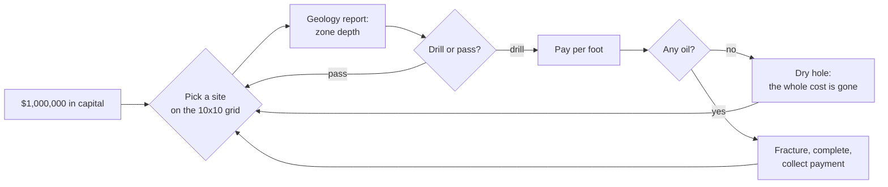
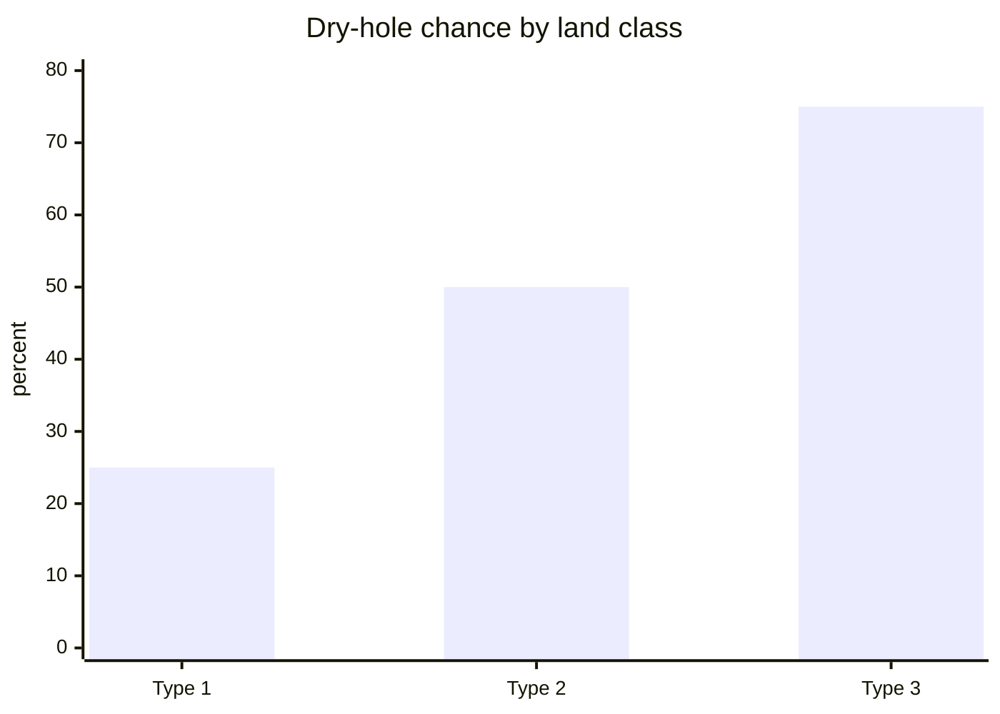
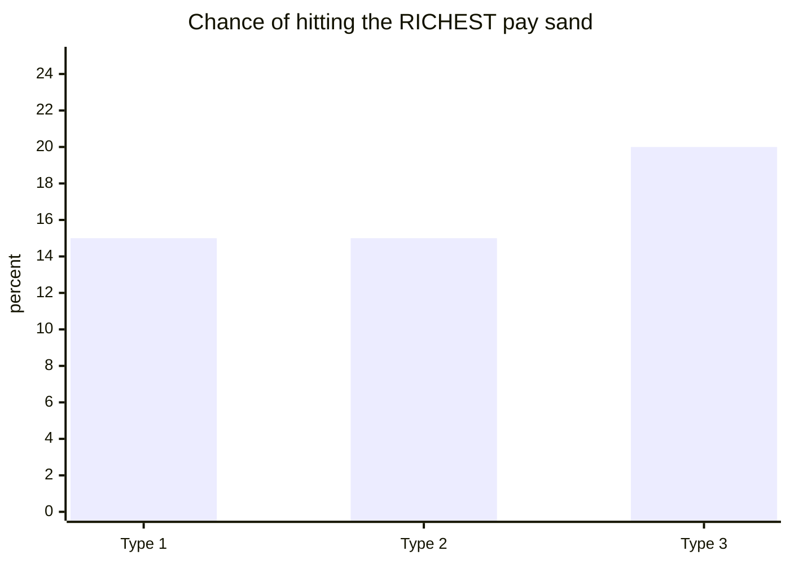
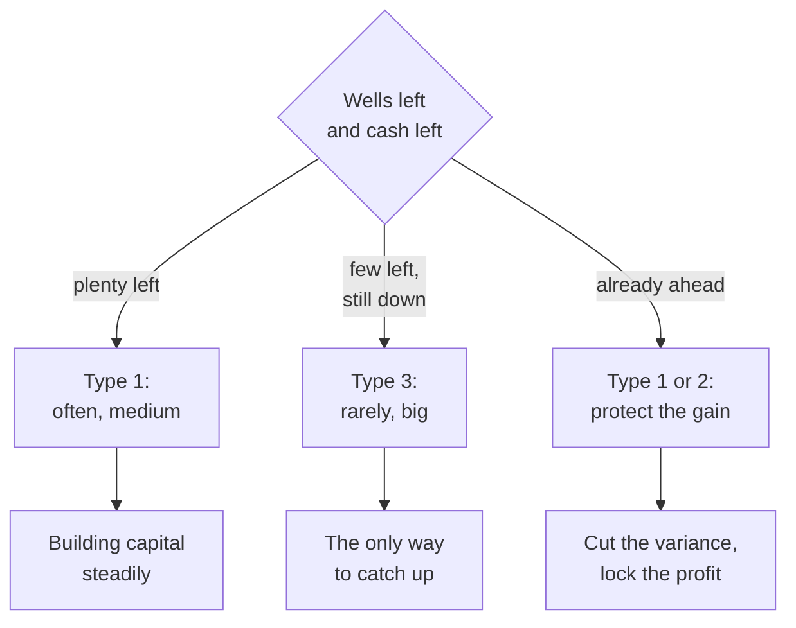
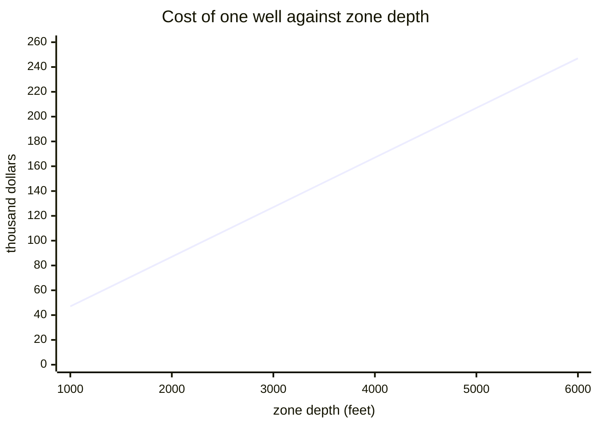
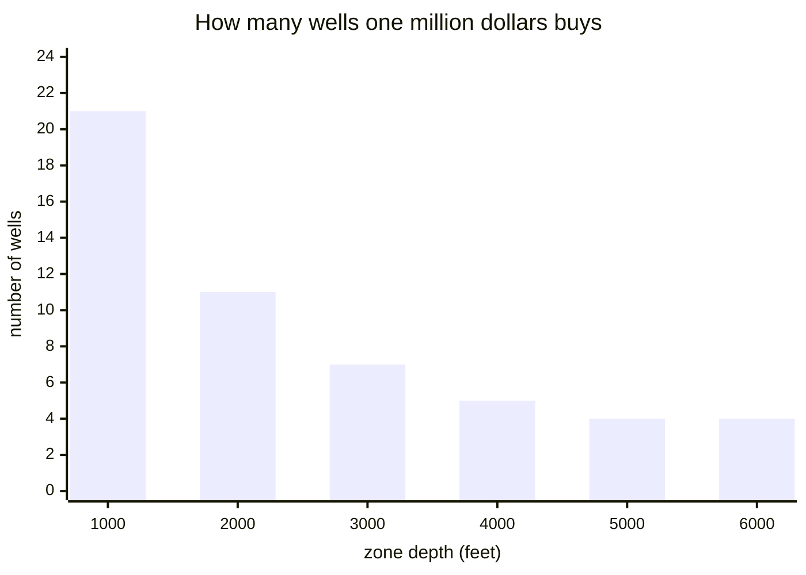
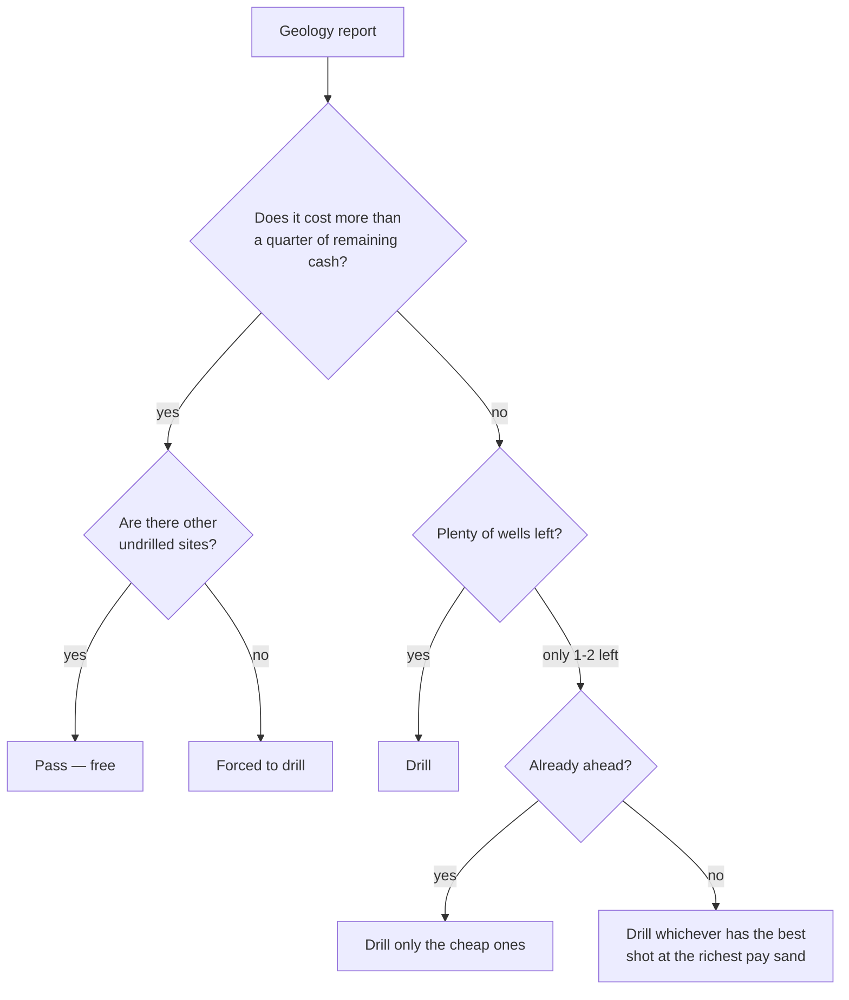

# Boom County Petroleum — business analysis

> **Field interview** · Boom County, 1982
> Subject: **Della Rourke**, *wildcatter* — independent driller
> Prepared by: a business analyst, at the request of a prospective investor
>
> This is not a technical document. No code, no variable names, no line
> numbers. It is about how this speculative oil-drilling business actually
> runs — and every number in it comes from a real operation.
>
> **For readers who are here to learn:** each section ends with a box called
> *From business to mechanic*, showing how the business rule becomes a game
> mechanic — and what is **lost** in that translation.

---

## 1 · The business in one paragraph

Della has **one million dollars** and permission to drill at **ten sites**. Not
ten sites of her own choosing anywhere in the world — ten chances, on a ten by
ten grid in Boom County. Each time, she picks a site, pays for the drilling out
of her own pocket, and learns the result only after the hole is finished.

If there is oil, she is paid. If there is not, the money is gone entirely and
the hole is plugged.

After ten wells, what is judged is not how much cash is left but **how much was
added on top of that million**. Coming home with $1,000,000 intact means a year
of work for nothing.



---

## 2 · Cost structure — and the cost is what you learn first

| item | amount | nature |
|---|---|---|
| Drilling | **$30 per foot** | proportional to zone depth |
| Fracturing | **$10 per foot** of total depth | required to make it flow |
| Well completion | **$1,800 – $2,688** | fixed, slightly variable |

The hole is always drilled **500 feet below the top of the zone**. So for a
zone topping out at 3,000 feet:

```
drilling      3,000 ft × $30  = $ 90,000
fracturing    3,500 ft × $10  = $ 35,000
completion                     = $  2,200
                                 ---------
total                            $127,200
```

In practice the cost is **$40 per foot of zone plus about $7,200 fixed**. A
shallow 1,000-foot zone costs $47,200; a deep 6,000-foot zone costs $247,200 —
**five times as much**. The full table is in section 5.

> **Della:** *"People think the gamble is in the oil. It isn't. The gamble is
> settled before the bit touches dirt — the moment I sign, the money going out
> is fixed. The only thing still unknown is the money coming in."*

**This is the shape of decision that makes the business interesting:** the cost
is **known exactly in advance**, the outcome is completely dark. The geology
report gives the zone depth before Della decides, so she can always compute
what she will lose if it comes up dry — and can never compute what she will
make if it comes in.

> **From business to mechanic.** A certain cost against a random outcome is the
> cleanest wager structure there is. The player needs no understanding of
> geology; he needs only to understand that he is buying a ticket whose price
> is printed plainly and whose prize is not. What is **lost**: in the real
> world a wildcatter sells shares to investors to spread the risk, and that is
> the single most important business decision there is — and it is entirely
> absent here.

---

## 3 · Revenue structure

| source | pays |
|---|---|
| Oil | **$9,000 per barrel-per-day** of well capacity |
| Gas | **$2.10 per thousand cubic feet** |

That $9,000 is not the price of one barrel — it is the value of **daily
capacity**, roughly a year of production at about $24.66 a barrel. So a
240-barrel-per-day well pays **$2,160,000** immediately, more than twice
Della's entire capital.

After payment, the report also states the **reserves still in the ground** —
five times the gross revenue. That figure **never enters the cash account**. It
is good news that cannot be spent.

> **Della:** *"Reserves in the ground are for the banker, not for me. I can't
> buy a bit with oil that's still down there."*

---

## 4 · Site selection logic — and this is the biggest finding

Boom County has three classes of land. Della recognizes them from experience;
the geology report **does not mention them**.

| class | dry-hole chance | chance of the richest pay sand |
|---|--:|--:|
| **Type 1** | **25 %** | 15 % |
| **Type 2** | **50 %** | 15 % |
| **Type 3** | **75 %** | **20 %** |





Read those two charts side by side, then read the last row of the table above
twice.

Type 3 is the worst land by every measure people normally use: **three of every
four wells come up dry.** But when it does come in, it lands on the **richest
pay sand** more often than type 1 does — 20 % against 15 %. Type 1 gives many
medium wells; type 3 gives few large ones.

That is not "worse". That is **a different risk profile**, and the choice
between them turns on one thing: how many chances Della has left.



> **Della:** *"With eight holes left I want the safe ground. With two left and
> still in the red, safe is the surest way to lose. That's when I go looking
> for the land everybody else laughs at."*

> **From business to mechanic.** This is a valuable design pattern: **the "bad"
> option must have a state in which it is right.** If type 3 were worse in
> every state it would not be a choice, it would be a trap. Because its
> variance is higher it becomes a legitimate instrument for a player who is
> behind — and that makes the decision depend on **position**, not on a table.
>
> What is **lost**: Della recognizes land classes from experience, but the game
> never tells the player which class he is facing. A designer who wants this
> decision to be genuinely available has to give a signal — seismic data,
> neighboring wells, something.

---

## 5 · Depth logic

Zone depth drives cost directly and linearly: **$40 per foot**. But it does
**not** drive the outcome. Deep zones do not pay better than shallow ones.

The cost is exactly **$40 per foot of zone plus $7,200** — $5,000 of that from
fracturing, which always runs 500 feet deeper, and the rest from completion.

| zone depth | total cost | barrels/day to break even | wells $1 million buys |
|--:|--:|--:|--:|
| 1,000 ft | $47,200 | 5.2 | **21** |
| 2,000 ft | $87,200 | 9.7 | 11 |
| 3,000 ft | $127,200 | 14.1 | 7 |
| 4,000 ft | $167,200 | 18.6 | 5 |
| 5,000 ft | $207,200 | 23.0 | 4 |
| 6,000 ft | $247,200 | 27.5 | **4** |



The straight line is itself the explanation: no economies of scale, no optimum
point. Every foot costs the same.

What is **not** straight is the effect on how many attempts you can afford:



Because the outcome does not depend on depth, **the rule of thumb is simple: on
the same class of land, shallower is always better.** A million dollars buys
**twenty-one** shallow 1,000-foot wells, but only **four** deep 6,000-foot
ones. Note the shape of the bars: the steepest fall is in the first two
thousand feet, then it flattens. Below 4,000 feet, drilling deeper barely
reduces the number of attempts any further &mdash; the damage is already done.

And because the opportunity is capped at ten wells rather than capped by money,
depth has a second meaning: **deep wells consume cash without consuming
chances.** Della can run out of money before she runs out of holes.

> **From business to mechanic.** Two resources draining at different rates —
> money per foot, chances per well — is how you make one decision press from
> two directions at once. What is **lost**: in the real world deep zones often
> genuinely are more productive, and that is why people drill deep. Here depth
> is pure burden.

---

## 6 · The logic of walking away

Every time a geology report comes back, Della may say **no**. Passing on a site
costs nothing at all and **does not consume** one of her ten chances.

That means passing on a zone that is too deep is always correct as long as
other sites remain. The only thing that eventually makes Della drill an
expensive zone is **running out of cheaper options**.



> **From business to mechanic.** A "pass" option that is **free and unlimited**
> looks like an empty decision — why not always skip the expensive ones? —
> until you notice the grid is finite. The limit lives not in the pass rule but
> in the number of sites. A designer who wants to constrain something need not
> always forbid it; sometimes it is enough to limit the supply.

---

## 7 · Risk register

| risk | trigger | impact | reducible? |
|---|---|---|---|
| Dry hole | land class | **the whole cost is gone** | yes — pick type 1 |
| Deep zone | geology | cost up to 6× | yes — pass, it is free |
| Running out of cash | too many deep wells | game ends before ten wells | yes — keep a reserve |
| Completion cost varies | random $1,800–$2,688 | small | no |
| Thin pay sand | outcome draw | the well comes in but small | no |

Note the last column: **every reducible risk is reduced before drilling, never
after.** Once the bit goes down, not one decision remains. That makes this
business very different from, say, driving a truck — where decisions come every
hour.

---

## 8 · Measures of success

What is judged is **profit above one million**, not the closing cash. And if
the cash runs out before the tenth well, the report closes with a line that
teaches the entire cost structure in one sentence:

> *"You ran out of money at N feet."*

The remaining cash divided by thirty. Even the defeat is measured in feet.

---

## 9 · Field advice — for anyone who has never drilled

**Before picking a site**

- **Do the arithmetic first, then answer.** Cost = zone depth × $40, plus about
  $2,200. If that number is more than a quarter of your remaining cash, think
  twice.
- **Passing is free.** No penalty, no chance consumed. If the zone is deep and
  the grid is still wide open, pass.
- **Shallow is always better on the same land.** Depth raises cost without
  raising the outcome.

**Reading your position**

- **Eight wells left and capital intact:** play safe. Accumulate medium wells.
- **Two wells left and still down:** safe is now the surest way to lose. Look
  for land with a high dry-hole rate but the best shot at the richest sand —
  that is the only road back.
- **Well ahead:** stop taking risk. Cheap wells, shallow zones, protect the
  result through the tenth well.

**What most often bankrupts a beginner**

Drilling three deep zones back to back at the start. Three 5,000-foot wells
consume **$621,600** — nearly two-thirds of the capital — and if all three come
up dry, the seven remaining chances have only $378,400 between them, enough for
eight shallow wells but not for two more deep ones.
Defeat in this business almost always happens at the third well, not the tenth.

---

## 10 · Summary for game designers

**Already strong:**

1. **Certain cost against random outcome** — the cleanest wager structure
   there is, and it demands no understanding of geology from the player.
2. **A "bad" option with a state in which it is right** — type 3 is drier *and*
   bigger, so it is an instrument for the player who is behind.
3. **Two resources draining at different rates** — money per foot, chances per
   well.
4. **A free pass option**, limited not by a rule but by the supply of sites.
5. **A number that teaches through defeat** — "ran out of money at N feet".

**Missing, and worth adding:**

1. **There are no investors.** A real wildcatter sells shares to spread risk;
   that is his most important business decision, and it is absent here.
2. **Land class is never disclosed** — so the most important decision in §4
   cannot actually be made knowingly by the player.
3. **Depth is pure burden**, where in the real world it is often the very
   reason people drill.
4. **There is no time.** No moving oil price, no lease expiring, no competitor
   drilling first.

That fourth absence defines its character most: this is a game of **ten
sequential wagers**, not a game of running a company. Adding time would turn it
into something else entirely — and that is a legitimate choice, as long as it
is made knowingly.

---

*This document is derived from the `WILDCAT` operation as it actually runs. The
numbers, thresholds, and consequences are real; only the voice was added. The
technical and architectural notes are in* [`wildcat.md`](wildcat.md) — *a
completely different document, for a different reader.*
